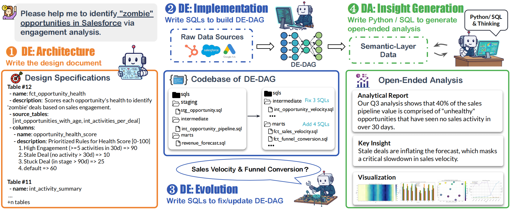

<!-- <div align="center">
  <h1>
     
    Benchmarking Data Agents across the Full Data Intelligence Lifecycle
  </h1>

  <p>
    &nbsp&nbsp🌐<a href="https://da-comp.github.io/">Website</a>&nbsp&nbsp | 
    &nbsp&nbsp📑<a href="https://arxiv.org/abs/2512.xxxxx">Paper</a>&nbsp&nbsp | 
    &nbsp&nbsp🤗<a href="https://huggingface.co/DAComp">Dataset</a>&nbsp&nbsp | 
    &nbsp&nbsp🐥<a href="https://arxiv.org/abs/2512.xxxxx">Twitter</a>&nbsp&nbsp | 
    &nbsp&nbsp🎮<a href="xxxxxxxxxxx">Demo</a>&nbsp&nbsp |
  </p>
</div> -->

<!-- <div style="text-align: center;">
  <h1 style="display: inline-block; margin: 0;">
    
    <br>
    Benchmarking Data Agents across the Full Data Intelligence Lifecycle
  </h1>

  <p style="margin-top: 10px; margin-bottom: 0;">
    &nbsp;&nbsp;🌐<a href="https://da-comp.github.io/">Website</a>&nbsp;&nbsp; | 
    &nbsp;&nbsp;📑<a href="https://arxiv.org/abs/2512.04324">Paper</a>&nbsp;&nbsp; | 
    &nbsp;&nbsp;🤗<a href="https://huggingface.co/DAComp">Dataset</a>&nbsp;&nbsp; | 
    &nbsp;&nbsp;🐥<a href="">Twitter</a>&nbsp;&nbsp; | 
  </p>
</div> -->

<div align="center">
  <h1 align="center">
    
    <br>
    Benchmarking Data Agents across the Full Data Intelligence Lifecycle
  </h1>
  <p>
    &nbsp;&nbsp;🌐 <a href="https://da-comp.github.io/">Website</a>&nbsp;&nbsp;|&nbsp;&nbsp;
    📑 <a href="https://arxiv.org/abs/2512.04324">Paper</a>&nbsp;&nbsp;|&nbsp;&nbsp;
    🤗 <a href="https://huggingface.co/DAComp">Dataset</a>&nbsp;&nbsp;|&nbsp;&nbsp;
    🐥 <a href="">Twitter</a>&nbsp;&nbsp;
  </p>
</div>


## 📰 News 
- **2025-12-03**: 🔥 We release the [DAComp dataset](https://huggingface.co/DAComp) and the [paper](https://arxiv.org/abs/2512.04324).


## 👋 Overview

DAComp offers a research-grade benchmark spanning full data intelligence workflows: repository-level data engineering (DAComp-DE), open-ended data analysis (DAComp-DA), a Chinese-localized split (DAComp-zh), and accompanying baseline agents with evaluation suites curated in this repository.

<div align="center">
  
</div>

## 🔍 Installation
Set up the environment using the following commands:
```
conda create -n dacomp python=3.12
conda activate dacomp

pip install -r requirements.txt
pip install openhands-ai
conda install -c conda-forge nodejs
conda install -c conda-forge poetry
```

## 🚀 Quick access DAComp Dataset

DAComp consists of two subsets: DA (Analysis) and DE (Engineering). You can download the dataset from [DAComp](https://huggingface.co/DAComp).

Please use the provided scripts in [dacomp-da/download.py](./dacomp-da/README.md) and [dacomp-de/download.py](./dacomp-de/README.md) to download the data automatically.
```
# --- Download DAComp-DA Dataset ---
cd dacomp-da
# Download DAComp-DA dataset，English tasks into `dacomp-da/tasks` and Chinese tasks into `dacomp-da/tasks_zh`. Change repo_id and download_dir in download.py.
python download.py   

# --- Download DAComp-DE Dataset ---
cd dacomp-de
# Download DAComp-DE dataset，English tasks into `dacomp-de/tasks` and Chinese tasks into `dacomp-de/tasks_zh`. Change repo_id and download_dir in download.py.
python download.py 
```

## 🚀 Quickstart 

### DAComp-DA
- Agents: pick `methods/da-agent` (three-stage baseline), `methods/spider-agent` (single, image-first baseline), or OpenHands; fill in your model config, install requirements, and run `run.py` as shown in each agent [README](./methods/README.md).

### DAComp-DE
- Agents: pick `methods/de-agent` (OpenHands integration); fill in your model config, install requirements, as shown in [README](./methods/de-agent/README.md).

## ⚖️ Evaluation

### DAComp-DA
- Standard DAComp-DA Tasks: follow [dacomp-da/evaluation_suite/README.md](./dacomp-da/evaluation_suite/README.md) to evaluate **DA** tasks.
- Results: export a run to `dacomp-da/evaluation_suite/agent_results` with `get_results.py` from the agent folder.

### DAComp-DE
- Standard DAComp-DE Tasks: follow [dacomp-de/evaluation_suite/README.md](./dacomp-de/evaluation_suite/README.md) to evaluate **DE-Impl** and **DE-Evol** tasks.
- DE-Arch Unified Evaluator: follow [dacomp-de/evaluation_suite_arch/README.md](./dacomp-de/evaluation_suite_arch/README.md) to evaluate **DE-Arch** tasks.

# 📋 Leaderboard Submission
To submit your agent results to the leaderboard, please follow the instructions in  [DAComp Submission Guidelines](https://docs.google.com/document/d/1t93acmrwBmJQ_I6bzlnqHq1y8G5N2kwJU_ZfeVNG3yE/edit?usp=sharing).


# 🙇‍♂️ Acknowledgement

We thank the [OpenHands](https://github.com/OpenHands/OpenHands) team for their valuable contributions to the open-source community. 

# ✍️ Citation
If you find our work helpful, please cite as
```
@misc{lei2025dacompbenchmarkingdataagents,
      title={DAComp: Benchmarking Data Agents across the Full Data Intelligence Lifecycle}, 
      author={Fangyu Lei and Jinxiang Meng and Yiming Huang and Junjie Zhao and Yitong Zhang and Jianwen Luo and Xin Zou and Ruiyi Yang and Wenbo Shi and Yan Gao and Shizhu He and Zuo Wang and Qian Liu and Yang Wang and Ke Wang and Jun Zhao and Kang Liu},
      year={2025},
      eprint={2512.04324},
      archivePrefix={arXiv},
      primaryClass={cs.CL},
      url={https://arxiv.org/abs/2512.04324}, 
}
```
