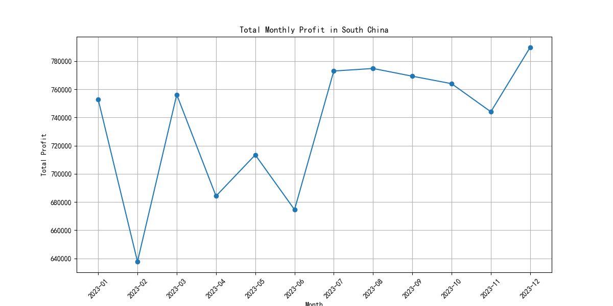
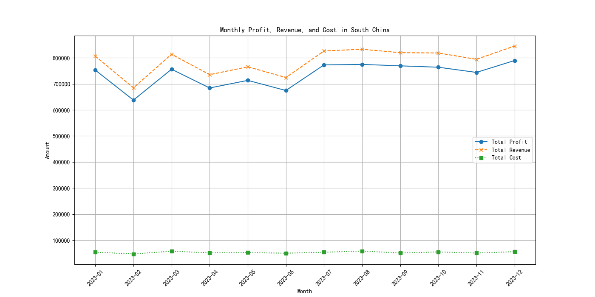

# Analysis of Monthly Profit Instability in South China

## Executive Summary

An analysis of the company's 2023 performance in the South China region was conducted to understand the reasons behind its unstable monthly profits. The investigation reveals that the profit fluctuations are not random but are primarily driven by significant volatility in monthly revenue. While logistical costs have remained relatively stable and proportional to sales, revenue has experienced sharp declines in specific months (notably February, April, and June), which directly impacts profitability.

The core issues identified are:
1.  **Volatile Sales Quantity:** Major profit dips in February and April correlate directly with significant drops in the number of products sold.
2.  **Decreasing Revenue Per Sale:** The profit drop in June was caused by a lower average revenue generated per sale, suggesting a shift in the product mix towards lower-value items.

To address this instability, it is recommended that the business investigates the causes of sales volatility and analyzes the product mix to ensure a consistent stream of revenue.

## Visualizing the Problem

The total monthly profit in South China shows a clear pattern of instability. The line chart below illustrates the profit trend throughout 2023, with noticeable dips that disrupt an otherwise stable performance.

As seen, profits dropped significantly in February, April, and June, creating unpredictability in the region's financial performance.

## Diagnosing the Root Cause: Revenue Volatility

To understand what drove these profit drops, a deeper analysis was performed by comparing the trends of total profit, total revenue, and total logistics costs.

This detailed comparison provides a clear answer: **the profit trend almost perfectly mirrors the revenue trend.** Total logistics costs, while fluctuating slightly, do not show the same dramatic dips and remain largely proportional to revenue. This indicates that the problem lies not with cost management, but with revenue generation.

A breakdown of the key months reveals the following:

-   **February Dip:** Profit fell by 15.3%. This was driven by a 15.0% drop in revenue, which corresponded to an 11.3% drop in sales quantity.
-   **April Dip:** Profit fell by 9.5%. This was driven by a 9.7% drop in revenue, linked to an 11.1% drop in sales quantity.
-   **June Dip:** Profit fell by a smaller 5.3%. Interestingly, sales quantity only fell by 1.4%, but revenue fell by 5.5%. This was due to a **7% decrease in the average revenue per sale** (from ¥28.35 in May to ¥27.20 in June), indicating a shift towards selling lower-priced products.

## Actionable Recommendations

The instability of profit in South China is a revenue problem, not a cost problem. To create a more stable and predictable profit stream, the following actions are recommended:

1.  **Investigate Sales and Marketing Effectiveness:** The sales and marketing teams should conduct a post-mortem on the months with sharp sales declines (February and April).
    -   Were there changes in marketing spend or strategy?
    -   Did competitor actions impact sales?
    -   Were there any stock availability issues for high-demand products?
    Answering these questions will help prevent similar sales droughts in the future.

2.  **Analyze and Optimize Product Mix:** The business should review the product mix sold in June to understand why lower-value items dominated sales.
    -   Are there pricing pressures forcing a shift in what customers buy?
    -   Can sales incentives or marketing campaigns be used to promote higher-margin products?
    A strategic approach to product promotion can help stabilize the average revenue per sale and protect profit margins.

By focusing on stabilizing revenue through consistent sales volume and a healthy product mix, the company can mitigate the monthly profit instability in the South China region.
