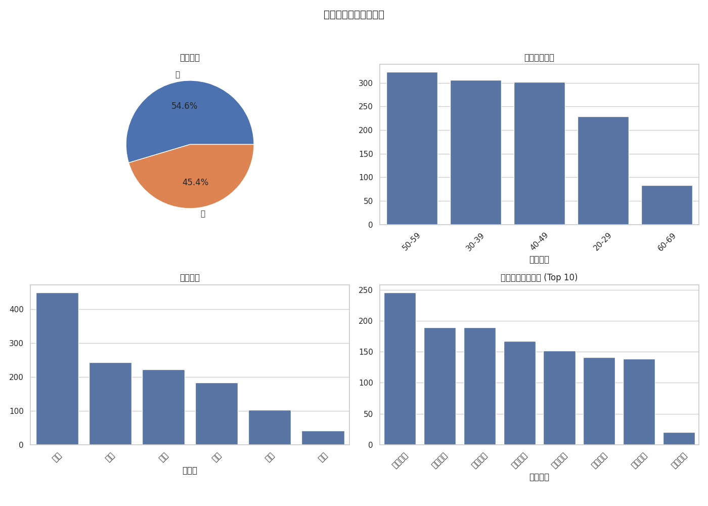
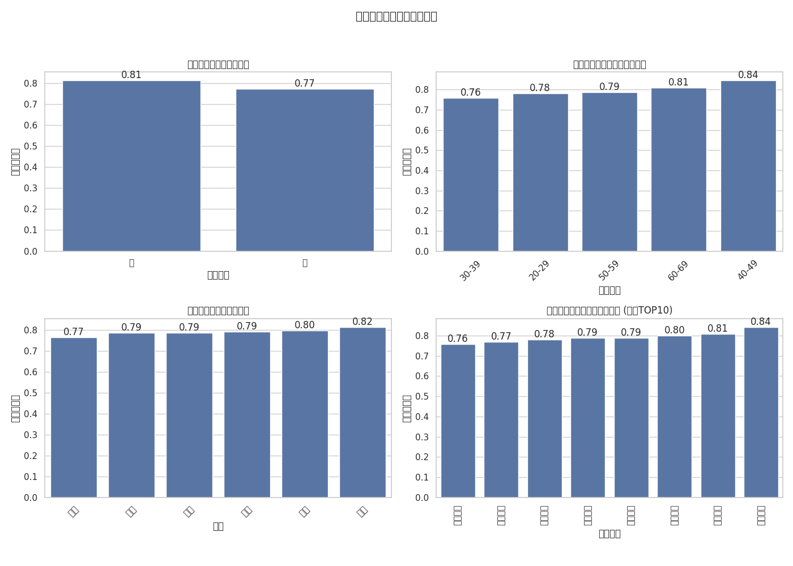

# 低利润率订单分析报告

## 整体概览
通过对订单数据进行分析发现，当订单利润率低于平均利润率的一半（即低于39.76%）时，这类订单呈现出一定的结构性特征。以下将围绕这些特征展开深入探讨。

## 关键发现

### 1. 低利润率订单自身具有明显的用户画像和行为特征

- **性别分布**：男性用户约占52.2%，女性用户占47.8%，两者相差不大，性别并非决定性因素。
- **年龄段**：低利润订单高度集中于'50-59'岁年龄段的消费者群体中，占比最高。
- **地理分布**：华南地区订单数最多，其次为华东和华北，表现出南方城市相对较高的低利润订单密度。
- **产品偏好**：床品件套是产生最多低利润订单的产品种类，远超过其它品类。

### 2. 不同维度对利润率的真实影响力验证

为了判断上述特征是否真正影响利润率表现，我们进一步对比了全量订单在各维度上的平均利润率差异：

- **性别层面**：男性用户的平均利润率为 0.83，略高于女性用户的 0.76，但差距较小。
- **年龄层面**：不同年龄段间存在明显差异，'20-29'岁群体贡献最高的平均利润率 (1.03)，而'60-69'岁群体却只有 0.55，说明年龄确实会影响盈利能力。
- **地域层面**：各区域利润率波动剧烈，东北地区的平均利润率仅为 0.49，远远落后于西南地区的 1.18，显示出巨大的区域性运营效率差异。
- **产品层面**：部分商品如'床品件套'的平均利润率仅 0.03，接近零利润运营状态，而'电脑硬件'类产品可达惊人的 2.27。

## 核心洞察

结合以上两方面的分析，我们可以提炼出几个核心结论：

1. 尽管低利润订单主要由50岁以上人群构成，但这并不意味着该年龄段天然带来低收益；而是因为他们在某些特定区域（如华南）购买了一些低毛利产品（如床品件套）所致。

2. 区域运营能力不均衡是造成利润率偏低的主要原因之一，尤其是在东北地区，亟需优化资源配置和服务流程以提升盈利水平。

3. 部分产品的定价策略未能覆盖其真实成本，尤其是'床品件套'等家居类目，可能存在严重的亏损风险。

## 解决方案与建议

针对以上问题，提出如下几点改进措施：

1. **动态定价模型建设**：根据不同地区消费能力和竞争状况建立差异化的价格体系，在保障市场占有率的同时提高单品利润率。

2. **精准营销定向调整**：向高价值客群（年轻消费者）倾斜资源投入，引导他们选择高利润产品，减少补贴型促销活动带来的损失。

3. **供应链优化升级**：对长期处于盈亏边缘的商品实施专项审查，重新评估采购价格、库存周转率和物流配送路径，寻找降本增效的空间。

4. **区域经营策略精细化管理**：针对东北等盈利能力较弱的大区制定专门的支持计划，包括增加本地仓库布点、加强渠道合作等方式改善服务质量和响应速度。
