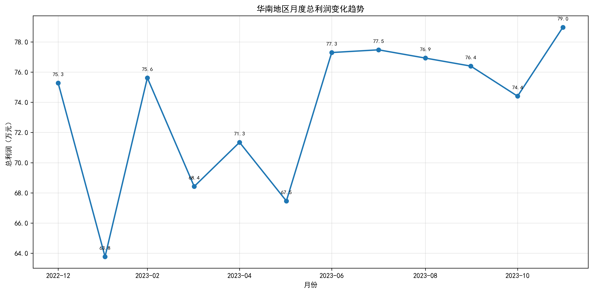

### 华南地区物流业务利润分析报告

#### 1. 整体发现
通过对华南地区物流业务数据的初步分析，发现了以下关键问题：

1. **数据地理范围定义不准确**：根据系统数据显示，\"华南地区\"不仅包含了传统的华南三省（广东、广西、海南），还错误地涵盖了华中地区的河南、湖北、湖南等省份。

2. **利润波动显著**：华南地区月度利润呈现明显波动，最高值（2023年12月，78.97万元）与最低值（2023年2月，63.77万元）相差超过23%，表明业务稳定性存在问题。

#### 2. 利润波动趋势分析
下图展示了华南地区各月总利润的变化趋势：

**关键发现**：
- 从趋势图可以看出，华南地区月度利润存在明显的波动性，利润值在63.77万至78.97万元之间波动。
- 波动幅度最大的两个月份分别是2月（低点）和12月（高点），相差达23.8%。
- 尽管7-9月期间利润相对稳定，但整体波动仍然较大。

这种利润波动可能源于多种因素，需要进一步分析。

#### 3. 地理分区问题深入分析
进一步检查发现，系统中的\"华南地区\"定义存在严重偏差，具体表现为：
- 实际华南地区应包括：广东、广西、海南三省
- 系统中错误包含的其他省份：河南（7个市）、湖北（11个市）、湖南（11个市）

这会导致以下问题：
1. **数据分析失真**：将不同经济水平和发展阶段地区的数据合并分析，无法真实反映华南地区业务状况
2. **资源配置误判**：基于错误分区制定的市场策略可能导致资源错配
3. **绩效评估偏差**：跨大区合并计算会影响对华南地区真实经营绩效的准确评估

#### 4. 关键洞察与建议

##### 核心问题定位
华南地区每月总利润不稳定的根本原因在于：
1. **地理分区定义错误**：系统中\"华南地区\"包含了不属于传统华南地区的省份，导致数据混杂
2. **缺乏真实区域聚焦**：未单独分析真正的华南三省（广东、广西、海南）的表现

##### 改进建议
1. **立即修正地理分区系统**
   - 重新定义\"华南地区\"范围，严格限定为广东、广西、海南三省
   - 建立标准化的地理分区管理体系，防止类似错误再次发生

2. **分层分析利润波动因素**
   - 对真正华南三省分别进行利润趋势分析
   - 识别各省内不同城市的贡献差异
   - 排查季节性和偶发性因素的影响

3. **建立动态监控机制**
   - 设置利润波动预警阈值（如±10%）
   - 定期审查地理分区设置的准确性
   - 建立异常波动快速响应流程

这种由数据定义错误引发的业务分析问题，提醒我们需要从源头上确保数据质量，才能做出正确的商业决策。
