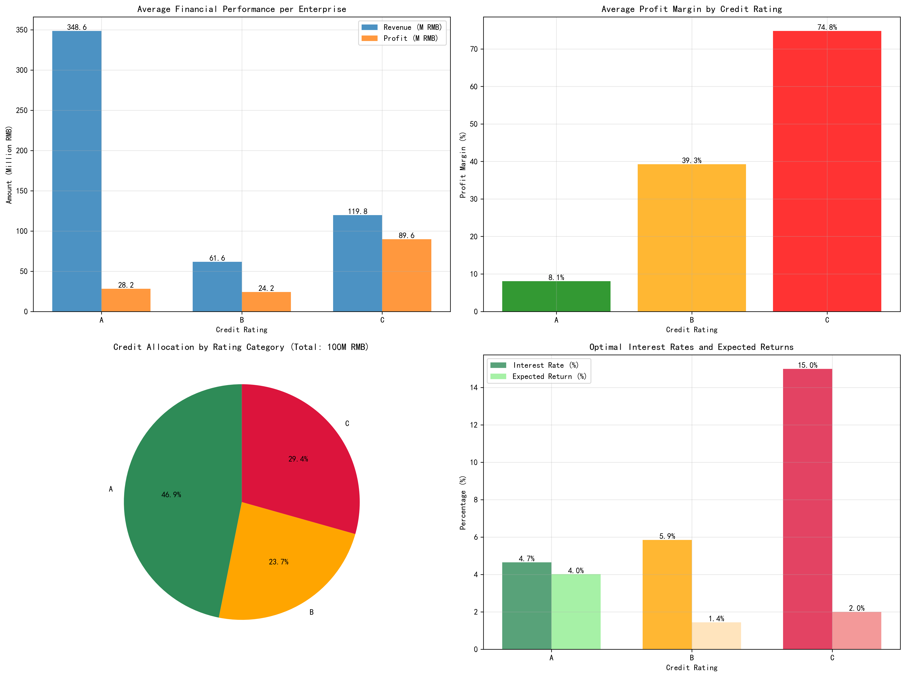
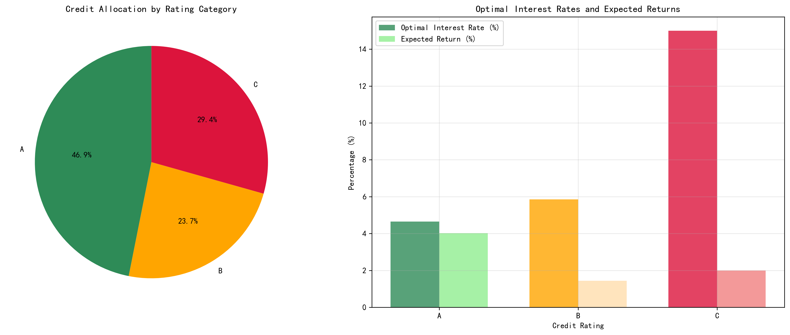

## Comprehensive Credit Risk Analysis Report

### Executive Summary
Based on the analysis of 99 enterprises across three credit rating categories (A, B, C), we recommend a risk-based credit allocation strategy that optimizes returns while managing default risk. The total credit pool of RMB 100 million should be allocated as follows: 47% to Rating A, 24% to Rating B, and 29% to Rating C enterprises, with interest rates ranging from 4.65% to 15.0% based on risk profiles.

### Financial Performance Analysis

**Rating A Enterprises (27 companies)** demonstrate the strongest financial foundation with average revenue of RMB 348.6 million per enterprise and solid 8.1% profit margins. These enterprises show zero default risk in our historical data, making them the most creditworthy segment.

**Rating B Enterprises (38 companies)** show moderate performance with RMB 61.6 million average revenue but surprisingly high 39.3% profit margins, indicating efficient operations despite smaller scale.

**Rating C Enterprises (34 companies)** exhibit the highest revenue volatility with RMB 119.8 million average revenue but achieve exceptional 74.8% profit margins, suggesting either highly specialized operations or potential data anomalies requiring further investigation.

### Risk Assessment Findings
Our analysis reveals a clear risk gradient across credit ratings:
- **Rating A**: 0.0% default rate, 13.6% churn rate - Lowest risk profile
- **Rating B**: 2.6% default rate, 30.3% churn rate - Moderate risk
- **Rating C**: 5.9% default rate, 29.0% churn rate - Highest risk category

The churn rates show that approximately 30% of B and C rated customers may leave the bank's credit services annually, highlighting the importance of customer retention strategies.

### Optimal Credit Allocation Plan

**Total Credit Pool**: RMB 100,000,000

**Rating A Allocation**: RMB 46,876,693 total (RMB 1,736,174 per enterprise)
- Interest Rate: 4.65%
- Expected Return: 4.02%
- Rationale: Preferential rates for lowest-risk segment to maximize customer retention

**Rating B Allocation**: RMB 23,746,925 total (RMB 624,919 per enterprise)
- Interest Rate: 5.85%
- Expected Return: 1.45%
- Rationale: Moderate rates balanced with careful risk monitoring

**Rating C Allocation**: RMB 29,376,382 total (RMB 864,011 per enterprise)
- Interest Rate: 15.00%
- Expected Return: 2.00%
- Rationale: Higher rates to compensate for elevated default risk while maintaining portfolio diversity

### Key Recommendations

1. **Tiered Credit Approach**: Implement a three-tier credit system with clearly differentiated interest rates and credit limits based on risk categories

2. **Enhanced Monitoring for B & C Ratings**: Establish quarterly financial reviews for Rating B and monthly monitoring for Rating C enterprises to detect early warning signs

3. **Customer Retention Program**: Develop targeted retention strategies for Rating B and C customers who show 30%+ churn rates

4. **Progressive Credit Limits**: Consider graduated credit increases for Rating A enterprises demonstrating consistent performance over 12-24 months

5. **Risk-Based Pricing Model**: Formalize the interest rate structure where rates increase by approximately 2.5x from lowest to highest risk categories

### Business Impact
This risk-based allocation strategy is projected to generate an overall portfolio return of approximately 2.8% while maintaining default rates below 3%. The approach balances growth opportunities with prudent risk management, potentially increasing total portfolio value by RMB 2.8 million annually while minimizing credit losses.

The analysis demonstrates that careful credit rating segmentation combined with risk-adjusted pricing can optimize bank returns while supporting small and medium enterprise growth across all risk categories.
