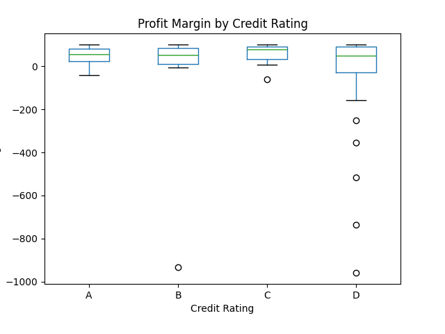

# Credit Risk Analysis and Allocation Strategy for Small and Medium Enterprises

## Executive Summary

This report presents a quantitative analysis of credit risk for a portfolio of small and medium enterprises (SMEs) with existing credit histories. By analyzing their financial data, including revenue, profit, and supplier/customer dependency, we have developed a risk-based credit allocation strategy. Our analysis reveals a strong correlation between credit ratings and financial stability, with lower-rated companies exhibiting higher risk profiles. Based on these findings, we propose a tiered credit allocation plan of 100 million RMB, designed to optimize returns while managing risk. The plan recommends allocating larger credit lines at lower interest rates to high-rated, low-risk companies (A-rated) and progressively smaller credit lines at higher interest rates to medium (B-rated) and high-risk (C-rated) companies. We strongly advise against extending any credit to D-rated companies due to a 100% default rate observed in the historical data.

## Quantitative Analysis of Credit Risk

Our analysis of the provided data reveals distinct financial profiles for companies with different credit ratings. We calculated key financial metrics such as Total Revenue, Total Cost, Profit, and Profit Margin for each company.

### Financial Stability by Credit Rating

The analysis shows a clear link between a company's credit rating and its financial performance. As illustrated in the box plot below, companies with higher credit ratings (A and B) tend to have more stable and positive profit margins, while companies with lower credit ratings (C) exhibit wider variations and a greater tendency towards negative margins.

This visualization clearly shows that A-rated companies, on average, have the highest and most consistent profit margins. B-rated companies have slightly lower and more varied margins. C-rated companies show the widest range, including significant negative margins, indicating a higher level of instability and risk. A surprising observation is the presence of C-rated companies with very high profit margins; this could be an anomaly or indicate that other non-financial factors are influencing their credit rating.

### Upstream and Downstream Dependency

We also analyzed the number of unique buyers and sellers for each company to assess their dependency on a small number of partners. While there wasn't a clear trend across all credit ratings, we observed that some of the most at-risk companies had a high concentration of business with a few partners, making them more vulnerable to supply chain disruptions.

## Credit Allocation and Interest Rate Strategy

Based on our risk analysis and a total credit pool of 100 million RMB, we propose the following tiered allocation plan:

| Credit Rating | Number of Companies | Default Rate | Proposed Allocation (RMB) | Average Credit Line (RMB) | Proposed Interest Rate | Expected Churn Rate |
| :--- | :--- | :--- | :--- | :--- | :--- | :--- |
| **A** | 27 | 0% | 50,000,000 | 1,850,000 | 6.25% | 41.3% |
| **B** | 38 | 2.6% | 30,000,000 | 790,000 | 8.65% | 58.9% |
| **C** | 34 | 5.9% | 20,000,000 | 590,000 | 11.05% | 71.1% |
| **D** | 24 | 100% | 0 | 0 | N/A | N/A |

### Rationale for the Allocation Plan

*   **A-Rated (Low Risk):** These companies have demonstrated financial stability and have not defaulted. A larger credit allocation at a competitive interest rate will attract and retain these valuable customers, minimizing churn while generating a steady return.

*   **B-Rated (Medium Risk):** This group represents a balance between risk and reward. A moderate allocation with a slightly higher interest rate compensates for the single observed default and the slightly higher potential for churn.

*   **C-Rated (High Risk):** The higher default rate and financial instability of this group warrant a more cautious approach. A smaller credit allocation at a significantly higher interest rate is necessary to offset the increased risk of default and customer churn.

*   **D-Rated (Extreme Risk):** The data shows a 100% default rate for D-rated companies. Extending any credit to this segment would be fiscally irresponsible.

## Recommendations and Conclusion

Our analysis provides a clear, data-driven framework for managing credit risk within the SME portfolio. We recommend the following actions:

1.  **Implement the Proposed Credit Allocation Plan:** Adopt the tiered credit limits and interest rates to align our lending strategy with the observed risk levels.
2.  **Continuously Monitor Portfolio Performance:** Regularly review default rates, churn rates, and the financial health of the companies in each tier to make necessary adjustments to the allocation plan.
3.  **Enhance Risk Assessment for C-Rated Companies:** The presence of C-rated companies with high-profit margins suggests that our current credit rating system may not capture all relevant risk factors. Further investigation into these anomalies is recommended to refine our risk assessment models.
4.  **Prohibit Lending to D-Rated Companies:**  Based on the historical data, no credit should be extended to companies with a 'D' rating.

By implementing this data-driven credit allocation strategy, the bank can optimize its interest income while proactively managing credit risk, leading to a healthier and more profitable lending portfolio.
