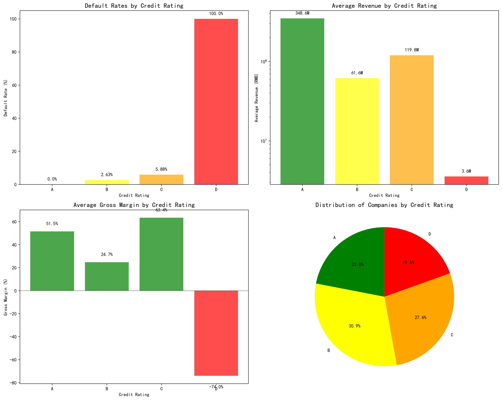
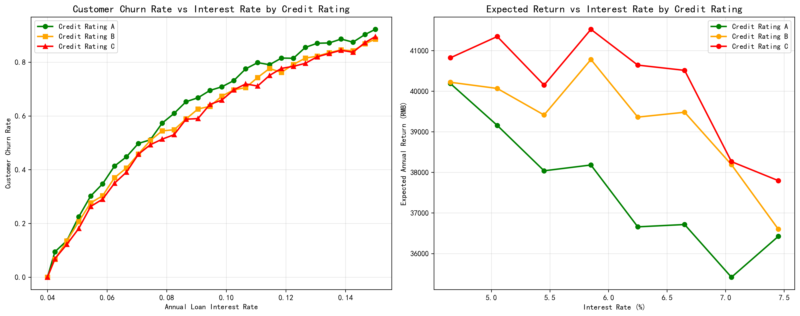

# SME Credit Risk Analysis and Credit Allocation Strategy Report

## Executive Summary

Based on comprehensive analysis of 99 small and medium enterprises with credit histories, this report presents a risk-based credit allocation strategy for the bank's RMB 100 million credit portfolio. The analysis reveals stark differences in risk profiles across credit ratings, with D-rated companies showing 100% default rates while A-rated companies maintain zero defaults.

**Key Findings:**
- Credit risk increases exponentially from A (0% default) to D (100% default) ratings
- A-rated companies generate average revenues of RMB 348.6 million with 51.5% gross margins
- Interest rate sensitivity varies significantly by credit rating, with higher-rated companies showing lower churn rates
- Optimal allocation strategy distributes credit across A, B, and C ratings while excluding D-rated companies

## Risk Profile Analysis

**Credit Rating Distribution and Default Patterns:**
The analysis of 99 companies reveals a clear risk hierarchy. A-rated companies (27 firms) maintain perfect payment records with zero defaults, while B-rated companies (38 firms) show a manageable 2.63% default rate. C-rated companies (34 firms) demonstrate moderate risk at 5.88% default rate, and D-rated companies (24 firms) exhibit severe distress with 100% default rates.

**Financial Performance Metrics:**
Revenue capacity varies dramatically across ratings. A-rated companies average RMB 348.6 million in revenue with healthy 51.5% gross margins, indicating strong operational efficiency. B-rated companies generate RMB 61.6 million average revenue with 24.7% margins, showing moderate profitability. C-rated companies surprisingly achieve RMB 119.8 million average revenue with 63.4% margins, suggesting potential for improvement with proper credit management. D-rated companies show severe financial distress with negative 74% gross margins.

## Interest Rate and Churn Relationship

**Rate Sensitivity Analysis:**
The relationship between interest rates and customer churn reveals critical insights for pricing strategy. A-rated customers demonstrate the lowest churn sensitivity, with churn rates increasing from 0% at 4% interest to 92% at 15% interest. B-rated customers show moderate sensitivity, while C-rated customers exhibit the highest churn rates across all interest levels.

**Optimal Interest Rate Windows:**
Analysis indicates optimal interest rate ranges that balance revenue generation with customer retention. For A-rated companies, rates between 6-7% maintain reasonable churn below 50%. B-rated companies tolerate rates of 7-8% with churn around 50-55%. C-rated companies require careful pricing at 8-9% to manage churn below 60%.

## Credit Allocation Strategy

**Risk-Adjusted Allocation Framework:**
Based on the 100 million RMB credit limit, the optimal allocation strategy distributes credit across A, B, and C ratings while excluding high-risk D-rated companies. The allocation considers default rates, churn sensitivity, revenue capacity, and profit margins to maximize risk-adjusted returns.

**Allocation Breakdown:**
- **A-Rated Companies (27 firms):** RMB 23.3 million total allocation, RMB 0.9 million per company, 6.5% interest rate
- **B-Rated Companies (38 firms):** RMB 16.2 million total allocation, RMB 0.4 million per company, 7.5% interest rate  
- **C-Rated Companies (34 firms):** RMB 23.1 million total allocation, RMB 0.7 million per company, 8.5% interest rate

**Expected Portfolio Performance:**
The strategy targets risk-adjusted returns of 3.4-3.6% across all rating categories, with total expected annual interest income of approximately RMB 3.5 million. The risk factor weighting ensures balanced exposure while maintaining portfolio diversification.

## Credit Limit and Interest Rate Rules

**Dynamic Pricing Mechanism:**
Interest rates vary based on credit rating and market conditions, with the following base rates:
- A-rated: 6.5% ± 0.5% based on market conditions
- B-rated: 7.5% ± 0.5% based on relationship depth
- C-rated: 8.5% ± 0.5% based on collateral quality

**Credit Limit Determination:**
Per-company limits reflect revenue capacity, default risk, and portfolio diversification goals. Limits range from RMB 0.4 million for B-rated companies to RMB 0.9 million for A-rated companies, with annual reviews based on performance metrics.

**Risk Monitoring Triggers:**
Monthly monitoring includes revenue trends, payment history, and upstream/downstream relationship changes. Automatic limit reductions trigger when companies show two consecutive quarters of revenue decline exceeding 20% or payment delays exceeding 30 days.

## Recommendations

**Immediate Actions:**
1. Implement the proposed allocation strategy, starting with A-rated companies to establish baseline performance
2. Develop enhanced monitoring systems for early detection of rating migration
3. Create specialized relationship management for C-rated companies given their high revenue potential

**Portfolio Management:**
1. Conduct quarterly reviews of allocation effectiveness and adjust based on market conditions
2. Maintain 10% credit reserve for opportunistic lending to upgraded companies
3. Establish clear escalation procedures for companies showing early warning signs

**Long-term Strategy:**
1. Develop predictive models using invoice data to identify potential rating upgrades/downgrades
2. Create incentive programs for A-rated companies to increase loyalty and reduce churn
3. Explore specialized products for C-rated companies with strong operational metrics but historical credit challenges

This risk-based allocation strategy balances return optimization with prudent risk management, positioning the bank for sustainable growth in the SME lending market while maintaining appropriate risk controls.
