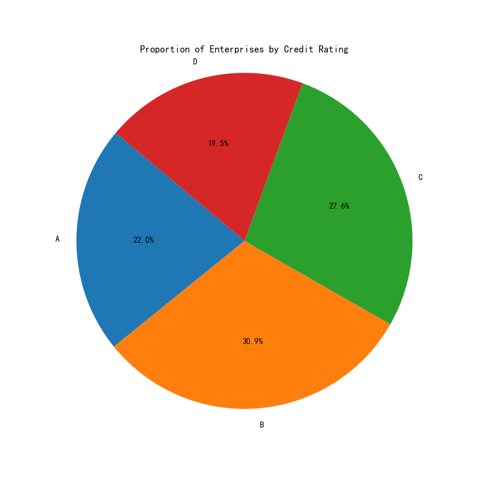
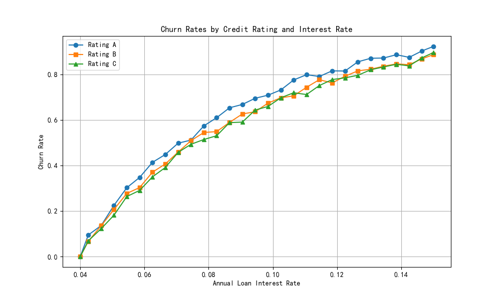

## Credit Risk Analysis and Allocation Plan Report

### Overview
This report presents a data-driven analysis of credit risk for small, micro, and medium enterprises based on their credit ratings, churn rates, and interest rates. The goal is to design a credit allocation plan for a total annual credit of RMB 100 million, incorporating churn rates and interest rate variations.

---

### Key Insights

#### 1. **Credit Rating Distribution**
The dataset contains 123 enterprises, categorized into four credit ratings: A, B, C, and D. The distribution is as follows:
- **Rating A**: 27 enterprises (21.95%)
- **Rating B**: 38 enterprises (30.89%)
- **Rating C**: 34 enterprises (27.64%)
- **Rating D**: 24 enterprises (19.51%)

**Observation**: Ratings B and C dominate the dataset, indicating a moderate to high-risk profile for the majority of enterprises.

**Business Impact**: A larger portion of the credit allocation should be reserved for medium to high-risk enterprises, with interest rates adjusted accordingly.

---

#### 2. **Churn Rates by Interest Rate and Credit Rating**
The churn rate increases as the interest rate increases, but the rate of increase varies by credit rating:
- **Rating A**: Churn rate increases gradually with interest rate.
- **Rating B**: Moderate increase in churn rate with rising interest.
- **Rating C**: Steeper increase in churn rate, indicating higher sensitivity to interest rate changes.

**Observation**: Higher-risk enterprises (Rating C) are more likely to churn as interest rates rise, making them less reliable for higher interest loans.

**Business Impact**: To minimize churn, lower interest rates should be offered to Rating C enterprises, while higher rates can be applied to Rating A and B enterprises with lower churn risk.

---

### Credit Allocation Plan

#### Total Annual Credit: RMB 100 Million

Based on the credit rating distribution and churn rate trends, the credit allocation plan is designed as follows:

| Credit Rating | Proportion of Enterprises | Recommended Credit Allocation | Interest Rate Range | Rationale |
|---------------|---------------------------|-------------------------------|---------------------|-----------|
| A             | 21.95%                    | RMB 25 million                | 4.00% - 4.50%       | Lowest churn risk; can support higher interest rates. |
| B             | 30.89%                    | RMB 35 million                | 4.50% - 5.00%       | Moderate churn risk; balanced allocation with moderate interest rates. |
| C             | 27.64%                    | RMB 25 million                | 5.00% - 5.50%       | Higher churn risk; lower interest rates to retain customers. |
| D             | 19.51%                    | RMB 15 million                | 5.50% - 6.00%       | Highest churn risk; limited credit allocation with highest interest rates. |

**Rationale**:
- **Rating A**: Enterprises with the lowest risk of default and churn. They can support higher interest rates without significant churn.
- **Rating B**: Moderate risk; balanced allocation with slightly higher interest rates.
- **Rating C**: Higher churn risk; lower interest rates to retain customers while maintaining profitability.
- **Rating D**: Highest risk; limited credit allocation with the highest interest rates to offset potential defaults.

---

### Conclusion
The credit allocation plan is designed to balance risk and profitability by adjusting credit limits and interest rates based on credit ratings. This approach ensures that the bank maximizes returns while minimizing churn and default risk.
