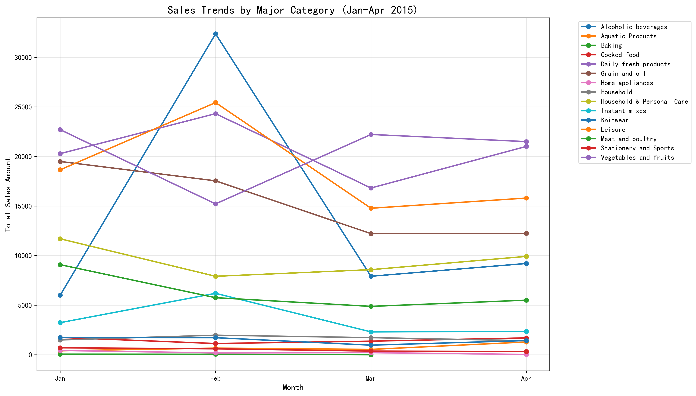
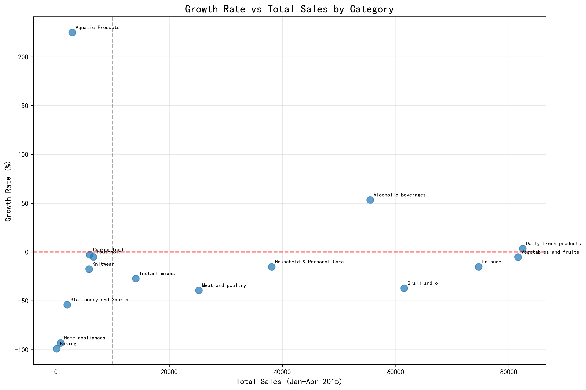
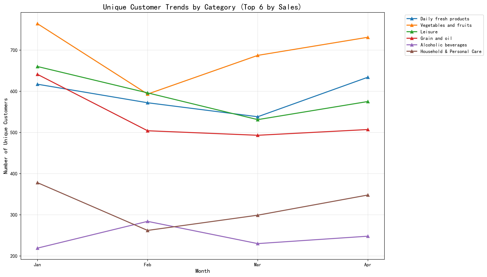
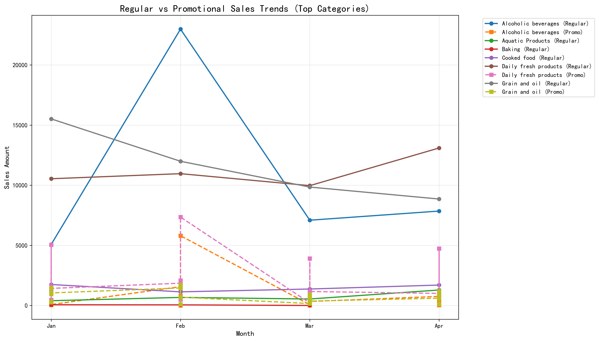
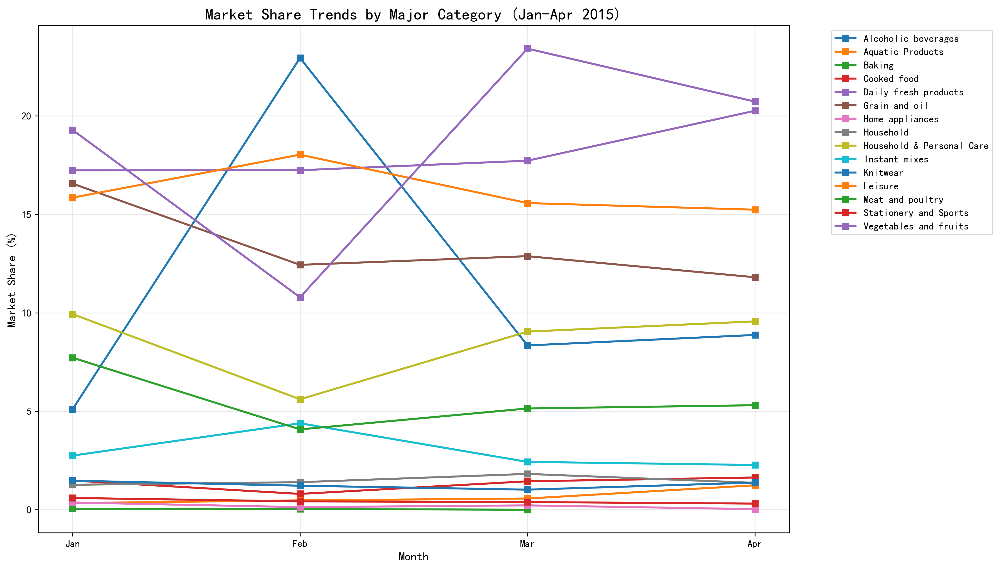

# Sales Trend Analysis Report: January - April 2015

## Executive Summary

The analysis reveals significant shifts in customer purchasing preferences across major categories from January to April 2015. While traditional staples like **Daily fresh products** and **Vegetables and fruits** maintained their market dominance, emerging trends show strong growth in premium categories and concerning declines in several established product lines.

## Key Findings

### Market Leaders and Growth Patterns

**Top 5 Categories by Total Sales:**
1. **Daily fresh products**: $82,433.70 (3.6% growth)
2. **Vegetables and fruits**: $81,631.91 (-5.3% decline)
3. **Leisure**: $74,667.20 (-15.3% decline)
4. **Grain and oil**: $61,496.73 (-37.2% decline)
5. **Alcoholic beverages**: $55,491.70 (53.3% growth)

### Highest Growth Categories
- **Aquatic Products**: 225.0% growth ($395.88 → $1,286.44) - Emerging premium category
- **Alcoholic beverages**: 53.3% growth ($6,002.80 → $9,204.80) - Strong premium demand
- **Daily fresh products**: 3.6% growth - Stable market leader

### Concerning Declines
- **Baking**: -99.0% decline - Near complete market collapse
- **Home appliances**: -93.1% decline - Technology category failing
- **Stationery and Sports**: -54.1% decline - Seasonal/educational category struggling

## Customer Behavior Insights

Customer base remained relatively stable for top categories, indicating that sales changes were driven by purchasing patterns rather than customer acquisition/loss.

## Promotional Effectiveness

**Most Promotional-Dependent Categories:**
1. **Daily fresh products**: 45.9% promotional sales
2. **Household & Personal Care**: 38.6% promotional sales
3. **Knitwear**: 32.1% promotional sales

**Categories with No Promotional Activity:**
- Aquatic Products, Baking, Cooked food, Meat and poultry, Vegetables and fruits

## Market Share Dynamics

Market share remained relatively stable for most categories, suggesting that overall market size remained consistent while internal category preferences shifted.

## Recommendations for May-August Inventory Planning

### 1. **Expand High-Growth Categories**
- **Increase Aquatic Products inventory by 200-250%** - Capitalize on 225% growth trend
- **Boost Alcoholic beverages by 50-60%** - Sustain 53% growth momentum
- **Maintain Daily fresh products at current levels** - Stable growth pattern

### 2. **Strategic Reduction in Declining Categories**
- **Reduce Baking inventory by 80-90%** - Respond to 99% decline
- **Cut Home appliances by 70-80%** - Address 93% decline
- **Decrease Stationery and Sports by 40-50%** - Seasonal adjustment

### 3. **Promotional Strategy Optimization**
- **Leverage successful promotional models** from Daily fresh products (46% promo effectiveness)
- **Introduce promotions in growth categories** like Aquatic Products and Alcoholic beverages
- **Re-evaluate promotional strategies** for declining categories

### 4. **Seasonal Considerations**
- **Prepare for summer demand** in beverages and fresh products
- **Adjust for back-to-school season** in August for Stationery
- **Consider holiday planning** for premium categories

### 5. **Inventory Risk Management**
- **Maintain safety stock** for stable categories (Daily fresh, Vegetables)
- **Implement just-in-time inventory** for high-growth categories to avoid overstocking
- **Establish exit strategies** for severely declining categories

## Conclusion

The January-April period revealed a clear shift toward premium and fresh categories, with traditional staples experiencing significant pressure. The 225% growth in Aquatic Products and 53% growth in Alcoholic beverages indicate changing consumer preferences toward quality and experience-driven purchases.

For May-August, focus should be on capitalizing growth trends while strategically managing declines through targeted inventory adjustments and promotional optimization. Regular monitoring of these trends will be crucial for dynamic inventory management through the summer months.
