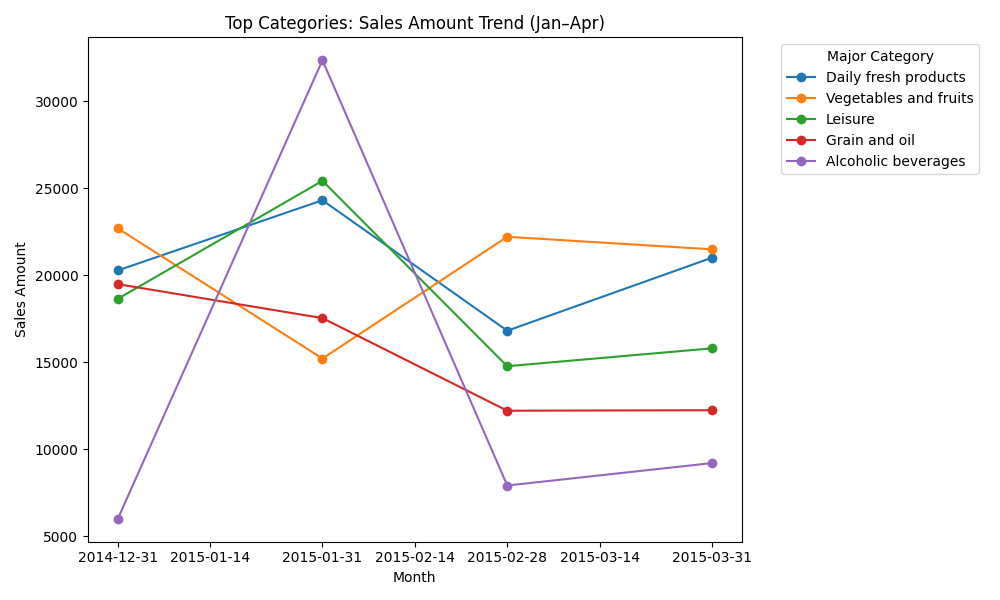
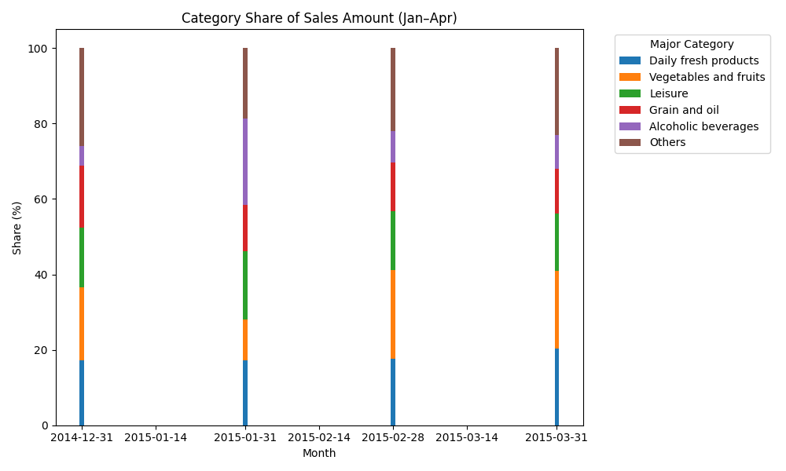

Executive Summary
- Sales peaked in February at 141,065.00 (+19.9% vs January), dipped in March to 94,888.77 (-32.7% vs February), and recovered in April to 103,727.90 (+9.3% vs March). This indicates seasonality and shifting category mix affecting overall demand.
- Customers shifted spend toward Alcoholic beverages (+3.77 percentage points share Jan→Apr), Daily fresh products (+3.03pp), Vegetables and fruits (+1.44pp), and Aquatic Products (+0.90pp). Spend pulled back in Grain and oil (-4.76pp), Meat and poultry (-2.41pp), Leisure (-0.61pp), and Instant mixes (-0.48pp).

Methodology and Data
- Source: SQLite table sheet1; fields used: “Major Category Name”, “Sales Month”, “Sales Amount”. Query: SUM(Sales Amount) by Major Category and Sales Month for 201501–201504.
- Python analysis: pivoted months×categories, computed shares and MoM growth, and plotted trends. See analysis_plot.py code executed to create visualizations.

Visuals and Key Takeaways
1) Top Categories: Sales Amount Trend (Jan–Apr)

- Takeaway: Alcoholic beverages accelerated to 9,204.80 in April (+53.3% vs January’s 6,002.80), Daily fresh products rose to 21,013.45 (+3.6% vs January’s 20,283.91), while Vegetables and fruits softened to 21,497.80 (-5.3% vs January’s 22,700.14). Leisure declined to 15,803.62 (-15.3% vs January’s 18,653.38).
- Why it matters: Demand is consolidating around beverages and fresh staples; discretionary categories like Leisure are cooling. Allocate shelf space and inventory to categories with sustained or accelerating demand.

2) Category Share of Sales Amount (Jan–Apr)

- Takeaway: Share gains Jan→Apr are led by Alcoholic beverages (+3.77pp), Daily fresh (+3.03pp), Vegetables and fruits (+1.44pp), and Aquatic Products (+0.90pp). Share losses are most pronounced in Grain and oil (-4.76pp) and Meat and poultry (-2.41pp), followed by Leisure (-0.61pp) and Instant mixes (-0.48pp).
- Why it matters: These shifts signal evolving customer preferences toward fresh and beverage categories, while pantry staples and meat saw reduced emphasis, impacting replenishment priorities and promotions.

Category-Level Insights (Observation → Root Cause → Impact/Recommendation)
- Alcoholic beverages
  • Observation: Apr Sales Amount 9,204.80; +3.77pp share gain Jan→Apr; +16.27% MoM (Mar→Apr); +3,202 absolute increase Jan→Apr.
  • Root Cause: Rising consumer demand likely tied to seasonal events and upselling; stronger mix in April.
  • Impact/Recommendation: Increase May–Aug inventory by 20–30% vs April average; expand premium and multipack SKUs; run cross-promotions with fresh food to capitalize on momentum.

- Daily fresh products
  • Observation: Apr 21,013.45; +3.03pp share gain; +24.95% MoM; +729.54 absolute increase Jan→Apr.
  • Root Cause: Stable staple demand with slight seasonal uplift in April; core basket relevance remains high.
  • Impact/Recommendation: Maintain a high in-stock rate (target 98%+) and add depth to top sellers; implement daily replenishment and tighter spoilage control; allocate more end-cap space.

- Vegetables and fruits
  • Observation: Apr 21,497.80; +1.44pp share gain; -3.24% MoM; -5.3% vs January.
  • Root Cause: Still a core category with minor pullback, possibly mix and price effects.
  • Impact/Recommendation: Sustain inventory at April levels; refine assortment to higher-velocity items; consider price/quality consistency to prevent further softening.

- Aquatic Products
  • Observation: Apr 1,286.44; +0.90pp share gain; +138.59% MoM; +224.96% vs January; +890.56 absolute increase Jan→Apr.
  • Root Cause: Strong April rebound (seasonal availability/consumer interest) after a slow January.
  • Impact/Recommendation: Increase May–Aug inventory by 25–35% vs April baseline; highlight freshness and bundle with sauces/spices; monitor daily sell-through to manage perishability.

- Grain and oil
  • Observation: Significant share loss (-4.76pp) Jan→Apr; MoM roughly flat (+0.23% Mar→Apr).
  • Root Cause: Pantry stocking waned after earlier months; consumers favor fresh and beverages.
  • Impact/Recommendation: Reduce inventory by 20–25% vs Q1 stocking levels; rationalize slow SKUs; run targeted value promotions to stabilize demand.

- Meat and poultry
  • Observation: Share declined -2.41pp Jan→Apr; +12.82% MoM Mar→Apr but still down vs January.
  • Root Cause: Category losing share to fresh produce and aquatic products; possible price sensitivity.
  • Impact/Recommendation: Right-size inventory to recent run-rate; focus on key cuts; consider limited-time promotions to boost trial.

- Leisure (snacking)
  • Observation: Apr 15,803.62; -0.61pp share Jan→Apr; +6.96% MoM but -15.3% vs January.
  • Root Cause: Softening discretionary spend; consumers consolidating on staples and beverages.
  • Impact/Recommendation: Trim inventory by 10–15%; emphasize top-performing SKUs; test bundles with beverages to lift basket.

- Instant mixes
  • Observation: Apr 2,356.70; -0.48pp share; +2.23% MoM; -27.2% vs January (-878.90 absolute).
  • Root Cause: Reduced pantry restocking; taste shift toward fresh cooking.
  • Impact/Recommendation: Reduce inventory by 20–30%; consider price promotions and recipe content marketing.

- Household & Personal Care
  • Observation: Apr 9,919.90; -15.17% vs January; +15.60% MoM.
  • Root Cause: Lower priority versus food categories; small April rebound.
  • Impact/Recommendation: Maintain moderate stock; promote essentials; bundle with fresh baskets for convenience.

- Home appliances and Baking
  • Observation: Home appliances plunged to 29.70 in April (-85.82% MoM), Baking fell to 0.00 in April (-100% MoM).
  • Root Cause: Abrupt demand drop—likely seasonal and limited assortment relevance.
  • Impact/Recommendation: Minimize inventory; clear residual stock; consider seasonal re-introduction later if demand re-emerges.

Overall Trend (Jan–Apr)
- Monthly totals indicate a February peak (141,065.00), contraction in March (94,888.77), and recovery in April (103,727.90). Category mix moved toward Alcoholic beverages and fresh staples, away from pantry-heavy categories.
- MoM highlights (Mar→Apr): Aquatic Products (+138.6%), Daily fresh (+24.95%), Alcoholic beverages (+16.27%) led the rebound; Home appliances (-85.82%) and Baking (-100%) collapsed.

May–August Action Plan
- Inventory and Assortment
  • Scale up Alcoholic beverages (+20–30%), Daily fresh (+10–15%), and Aquatic Products (+25–35%) based on Apr strength and share gains.
  • Maintain Vegetables and fruits around April levels; tilt mix to higher velocity SKUs.
  • Reduce Grain and oil and Instant mixes by 20–30%; trim Leisure by 10–15%; right-size Meat and poultry to recent run-rate.
  • Minimize inventory for Home appliances and Baking; focus on clearance and avoid replenishment unless demand signals change.

- Promotions and Merchandising
  • Cross-promote beverages with Leisure and fresh; feature bundle deals to lift basket size.
  • For declining pantry categories, deploy value promotions and educate with recipes to re-engage.
  • Use end-caps for Daily fresh and beverages; highlight freshness/quality cues for Aquatic Products.

- Operations
  • Adopt dynamic reorder points using April sell-through plus category-specific growth targets (e.g., beverages +20%, aquatic +30%).
  • Tighten spoilage controls for perishables; aim for 98%+ in-stock for Daily fresh and fruits.
  • Monitor weekly MoM trends; adjust replenishment within 1–2 weeks based on sell-through signals.

Evidence Links
- SQL: SELECT \"Major Category Name\" AS major_category, \"Sales Month\" AS sales_month, SUM(\"Sales Amount\") AS total_sales FROM sheet1 GROUP BY major_category, sales_month ORDER BY sales_month, major_category.
- Python: analysis_plot.py computed pivots, shares, MoM growth, and generated plots major_category_trends.png and category_share_jan_apr.png.

Conclusion
- Customers are pivoting toward Alcoholic beverages and fresh staples, with notable April recovery led by Aquatic Products and Daily fresh. To capture May–August demand, expand inventory and merchandising in these categories, reduce lower-velocity pantry and discretionary items, and employ targeted promotions to balance the portfolio. The recommended adjustments align with observed share gains (+3.77pp beverages, +3.03pp fresh) and category-level growth (Aquatic +224.96% Jan→Apr), positioning the assortment for a strong summer season.
