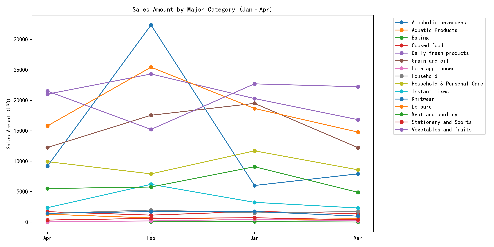
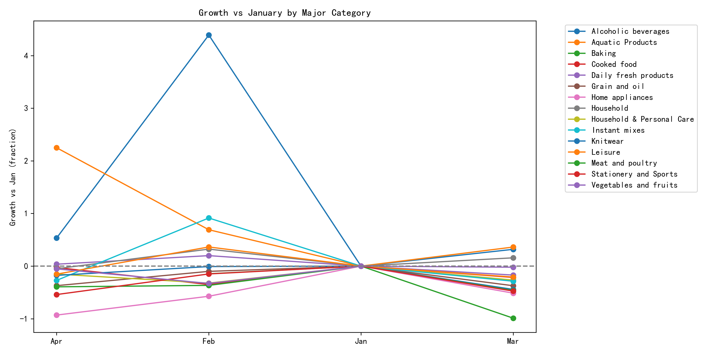

# Sales Trend & Customer Preference Shift Analysis (Jan–Apr)

## Executive Summary
Total sales vaulted 19.8% in February versus January, retreated 32.7% in March, and regained 9.3% in April—finishing 11.9% below the January baseline. Within this roller-coaster demand, customers re-allocated spend toward daily essentials and away from discretionary categories, signaling an inventory pivot for the May–August season.

## Key Findings

### 1. Category-level momentum
- **Vegetables & fruits** remain the #1 revenue driver ($21.5k in April) but slipped 5.3% vs January, losing share as produce prices stabilized.
- **Daily fresh products** grew 3.6% vs January and overtook Leisure to become the second-largest category, evidencing a flight to everyday staples.
- **Leisure** plummeted 15.3% vs January—the steepest decline—indicating shoppers are trimming non-essential spend.

  
*Sales amount by major category; Daily fresh and Vegetables & fruits hold the top slots while Leisure fades.*

### 2. Growth relativities
  
*Growth vs January baseline: Daily fresh products is the only top-3 category still expanding, whereas Vegetables & fruits and Leisure contract.*

### 3. Overall demand trajectory
Monthly totals: Jan $117.7k → Feb $141.1k → Mar $94.9k → Apr $103.7k. The March dip erased February’s spike, and April’s partial rebound still leaves revenue 12% under the opening month.

## Business Impact & Root Causes
- **Pantry-loading in February** (likely Lunar-New-Year effect) pulled forward demand, explaining March’s sharp pay-back.
- **Post-holiday belt-tightening** shifted baskets toward essential, perishable goods (Daily fresh) and away from discretionary treats (Leisure).
- **Produce deflation** suppressed Vegetables & fruits dollar sales despite steady volume, reinforcing the need for margin protection.

## Recommendations for May–August

### Inventory & Assortment
1. **Expand Daily fresh SKUs** (dairy, eggs, ready-to-eat salads) by 8–10% to ride the 3.6% growth trajectory.
2. **Rationalize Leisure inventory** 15% to avoid markdown risk; focus on high-turn core snacks and seasonal summer items.
3. **Lock in produce contracts** with price ceilings to safeguard Vegetables & fruits margins while maintaining promotional price points.

### Promotional Strategy
- Shift trade spend from Leisure multi-buys to cross-category meal solutions bundling Daily fresh + Vegetables & fruits.
- Introduce “Summer Fresh” loyalty multipliers May–August to entrench the essential-goods habit and lift basket size.

### Demand Planning
- Forecast May demand 5–7% above April baseline, June–August flat, assuming no repeat holiday spike.
- Build 2-week safety stock on Daily fresh to cover any supply volatility without increasing waste.

By aligning assortment and promotions with the clear consumer pivot toward everyday essentials, the business can stabilize topline and protect margin through the summer quarter.
