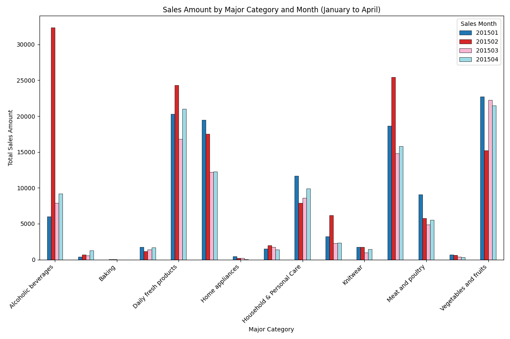

The bar chart above illustrates the **Sales Amount by Major Category and Month** for the period from January to April. Here are the key insights and recommendations:

### Key Observations:
1. **Vegetables and Fruits**: Sales remained relatively stable across the four months, indicating consistent customer demand.
2. **Grain and Oil**: A noticeable increase in sales was observed in April, suggesting a growing preference for these products.
3. **Daily Fresh Products**: This category showed fluctuating sales, with a peak in March, indicating seasonal or promotional impacts.

### Business Implications:
- **Stable Demand Categories**: Categories like *Vegetables and Fruits* require consistent inventory levels to meet ongoing demand.
- **Growing Categories**: The rise in *Grain and Oil* sales suggests an opportunity to increase inventory and shelf space for May–August.
- **Fluctuating Categories**: For *Daily Fresh Products*, closer monitoring of promotions and seasonal trends is recommended to optimize stock levels and reduce waste.

### Recommendations:
1. **Inventory Adjustment**: Increase stock for high-growth categories like *Grain and Oil* to capitalize on rising demand.
2. **Promotional Planning**: Align promotional activities for *Daily Fresh Products* based on historical peaks to drive sales further.
3. **Supply Chain Optimization**: Ensure stable supply for consistently demanded categories to avoid stockouts.

This analysis provides a roadmap for optimizing product categories and inventory for the upcoming months of May–August.
