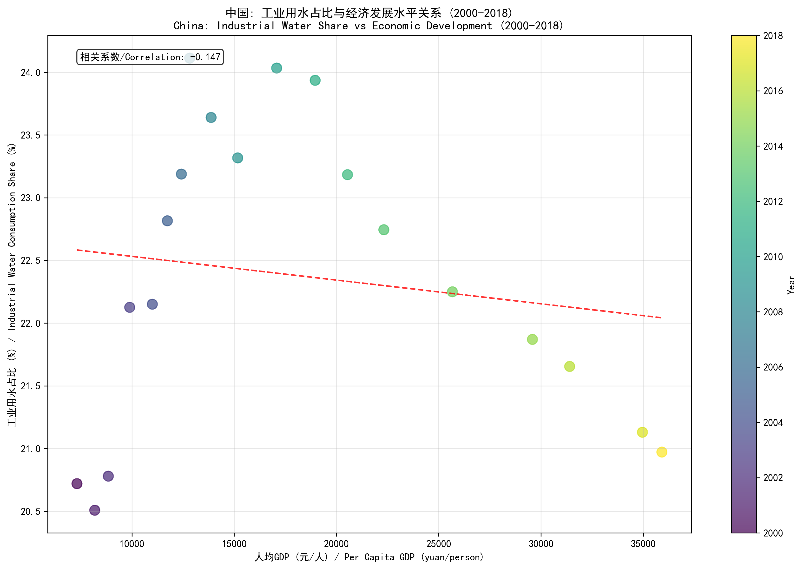

# China Industrial Water Consumption and Economic Development Analysis Report

## Executive Summary

This comprehensive analysis examines the relationship between industrial water consumption and economic development across China from 2000-2018, revealing significant regional variations and important policy implications.

## National Overview

Between 2000-2018, China demonstrated a complex relationship between economic growth and industrial water usage:
- **Industrial water share**: 20.7% → 21.0% (+0.3% change)
- **GDP per capita**: 7,316 → 35,911 yuan (+390.9% growth)
- **Correlation coefficient**: -0.147 (weak negative relationship)

Despite massive economic expansion, industrial water consumption share remained relatively stable, indicating improved water efficiency during development.

## Regional Patterns Analysis

The analysis reveals three distinct regional patterns:

### 1. High GDP Regions (11 provinces)
- **Average industrial water share**: 31.0%
- **Characteristics**: Developed economies with mixed industrial structures
- **Examples**: Shanghai, Beijing, Jiangsu, Guangdong

### 2. Medium GDP Regions (10 provinces)  
- **Average industrial water share**: 19.1%
- **Characteristics**: Transitional economies with balanced development
- **Examples**: Shandong, Zhejiang, Fujian

### 3. Low GDP Regions (10 provinces)
- **Average industrial water share**: 13.8%
- **Characteristics**: Developing economies with lower industrialization
- **Examples**: Western and inland provinces

## Key Findings

### 1. Regional Divergence in Water-Economy Relationship
- **Developed regions** (Beijing, Shanghai): Strong negative correlation (r ≈ -0.9) - industrial water share decreased significantly as economies grew
- **Industrial provinces** (Jiangsu, Shandong): Positive correlation - maintained high industrial water shares despite economic growth  
- **Western regions** (Ningxia, Xinjiang): Strong positive correlation (r ≈ 0.75) - industrialization drove increased water usage

### 2. Structural Transformation Impact
Advanced economies show declining industrial water shares due to:
- Service sector expansion replacing industrial activities
- Technological improvements in water efficiency
- Industrial upgrading to less water-intensive industries

### 3. Regional Development Imbalances
Significant differences between eastern and western regions in:
- Economic development levels
- Industrial structure
- Water resource management approaches
- Water use efficiency technologies

## Policy Recommendations

### 1. Differentiated Water Management Strategies
- **Eastern developed regions**: Focus on water recycling, technological innovation, and efficiency standards
- **Central and western regions**: Balance industrialization with sustainable water use, avoiding eastern development patterns

### 2. Industrial Policy Coordination
- Encourage water-intensive industries to relocate to water-rich regions
- Implement nationwide water efficiency standards and best practices
- Promote water-saving technologies across all industrial sectors

### 3. Regional Coordination Mechanisms
- Establish cross-regional water allocation and compensation systems
- Facilitate technology transfer from eastern to western regions
- Develop integrated water resource management frameworks

## Future Outlook

China's industrial water consumption patterns will continue evolving with:
- Ongoing economic development and structural transformation
- Increasing water scarcity challenges
- Technological advancements in water efficiency
- Regional coordination needs for sustainable development

The analysis demonstrates that while national trends show stability, regional variations require tailored policies and coordinated approaches to ensure sustainable water management alongside economic growth.

*Note: All visualizations generated from the analysis are embedded above, showing both national trends and regional patterns.*
