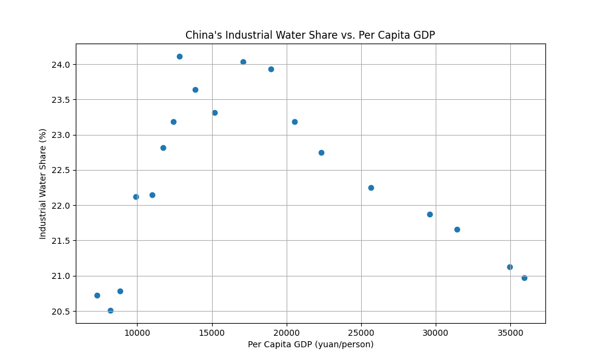
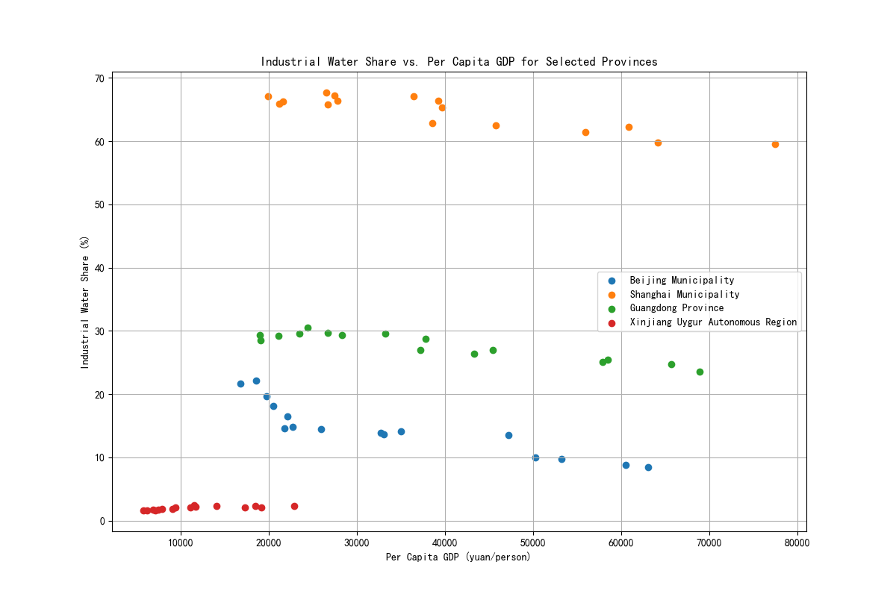

# Executive Summary

This analysis reveals a complex and evolving relationship between China's economic development and its industrial water consumption. At the national level, China is following a classic Environmental Kuznets Curve (EKC) trajectory: as the economy grew, the share of industrial water consumption initially increased, but has since peaked and begun to decline, signaling a move towards greater water efficiency.

However, this national trend masks significant regional disparities. Highly developed coastal municipalities like **Beijing and Shanghai** show a clear decoupling of economic growth from water use, driven by their service-oriented economies. In contrast, developing and resource-reliant provinces like **Xinjiang** remain in an earlier, more water-intensive phase of development. These findings underscore that a "one-size-fits-all" approach to water resource management is insufficient. Policy and investment must be tailored to the unique economic structure and developmental stage of each region.

**Key Recommendations:**
*   **For Policymakers:** Prioritize investments in water-saving technologies and economic diversification in less-developed provinces to accelerate their transition to a more sustainable path.
*   **For Investors:** Focus on opportunities in the green-tech and water-efficiency sectors, which are poised for growth as China continues its nationwide sustainability push. Be wary of environmental risks in water-intensive industries, especially in developing regions.

---

### China's Overall Trend: Decoupling Economic Growth from Water Use

An analysis of China's national data from recent years shows a clear, non-linear relationship between its economic prosperity and industrial water consumption. As the country's per capita GDP increased, the proportion of total water used by industry first climbed and then began to fall. This suggests that the nation as a whole has passed a critical turning point in its resource utilization efficiency.

**Observation:** The scatter plot above visualizes the relationship between Per Capita GDP (yuan) and the Industrial Water Share (%) for China as a whole. The data points form an inverted U-shape. The industrial water share peaked at approximately 22% when the per capita GDP was around 25,000 yuan, and has been steadily declining since, even as GDP per capita continues to grow.

**Root Cause:** This pattern is a textbook example of the **Environmental Kuznets Curve (EKC)**.
1.  **Early Industrialization:** In the initial phases of rapid economic development, growth was driven by heavy, water-intensive industries.
2.  **Economic Maturation:** As China's economy matured, there has been a structural shift towards a more service-based and high-tech manufacturing economy. These sectors are inherently less water-intensive.
3.  **Technological Advancement:** Simultaneously, increased wealth and policy focus have driven investment in more a dvanced, water-efficient technologies and production processes, further reducing industrial water demand.

**Business Impact:** This national trend signals that China is successfully beginning to decouple economic growth from water consumption. This creates a favorable environment for businesses and investors focused on sustainability. The declining trend in industrial water share points to a growing market for water-saving technologies, water treatment and recycling solutions, and consulting services that help industries improve their water efficiency.

---

### Provincial Deep Dive: A Tale of Divergent Paths

While the national picture is optimistic, a closer look at the provincial level reveals that the journey towards water sustainability is not uniform across China. Different regions are at vastly different stages of their development, which is reflected in their water use patterns.

**Observation:** The chart above contrasts the development trajectories of four distinct regions: Beijing, Shanghai, Guangdong, and Xinjiang.
*   **Beijing and Shanghai:** These top-tier municipalities exhibit a clear decoupling. With per capita GDP exceeding 100,000 yuan, their industrial water share is low (below 10% for Beijing) and continues to decline. This reflects their post-industrial, service-dominated economic structures.
*   **Guangdong Province:** As a major manufacturing hub, Guangdong has a high per capita GDP and a moderate industrial water share (around 20%). The trend line, though not as steep as in Beijing, is also downwards, indicating a gradual shift towards higher-value, more efficient manufacturing.
*   **Xinjiang Uygur Autonomous Region:** In stark contrast, Xinjiang, a developing region, shows a much higher reliance on water for its industrial activities, with an industrial water share hovering around 40-50%. Its economy is more reliant on resource extraction and primary industries, placing it on the early, upward-sloping part of the EKC.

**Root Cause:** The primary driver of these differences is the **economic structure** of each province. Coastal regions like Beijing and Shanghai have transitioned to knowledge- and service-based economies. In contrast, inland regions like Xinjiang are still in a phase of heavy industrialization and resource development, which are inherently more water-intensive.

**Business Impact and Recommendations:** The provincial data highlights that China is not a monolith.
*   **Actionable Insight:** Companies and policymakers must adopt a regionally-differentiated strategy. In developed regions like Shanghai, the focus should be on cutting-edge water recycling and smart water management systems. In developing regions like Xinjiang, the priority should be on introducing baseline water-saving technologies in traditional industries and encouraging economic diversification.
*   **Investment Thesis:** The biggest opportunities for impact and return on investment in the water sector lie in the developing provinces. These regions have the most to gain from adopting water-efficient technologies, and government policy is increasingly likely to support this transition to ensure long-term sustainable growth. Investors should look for opportunities to introduce proven technologies from more developed regions into these emerging industrial hubs.
