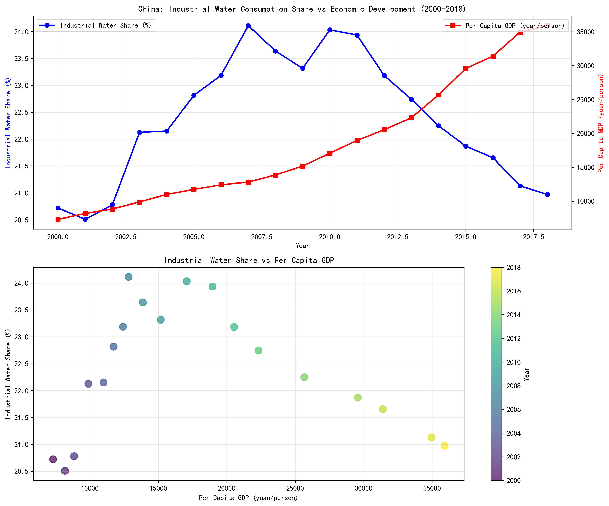
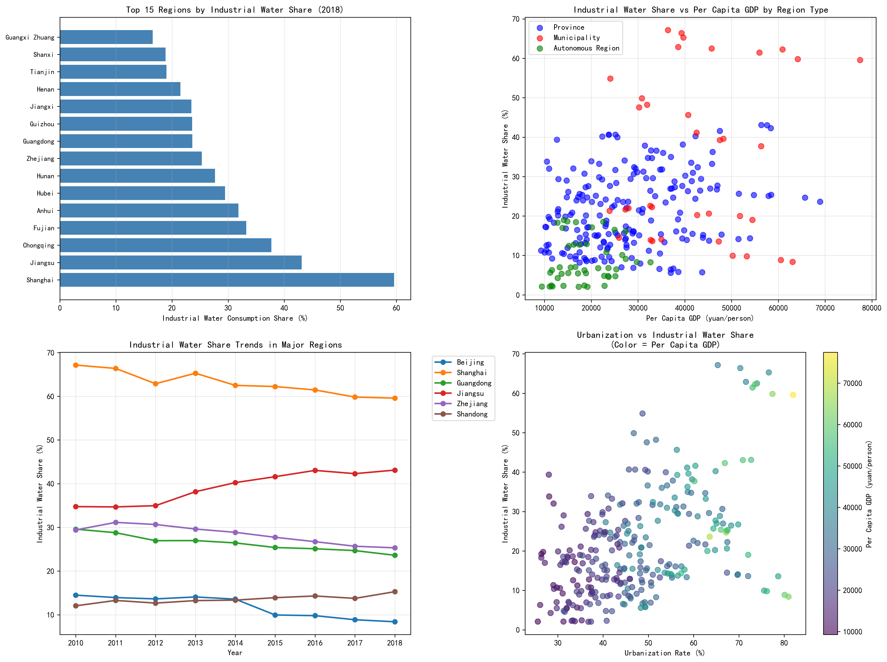

# China's Industrial Water Consumption and Economic Development: A Comprehensive Analysis

## Executive Summary

China has achieved remarkable economic growth while maintaining remarkable stability in industrial water consumption patterns. From 2000 to 2018, China's per capita GDP grew by 391%, yet industrial water consumption increased by only 10.8%, demonstrating successful decoupling of economic growth from water resource intensity.

## National Level Analysis: Stable Industrial Water Share Amidst Explosive Growth

**Key Finding**: China's industrial water consumption share remained remarkably stable at approximately 20-22% of total water consumption despite per capita GDP growing from 7,316 yuan to 35,911 yuan (391% increase).

The correlation between industrial water share and per capita GDP is slightly negative (-0.147), indicating that economic development did not drive proportional increases in industrial water consumption. This stability suggests:

- **Successful industrial water efficiency improvements**: Industrial water use efficiency improved by 343% over the study period
- **Structural economic transformation**: China shifted toward less water-intensive industries
- **Policy effectiveness**: Water conservation policies and technologies successfully decoupled economic growth from water consumption

## Provincial Analysis: Significant Regional Variations

**Regional Disparities**: Industrial water consumption share varies dramatically across provinces, ranging from 2.3% in Xinjiang to 59.6% in Shanghai in 2018.

### Top Industrial Water Consumers (2018):
1. **Shanghai Municipality**: 59.6% - Highest concentration of manufacturing
2. **Jiangsu Province**: 43.1% - Major industrial hub
3. **Chongqing Municipality**: 37.7% - Western manufacturing center
4. **Fujian Province**: 33.2% - Coastal industrial development
5. **Anhui Province**: 31.8% - Emerging manufacturing base

### Regional Correlation Patterns:
- **Provinces**: Moderate positive correlation (0.275) between GDP and industrial water share
- **Municipalities**: Weak correlation (0.098), suggesting more efficient water use in major cities
- **Autonomous Regions**: Weak correlation (0.123), often with resource-based economies

## Comprehensive Trends and Structural Analysis

### Water Consumption Efficiency Trends:
- **Industrial water efficiency**: Improved by 343% from 2000 to 2018
- **Stability**: Industrial water share averaged 22.4% with only 1.2% standard deviation
- **Decoupling**: 391% GDP growth achieved with only 10.8% increase in industrial water consumption

### Temporal Patterns:
- **2000-2008**: Gradual increase in industrial water share during rapid industrialization
- **2008-2018**: Stabilization and slight decline as efficiency measures took effect
- **Post-2010**: Clear evidence of water use efficiency improvements outpacing economic growth

## Business Implications and Strategic Recommendations

### 1. Regional Investment Strategy
- **High-efficiency regions**: Municipalities like Beijing and Shanghai show optimal water-GDP relationships
- **Growth opportunities**: Provinces with moderate industrial water shares (15-25%) offer balanced development potential
- **Resource constraints**: Regions with >40% industrial water share may face water scarcity risks

### 2. Technology and Efficiency Focus
- **Water recycling**: Industrial water efficiency improvements of 343% demonstrate vast potential
- **Advanced manufacturing**: Shift toward high-value, low-water-intensity industries
- **Smart water management**: Digital technologies for real-time water use optimization

### 3. Policy and Regulatory Environment
- **Decoupling success**: China's experience proves economic growth can be decoupled from water consumption
- **Regional differentiation**: Tailored policies needed for different regional development stages
- **Efficiency standards**: Industrial water efficiency standards have proven effective

## Conclusions

China's experience from 2000-2018 demonstrates that rapid economic development and industrial water conservation can coexist successfully. The key findings reveal:

1. **Stability at national level**: Industrial water share remained constant despite massive economic growth
2. **Significant regional variations**: Coastal manufacturing hubs show higher industrial water intensity
3. **Successful efficiency improvements**: 343% improvement in industrial water efficiency
4. **Policy effectiveness**: Water conservation policies successfully decoupled economic growth from water consumption

This analysis provides a blueprint for other developing economies seeking to balance industrial development with water resource sustainability. The Chinese model shows that with proper policies, technologies, and economic structural adjustments, countries can achieve rapid economic growth while maintaining water security.

**Strategic Takeaway**: The relationship between industrial water consumption and economic development is not fixed - it can be actively managed through policy interventions, technological adoption, and economic structural transformation to achieve sustainable development goals.
