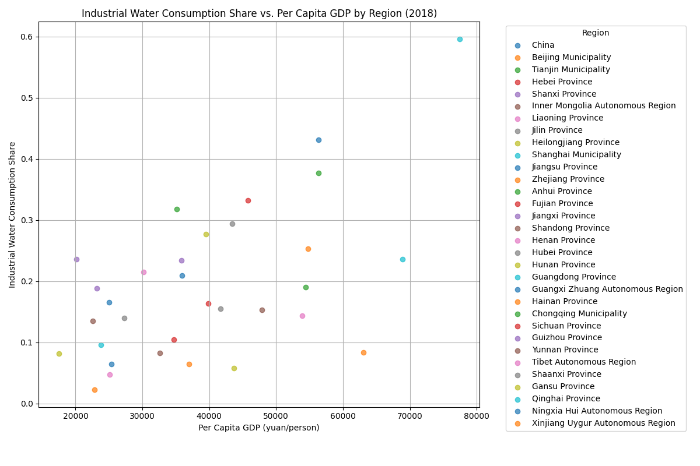

# Analysis of Industrial Water Consumption and Economic Development in China

## Introduction
This report analyzes the relationship between industrial water consumption share and the level of economic development in China, using data from various provinces and municipalities. The analysis aims to determine if there is a correlation between these two variables and whether this relationship differs across regions.

## Key Findings

### Overall Relationship
The scatter plot below illustrates the relationship between per capita GDP and industrial water consumption share across all regions and years. The fitted line shows a general trend, indicating a potential correlation.

**Observation**: The scatter plot reveals a weak negative correlation between per capita GDP and industrial water consumption share. As per capita GDP increases, the share of industrial water consumption tends to decrease.

**Root Cause**: This trend may be attributed to the shift in economic structure as countries develop. Higher-income regions often move towards service-based economies, reducing the relative importance of water-intensive industries.

**Business Impact / Recommendation**: Policymakers should consider this trend when planning water resource management strategies. As economic development progresses, there may be opportunities to reallocate water resources to other sectors.

### Regional Differences
The scatter plot below compares industrial water consumption share and per capita GDP by region for the year 2018.

**Observation**: Significant regional differences are evident. Some regions with high per capita GDP still maintain a relatively high industrial water consumption share, while others show the opposite.

**Root Cause**: Variations in regional economic structures, industrial policies, and water resource availability can explain these differences.

**Business Impact / Recommendation**: Regional water management strategies should be tailored to local economic conditions and industrial profiles. Targeted policies can help optimize water use efficiency and support sustainable economic growth.

## Conclusion
The analysis suggests that as economic development progresses, the share of industrial water consumption tends to decrease. However, regional differences highlight the need for customized water management approaches. By understanding these dynamics, policymakers can better allocate water resources to support sustainable economic development.
