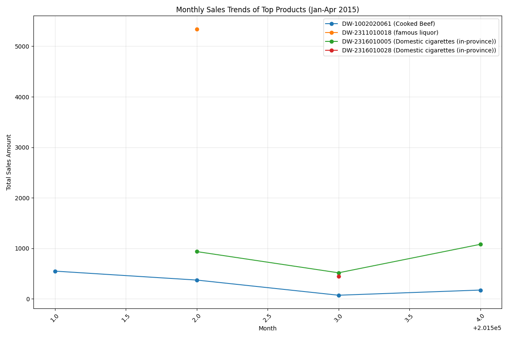
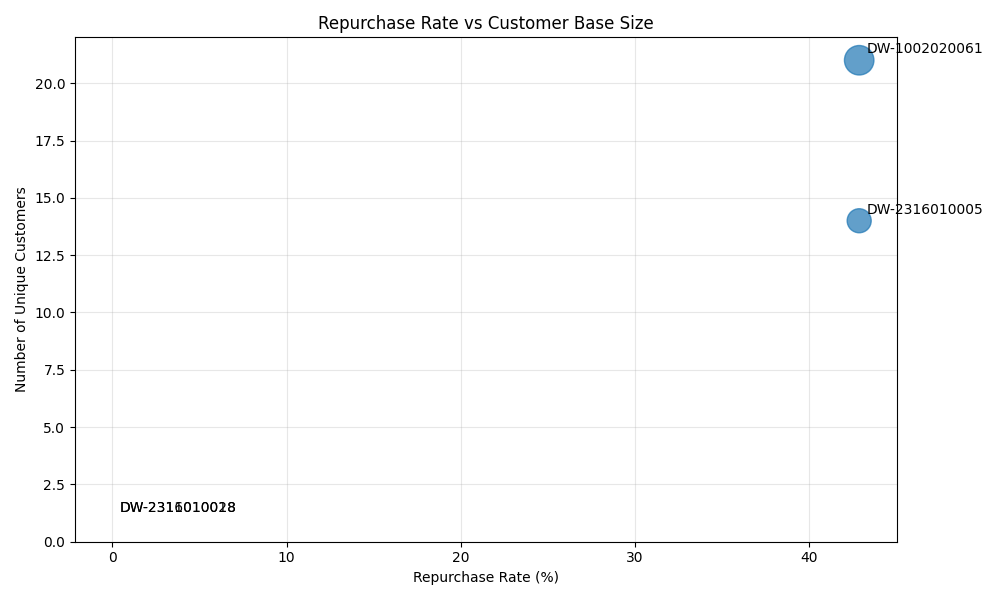

# Monthly Product Performance Analysis: Sales Trends and Repurchase Patterns

## Executive Summary

Our analysis of the January-April 2015 sales data reveals significant insights about top-performing products, their monthly sales patterns, and the crucial relationship between customer loyalty and sales performance.

## Monthly Top Performers Analysis

The highest-selling products by month show diverse performance patterns:

- **January 2015**: DW-1002020061 (Cooked Beef) with ¥481.60 in a single transaction
- **February 2015**: DW-2311010018 (Famous Liquor) with an exceptional ¥5,340.00 sale
- **March 2015**: DW-2316010028 (Domestic Cigarettes) with ¥450.00
- **April 2015**: DW-2316010005 (Domestic Cigarettes) with ¥480.00

The visualization reveals that while some products achieve massive single transactions (like the famous liquor in February), others demonstrate more consistent monthly performance. Cooked beef shows the most stable sales pattern across all four months.

## Product Performance Deep Dive

### Cooked Beef (DW-1002020061)
- **Total Transactions**: 26 sales across 4 months
- **Average Sale**: ¥44.93 per transaction
- **Customer Base**: 21 unique customers with 9 repeat buyers (42.9% repurchase rate)
- **Monthly Trend**: Consistent performance with January peak (¥549.28 total)

### Domestic Cigarettes (DW-2316010005)
- **Total Transactions**: 18 sales across 3 months
- **Average Sale**: ¥140.67 per transaction
- **Customer Base**: 14 unique customers with 6 repeat buyers (42.9% repurchase rate)
- **Monthly Trend**: Strong growth from ¥936.00 in February to ¥1,080.00 in April

### Premium Products Analysis
The famous liquor (¥5,340 single sale) and premium cigarettes (¥450 single sale) represent high-value but infrequent purchases with zero repurchase rates, indicating these are likely one-time luxury purchases.

## Repurchase Rate vs Sales Performance

Our analysis reveals a strong correlation between repurchase rates and sustainable sales performance:

1. **High Repurchase Products** (42.9% rate): Both cooked beef and domestic cigarettes show strong customer loyalty, driving consistent monthly revenue
2. **One-Time Luxury Purchases**: Premium liquor and cigarettes generate high individual sales but lack repeat business
3. **Customer Base Size**: Products with larger customer bases (21 and 14 customers) naturally generate more repeat business opportunities

## Key Business Insights

### Observation 1: Consistency Over Spikes
Products with moderate but consistent sales (cooked beef) outperform luxury items in long-term revenue stability despite lower individual transaction values.

### Observation 2: The 42.9% Loyalty Benchmark
Both cooked beef and domestic cigarettes achieved identical 42.9% repurchase rates, suggesting this may represent an optimal loyalty threshold for this product category.

### Observation 3: Luxury vs Everyday Products
High-value luxury items generate impressive single transactions but lack the customer loyalty needed for sustainable growth.

## Recommendations

1. **Focus on Loyalty Programs**: Invest in customer retention strategies for products showing high repurchase potential
2. **Product Bundling**: Consider pairing high-value luxury items with everyday products to increase overall purchase frequency
3. **Inventory Optimization**: Maintain consistent stock levels for products demonstrating stable monthly demand patterns
4. **Customer Segmentation**: Develop targeted marketing for repeat customers of high-loyalty products to maximize lifetime value

The data clearly shows that while occasional luxury purchases provide revenue spikes, sustainable growth comes from products that build customer loyalty and repeat business.
