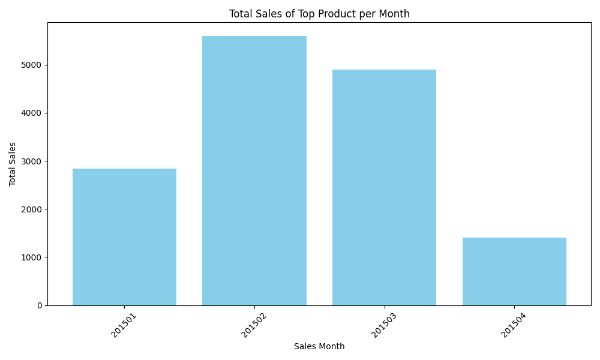
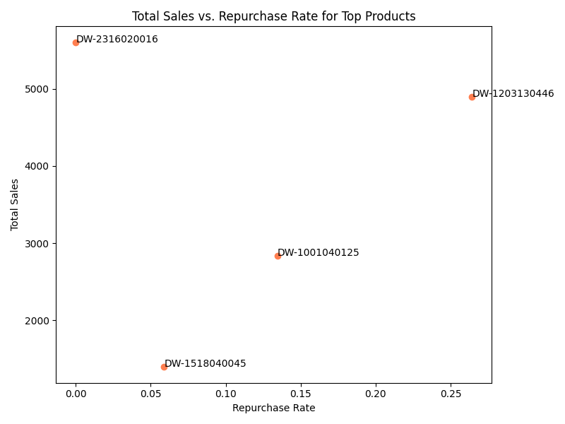

# Analysis of Monthly Top Products and Repurchase Rates

## Executive Summary

This report analyzes the top-selling products for each month from January to April 2015. The analysis reveals that while some products achieve high sales, this doesn't always correlate with customer loyalty (repurchase rate). We've identified that the product with the highest sales had a 0% repurchase rate, while another product with high sales had the highest repurchase rate. This suggests different drivers for sales success. Our key recommendation is to focus on strategies that drive both high sales and customer loyalty, rather than just focusing on short-term sales boosts.

## Monthly Top Selling Products

Each month, a different product emerged as the top seller, indicating a dynamic market. The bar chart below illustrates the total sales of the top product for each month.

As the chart shows, the top-selling product's sales varied significantly month-to-month. The peak was in February 2015, with product **DW-2316020016** reaching **$5,600** in sales. This was followed by a significant drop in the sales of the top product in the following months. This volatility suggests that the top-seller position is not stable and might be influenced by transient factors like promotions or seasonal demand.

## Repurchase Analysis of Top Products

To understand customer loyalty, we analyzed the repurchase rate of the top-selling products. The repurchase rate is the percentage of customers who bought a product more than once. The scatter plot below shows the relationship between total sales and the repurchase rate for the top products.

The analysis reveals some interesting insights:

*   **Product DW-1203130446**: This product had the second-highest sales (**$4,893.62**) and the highest repurchase rate (**26.4%**). This indicates that the product is not only a top seller but also has a loyal customer base.
*   **Product DW-2316020016**: This product had the highest sales (**$5,600**) but a **0%** repurchase rate. This suggests that the high sales were likely driven by one-time purchases, possibly due to a large discount or a specific need that doesn't lead to repeat business.
*   **Product DW-1001040125**: This product had moderate sales (**$2,836.46**) and a moderate repurchase rate (**13.5%**).
*   **Product DW-1518040045**: This product had the lowest sales among the top sellers (**$1,400.30**) and a low repurchase rate (**5.9%**).

This analysis highlights that high sales do not necessarily imply high customer loyalty.

## Recommendations

Based on this analysis, we recommend the following:

1.  **Investigate the drivers of high sales with low repurchase rates**: For products like **DW-2316020016**, it's crucial to understand what drove the high sales. If it was a promotion, the business should evaluate the long-term profitability of such promotions. If it was a large one-time purchase, the business should explore opportunities for similar deals.

2.  **Focus on products with high repurchase rates**: Products like **DW-1203130446** represent a sustainable source of revenue. The business should focus on marketing and promoting these products to a wider audience to leverage their proven customer loyalty. Further analysis could be done to understand the profile of the loyal customers for this product.

3.  **Develop strategies to increase repurchase rates for other products**: For products with moderate to low repurchase rates, the business should consider strategies to encourage repeat purchases. This could include loyalty programs, targeted email marketing, or subscription models.

By focusing on both sales volume and customer loyalty, the business can build a more sustainable and profitable product portfolio.
