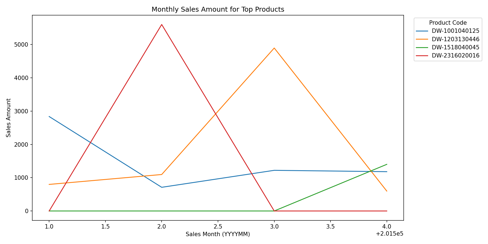
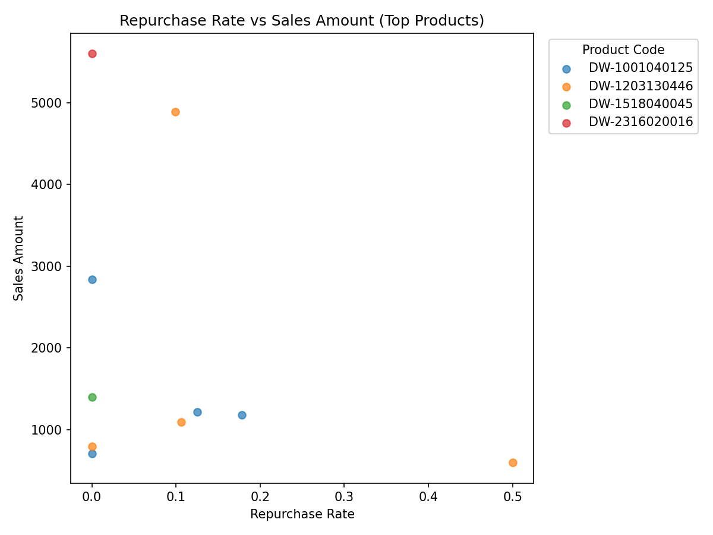

Executive Summary

• Each month has a distinct top-selling product, and the top product contributes between 1.35% and 5.16% of monthly sales—this concentration is relatively low, indicating broad sales distribution across the catalog.
• Repurchase rates for these top product-months are mostly 0%, with only March showing 9.94% repeat customers—high sales appear driven by first-time buyers rather than repeat purchasing.
• Across months, top products peak in different periods (Feb/March), and the overall relationship between repurchase rate and sales amount across top products is modestly negative (correlation −0.311), suggesting acquisition-driven spikes.

Dataset & Methods
• Source: SQLite table sheet1 with columns including Sales Month, Product Code, Sales Amount, Customer ID, and Is Promotional.
• Steps: Python pandas grouped monthly sales by Product Code, identified the top product per month, computed monthly totals and shares, calculated repurchase rate for product-months (repeat customers ÷ unique customers who previously purchased the same product in earlier months), and built two plots.
• Visuals created via matplotlib and saved in current directory: top_products_monthly_sales.png and repurchase_vs_sales.png.

1) Top Product per Month (Product Code + Sales Amount)
Observation: For each month, the product with the highest Sales Amount is:
• 201501: Product Code DW-1001040125 with Sales Amount 2,836.46.
• 201502: Product Code DW-2316020016 with Sales Amount 5,600.00.
• 201503: Product Code DW-1203130446 with Sales Amount 4,893.62.
• 201504: Product Code DW-1518040045 with Sales Amount 1,400.30.

Supporting fields/steps: Calculated via pandas groupby on Sales Month and Product Code and picking the max Sales Amount per month.
Root Cause: Monthly demand concentrates on different SKUs depending on seasonality, availability, and category dynamics.
Business Impact/Recommendation: Track inventory and marketing around these SKUs in their peak months; ensure availability and targeted promotions to maximize revenue during peak demand.

Top Product Share of Monthly Sales
Observation: The top product contributes a relatively small share of the month’s total sales.
• 201501: 2,836.46 out of 117,708.72 (2.41%).
• 201502: 5,600.00 out of 141,065.00 (3.97%).
• 201503: 4,893.62 out of 94,888.77 (5.16%).
• 201504: 1,400.30 out of 103,727.90 (1.35%).
Root Cause: Sales are diversified across many products; the catalog contributes broadly rather than relying on one hero SKU.
Business Impact/Recommendation: Diversified revenue lowers risk, but also means growth must come from scaling many SKUs; prioritize a curated set of high-potential products for growth initiatives (assortment optimization, demand forecasting, and targeted campaigns).

2) Performance Across Months for Top Products
Observation: The top products show distinct monthly peaks and limited persistence across months.
• DW-2316020016 peaks in February at 5,600.00.
• DW-1203130446 peaks in March at 4,893.62.
• DW-1001040125 peaks in January at 2,836.46.
• DW-1518040045 peaks in April at 1,400.30.
Why it matters: Peaks are staggered, indicating opportunities to align merchandising and stock planning to month-specific demand.
Visual: Monthly sales trends for these products show their peaks and variability. 
Key takeaway: Each top product dominates in a different month, reaching exact peaks listed above; no single product sustains dominance across all months, so planning should be month-specific.

Supporting fields/steps: Calculated monthly_sales pivot using pandas and plotted with matplotlib.
Root Cause: Likely seasonality/category rotation; customers’ needs differ by month.
Business Impact/Recommendation: Build a rolling monthly calendar for these SKUs—secure inventory ahead of peak months, rotate promotional focus, and plan cross-sell bundles that match seasonal demand.

3) Repurchase Rate vs Sales Amount
Observation: Repurchase rates for monthly top product entries are generally low.
• 201501 DW-1001040125: unique customers 45, repeat 0, repurchase rate 0.00.
• 201502 DW-2316020016: unique customers 2, repeat 0, repurchase rate 0.00.
• 201503 DW-1203130446: unique customers 161, repeat 16, repurchase rate 9.94%.
• 201504 DW-1518040045: unique customers 34, repeat 0, repurchase rate 0.00.
Observation: Overall relationship across months for top products shows a negative correlation of −0.3109 between repurchase rate and Sales Amount.
Why it matters: High sales for these SKUs appear driven by first-time buyer acquisition surges, not repeat purchases, suggesting untapped retention potential.
Visual: Scatter plot shows the spread by product code across months. 
Key takeaway: Months with high Sales Amount do not coincide with high repurchase rates; March’s 9.94% is the only instance of meaningful repeat activity.

Supporting fields/steps: Repurchase rate computed by tracking each Customer ID’s prior purchases of the same Product Code in earlier months; merged with monthly Sales Amount and plotted.
Root Cause: Products may be impulse or seasonal buys, or customers lack nudges for repeat purchases.
Business Impact/Recommendation:
• Retention plays: implement post-purchase reminders, subscription or auto-replenish programs for eligible products, and loyalty incentives to convert first-time buyers into repeat customers.
• CRM segmentation: target customers who purchased top products in their peak months with tailored offers 2–4 weeks later.
• Product-level tactics: test value packs or bundles for top SKUs to encourage habit formation and repeat buying.

4) Promotional Effects
Observation: Promotional share for each monthly top product-month is 0% (all Full price in these observations).
Why it matters: Top product peaks were achieved without discounting; margin preservation is strong, but promotions weren’t used to drive repeat behavior.
Business Impact/Recommendation: Use targeted, light-touch promotions (e.g., loyalty points or bundle discounts) after peak months to stimulate repurchase without eroding margin on initial sales.

Operational Checklist
• Monitor the four top SKUs monthly and align inventory, shelf placement, and digital merchandising with expected peaks.
• Create automated CRM triggers for purchasers of these SKUs to nudge repurchase at expected replenishment intervals.
• Track cohort-level repeat rates by product and month; set a KPI to lift repurchase rate from ~0–10% to ≥15% for peak SKUs.
• Run A/B tests on post-purchase offers to quantify lift in repurchase and ensure margin discipline.

Notes on Analysis
• Data fields used: Sales Month, Product Code, Sales Amount, Customer ID, Is Promotional.
• Methods: pandas groupby for monthly top products, monthly total share, and repurchase calculation; matplotlib for line and scatter plots. Plots saved in current directory as top_products_monthly_sales.png and repurchase_vs_sales.png.
• Code executed in this analysis included loading from SQLite, deriving monthly aggregates, computing repurchase flags, and plotting visuals.

Conclusion
• The top product varies month to month (DW-1001040125, DW-2316020016, DW-1203130446, DW-1518040045) with Sales Amounts of 2,836.46, 5,600.00, 4,893.62, and 1,400.30 respectively.
• Peaks are acquisition-driven and not promotion-led; repurchase rates are mostly 0%, with one notable month at 9.94%. The correlation of −0.311 between repurchase rate and Sales Amount underscores a growth opportunity in retention.
• Focus on month-specific merchandising and structured retention programs to convert peak-month buyers into repeat customers, improving LTV without heavy discounting.
