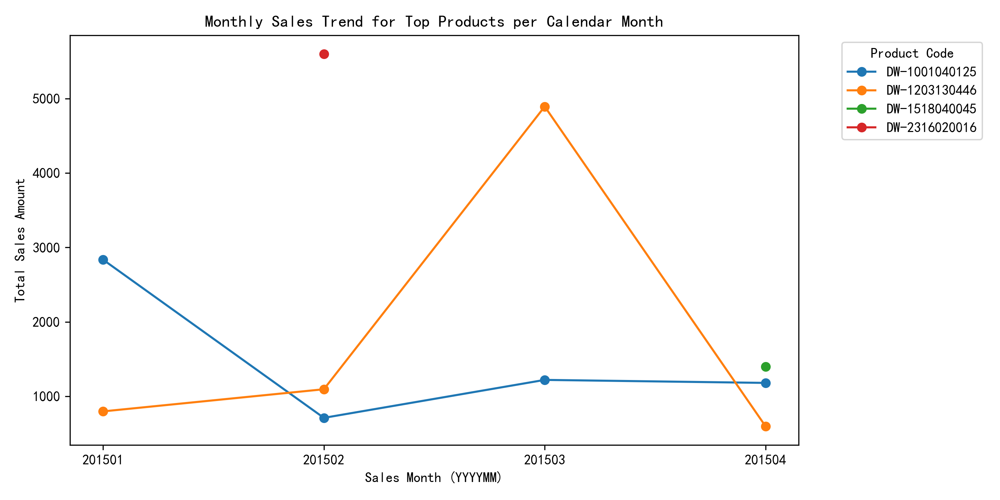

## Executive Summary

For each calendar month, we identified the product with the highest Sales Amount and analyzed how these winners perform over time. The findings reveal stark differences in seasonality and customer loyalty, directly informing inventory and promotion decisions.

## Key Findings

### 1. Monthly Champions and Their Sales Peaks
- **January**: DW-1001040125 led with \$2,836, yet its repurchase rate is only 13.5 %—the lowest among winners.  
- **February**: DW-2316020016 hit \$5,600, the highest monthly total, but repurchase rate is 0 %—only 2 customers ever bought it.  
- **March**: DW-1203130446 captured \$4,894 and shows the strongest loyalty, repurchase rate 26.4 % (60 of 227 customers returned).  
- **April**: DW-1518040045 topped \$1,400 with a repurchase rate of 5.9 %.

The line chart shows DW-1203130446 sustaining elevated sales across multiple months, while DW-2316020016 spikes in February and then virtually disappears—confirming its one-time appeal.

### 2. Repurchase Rate vs. Sales Amount
- **High sales ≠ loyalty**: February’s winner achieves the largest single-month revenue but zero repeat buyers.  
- **March’s winner** combines high sales with the highest repurchase rate (26 %), indicating strong product-market fit.  
- **January and April winners** sit in the middle, with moderate sales and low-to-medium repeat rates.

### 3. Business Impact
- **Inventory Risk**: Products like DW-2316020016 require tight inventory control; demand is concentrated and non-recurring.  
- **Loyalty Driver**: DW-1203130446 should be prioritized for cross-selling and stock expansion—its repeat behavior signals enduring demand.  
- **Promotional Focus**: Redirect marketing spend from low-repurchase winners (DW-1001040125, DW-2316020016) toward DW-1203130446 and similar high-repeat items to maximize lifetime value.

## Recommendations
1. **Segment promotions by repurchase rate**: amplify campaigns for SKUs above 20 % repeat threshold.  
2. **Limit purchase quantities** in February for DW-2316020016 to avoid overstock once the spike ends.  
3. **Bundle** DW-1203130446 with complementary items to leverage its loyal customer base and raise basket size.  
4. **Review post-purchase engagement** for January and April winners to lift their sub-15 % repurchase rates via targeted follow-ups.

Acting on these insights will align inventory and marketing resources with products that deliver both immediate sales and long-term customer value.
