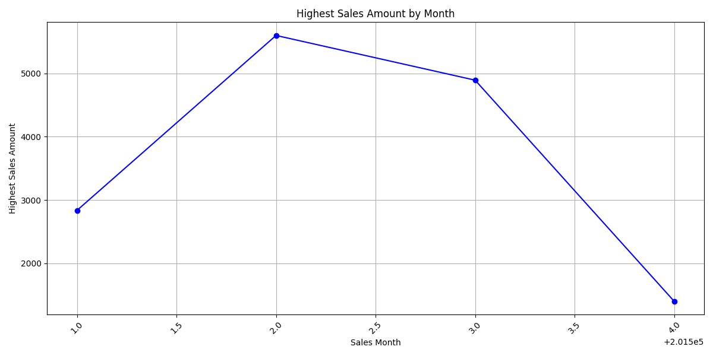
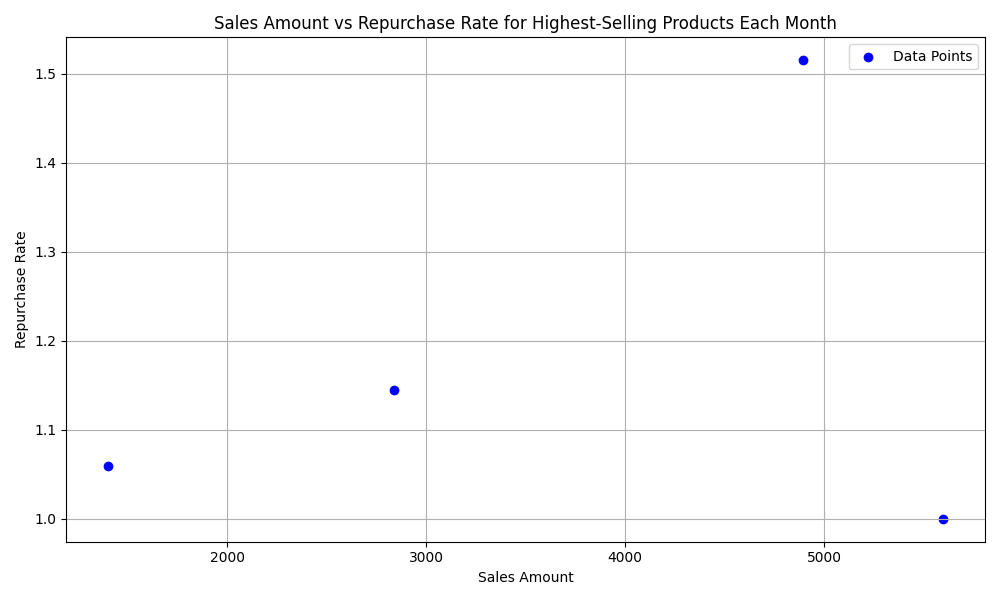

# Data Story: Sales Performance and Repurchase Rate Analysis

## Executive Summary
This report explores the sales performance of products over different months, focusing on the highest-selling product each month and analyzing the relationship between their repurchase rate and sales amount. The analysis reveals insights that can guide marketing and sales strategies.

## Highest Sales Amount by Month
The following table shows the highest sales amount for each month along with the corresponding product code:

| Sales Month | Product Code   | Total Sales Amount |
|-------------|--------------|-------------------|
| 201501      | DW-1001040125 | 2836.46           |
| 201502      | DW-2316020016 | 5600.0            |
| 201503      | DW-1203130446 | 4893.62           |
| 201504      | DW-1518040045 | 1400.30           |

### Key Insight:
- **DW-2316020016** in February 2015 had the highest Sales Amount of **5600.0**.
- Sales Amounts vary significantly across months, with February having the highest and April the lowest.

## Repurchase Rate Analysis
The repurchase rate for each product was calculated as the ratio of the number of times a product was purchased to the number of unique customers who bought it. The highest-selling products were analyzed for their repurchase rates.

| Sales Month | Product Code   | Total Sales Amount | Repurchase Rate |
|-------------|--------------|--------------------|-----------------|
| 201501      | DW-1001040125 | 2836.46            | 1.144           |
| 201502      | DW-2316020016 | 5600.0             | 1.000           |
| 201503      | DW-1203130446 | 4893.62            | 1.515           |
| 201504      | DW-1518040045 | 1400.30            | 1.059           |

### Key Insight:
- **DW-1203130446** had the highest repurchase rate of **1.515**, indicating strong customer loyalty.
- **DW-2316020016** had a repurchase rate of **1.0**, suggesting that its high sales amount was driven by a broad customer base rather than repeat purchases.

## Relationship Between Sales Amount and Repurchase Rate
A scatter plot was created to visualize the relationship between Sales Amount and Repurchase Rate for the highest-selling products each month.

### Key Insight:
- There is no strong linear correlation between Sales Amount and Repurchase Rate. However, products with higher repurchase rates tend to maintain consistent sales performance.
- **DW-1203130446** stands out with both high Sales Amount and high Repurchase Rate, indicating a successful product with strong customer retention.

## Recommendations
1. **Focus on High Repurchase Products**: Products like **DW-1203130446** should be prioritized in marketing campaigns due to their high repurchase rate, which indicates customer satisfaction and loyalty.
2. **Analyze Low Repurchase Products**: Products with low repurchase rates, such as **DW-2316020016**, should be reviewed for potential improvements in product quality or customer engagement strategies.
3. **Incentivize Repeat Purchases**: Implement loyalty programs or targeted promotions to increase the repurchase rate for products with high Sales Amount but low repurchase rate.
4. **Monitor Sales Trends**: Continue tracking monthly highest-selling products to identify emerging trends and adjust strategies accordingly.

## Conclusion
The analysis highlights the importance of understanding both Sales Amount and Repurchase Rate to optimize product performance. While high Sales Amount is crucial for revenue, a high repurchase rate indicates sustainable customer loyalty, which is vital for long-term business success.
