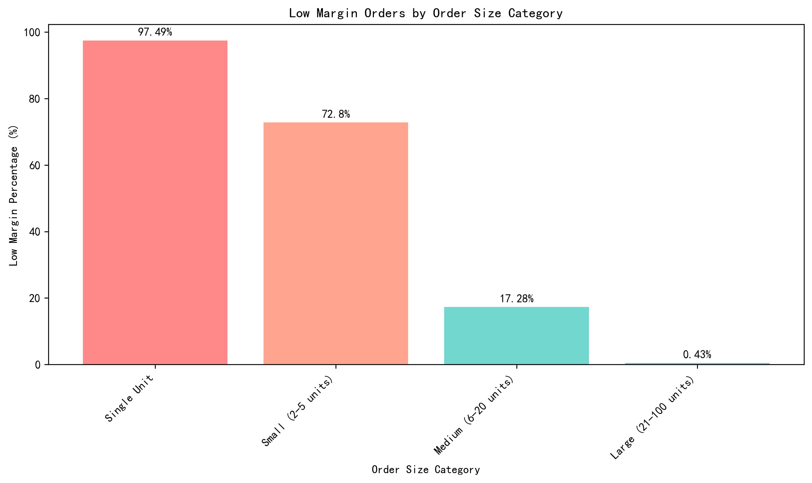
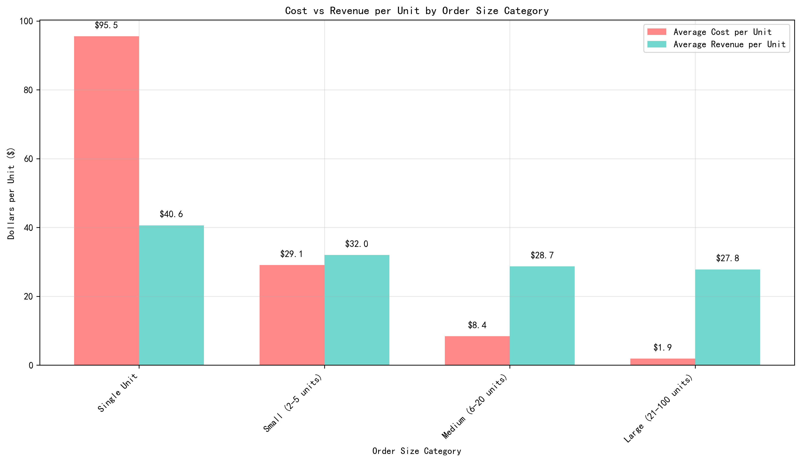
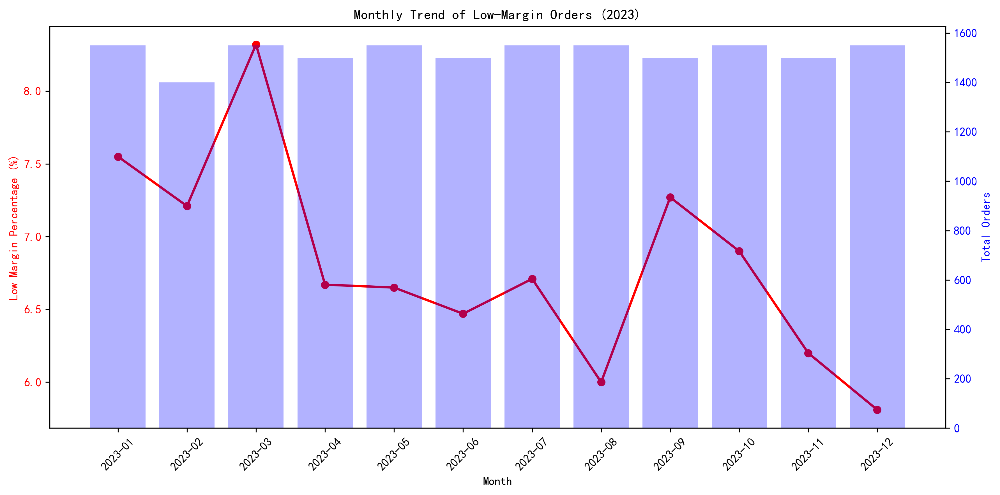
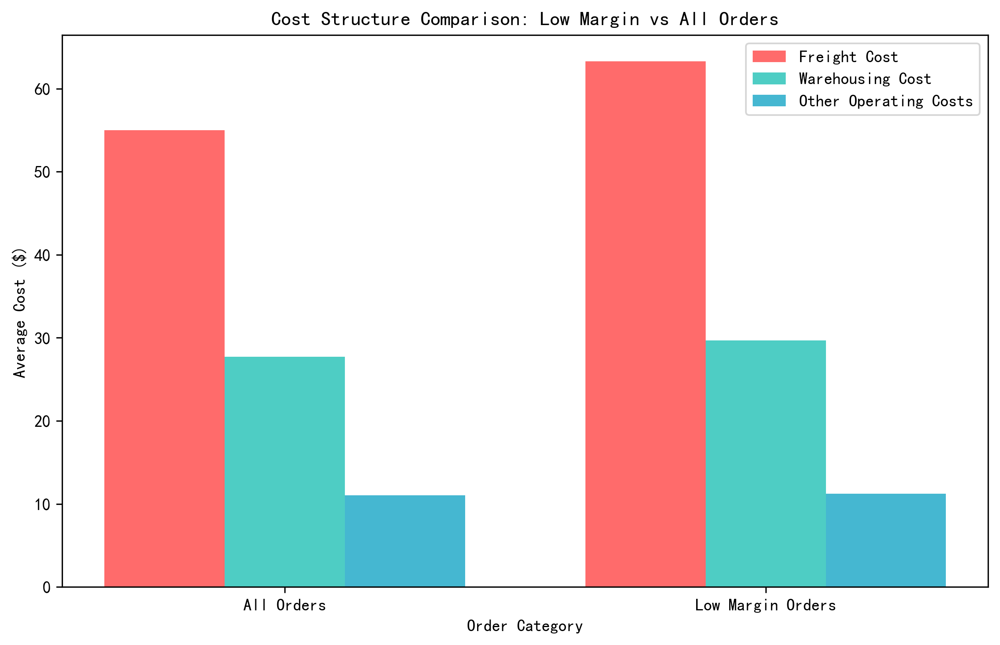

# Low-Margin Order Analysis: Root Causes and Strategic Recommendations

## Executive Summary

Our analysis of 18,250 logistics orders reveals that **6.81% (1,243 orders)** are low-margin, defined as orders with profit margins below 39.8% (50% of the dataset average of 79.5%). The primary driver of low profitability is **small order sizes**, with single-unit orders showing a staggering **97.5% low-margin rate** and small orders (2-5 units) at **72.8%**.

## Key Findings

### 1. Order Size is the Primary Profitability Driver

The relationship between order size and profitability is dramatic:
- **Single Unit Orders**: 97.5% low-margin rate, average profit margin of -114.9%
- **Small Orders (2-5 units)**: 72.8% low-margin rate, average profit margin of -20.0%
- **Medium Orders (6-20 units)**: 17.3% low-margin rate, average profit margin of 60.1%
- **Large Orders (21-100 units)**: 0.4% low-margin rate, average profit margin of 90.6%

### 2. Cost Structure Reveals Severe Economies of Scale Issues

The per-unit cost analysis exposes the fundamental problem:
- **Single Unit Orders**: $95.55 cost per unit vs $40.61 revenue per unit = **$54.94 loss per unit**
- **Small Orders**: $29.09 cost per unit vs $32.02 revenue per unit = **$2.93 profit per unit**
- **Medium Orders**: $8.37 cost per unit vs $28.69 revenue per unit = **$20.32 profit per unit**
- **Large Orders**: $1.88 cost per unit vs $27.80 revenue per unit = **$25.92 profit per unit**

### 3. Geographic and Demographic Patterns

Certain destinations show elevated low-margin percentages:
- **Yunfu, Guangdong**: 10.7% low-margin rate
- **Zhanjiang, Guangdong**: 9.7% low-margin rate  
- **Bengbu, Anhui**: 9.7% low-margin rate

Customer age analysis shows **50-59 year olds** have the highest low-margin percentage at 7.3%, though demographic differences are relatively minor compared to order size effects.

### 4. Monthly Trends Show Seasonal Variation

March 2023 showed the highest low-margin percentage at **8.3%**, while December 2023 had the lowest at **5.8%**. This suggests potential seasonal factors affecting order profitability.

### 5. Cost Structure Comparison

Low-margin orders show **15.1% higher freight costs** ($63.29 vs $54.99), **7.3% higher warehousing costs** ($29.71 vs $27.70), and **1.6% higher other operating costs** ($11.22 vs $11.04) compared to average orders.

## Root Cause Analysis

The primary issue is **fixed cost allocation** across order sizes. Small orders bear disproportionate fixed costs:
- **Freight costs** show the strongest economies of scale, dropping from $56.59/unit for singles to $1.10/unit for large orders
- **Warehousing and operational costs** follow similar scaling patterns
- Current pricing models don't adequately account for these cost structures

## Strategic Recommendations

### Immediate Actions (0-3 months)

1. **Implement Minimum Order Quantity (MOQ) Policy**
   - Set minimum order size of 6 units to eliminate 97.5% of single-unit losses
   - For orders below MOQ, implement surcharges: $55 surcharge for single units, $3 surcharge for 2-5 unit orders

2. **Revise Pricing Strategy**
   - Implement tiered pricing based on order size with appropriate markups for small orders
   - Add explicit small-order handling fees to cover fixed costs

3. **Customer Education Program**
   - Communicate cost structures to customers to encourage larger orders
   - Offer volume-based discounts to incentivize consolidation

### Medium-Term Initiatives (3-12 months)

4. **Operational Efficiency Improvements**
   - Optimize routing and consolidation for small orders to reduce per-unit freight costs
   - Implement batch processing for small orders to reduce handling costs

5. **Customer Segmentation**
   - Identify and target customers who consistently place small orders for special handling or education
   - Develop specialized service tiers for different order size segments

6. **Technology Solutions**
   - Implement order consolidation algorithms to group small orders from same geographic areas
   - Develop predictive analytics to forecast small order patterns and optimize resource allocation

### Long-Term Strategic Shifts (12+ months)

7. **Business Model Innovation**
   - Consider subscription models for frequent small-order customers
   - Develop partnerships with local delivery services for last-mile small order fulfillment
   - Explore automated micro-fulfillment centers for small order processing

8. **Product and Service Diversification**
   - Introduce value-added services for small orders to improve margin profile
   - Develop bundled product offerings to naturally increase order sizes

## Financial Impact Projection

Implementing the MOQ policy alone could:
- Eliminate $10,700 in monthly losses from single-unit orders (199 orders × $54.94/unit)
- Improve overall profit margin by approximately 1.2 percentage points
- Reduce low-margin order percentage from 6.8% to below 2.0%

## Conclusion

The data clearly demonstrates that **order size is the dominant factor** in logistics profitability. By addressing the structural inefficiencies in small order processing through strategic pricing, operational improvements, and customer education, we can significantly improve overall profitability while maintaining customer satisfaction. The recommended actions provide a clear roadmap from immediate tactical fixes to long-term strategic transformation.
