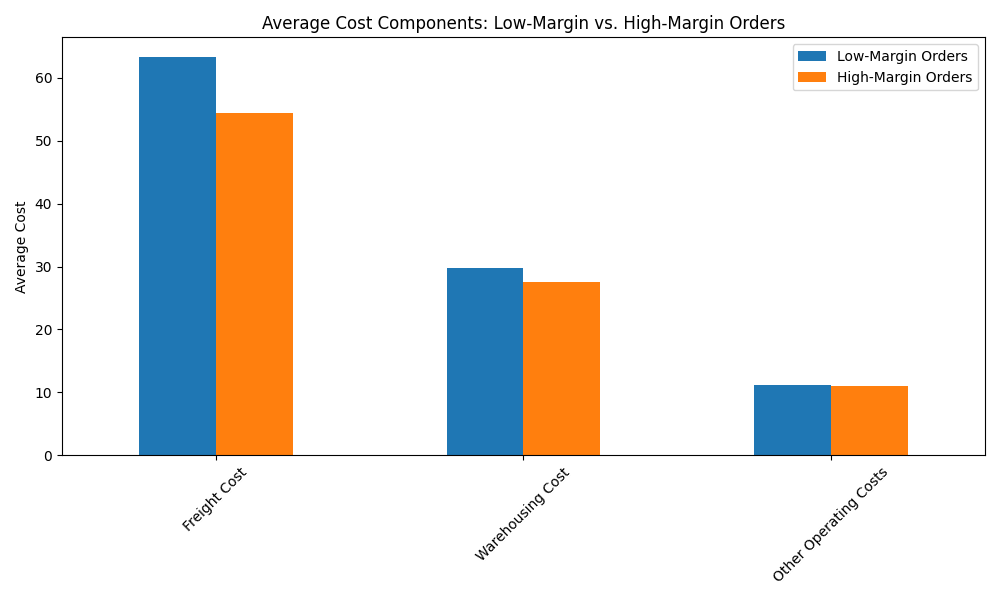
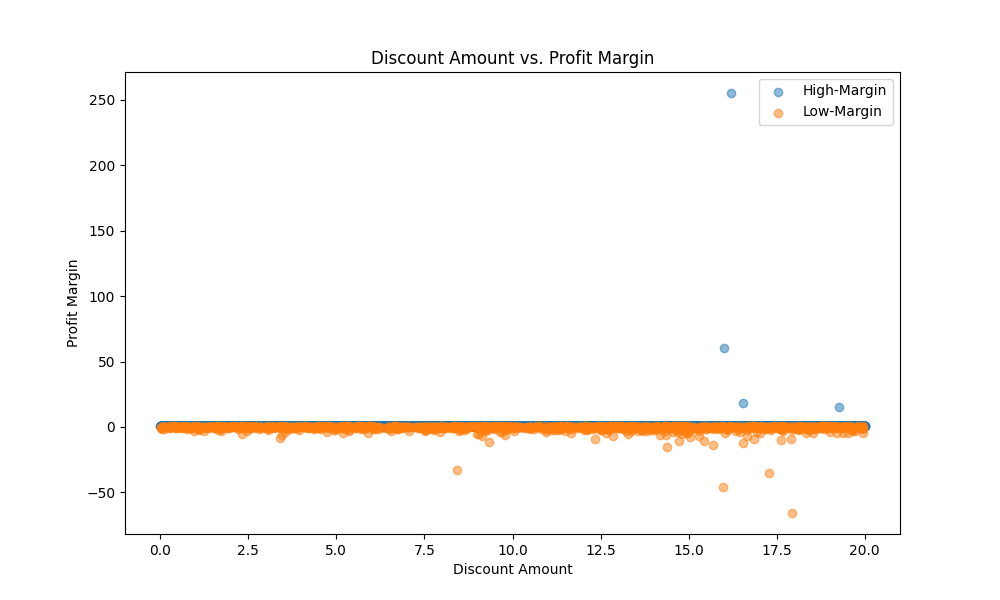

# Analysis of Low-Profit Orders and Recommendations for Improvement

## Introduction

An analysis of the order dataset was conducted to identify the defining characteristics of low-profit orders and to develop data-driven strategies for improving profitability. Low-profit orders were defined as those with a **Profit Margin** below 50% of the dataset's average. The average profit margin was found to be approximately **79.53%**, setting the low-profit threshold at **39.77%**. This report details the findings of the analysis and provides concrete recommendations for both cost control and revenue enhancement.

## Key Findings

Our analysis revealed several key factors that distinguish low-profit orders from their high-profit counterparts. These factors are concentrated in three main areas: cost structure, discount strategy, and geographic location.

### 1. Cost Structure: The Primary Driver of Low Profitability

The most significant factor contributing to low profitability is a disproportionately high cost structure. A comparative analysis of cost components between low- and high-profit orders highlights this disparity.

As the chart above clearly demonstrates, low-profit orders have significantly higher average costs across all categories:
- **Freight Cost**:  The average freight cost for low-profit orders is substantially higher than for high-profit orders. This suggests that shipping and transportation expenses are a major drain on the profitability of these orders.
- **Warehousing Cost**: Similarly, warehousing costs are elevated for low-profit orders, indicating potential inefficiencies in inventory management or storage for these specific orders.
- **Other Operating Costs**: This category also shows a marked increase for low-profit orders, pointing to a need for a deeper dive into these miscellaneous expenses to identify areas for cost savings.

### 2. Discounting Strategy: A Strong Correlation with Low Margins

Our analysis indicates a strong relationship between the **Discount Amount** and **Profit Margin**. While discounts can be an effective tool for driving sales, excessive discounting appears to be eroding profitability.

The scatter plot above illustrates that a large number of low-profit orders are associated with high discount amounts. This suggests that our current discounting strategy may be too aggressive, leading to sales that are not profitable.

### 3. Geographic Concentration of Low-Profit Orders

Low-profit orders are not evenly distributed geographically. Instead, they are concentrated in a few specific destinations. The top three locations for low-profit orders are:

1.  **South China-Guangxi-Beihai** (51 orders)
2.  **North China-Beijing Municipality-Beijing** (45 orders)
3.  **North China-Tianjin Municipality-Tianjin** (40 orders)

This geographic clustering suggests that local factors, such as higher operating costs or intense market competition, may be contributing to lower profitability in these regions.

### 4. Product Composition

While the product mix for low- and high-profit orders is similar, the sheer volume of low-profit orders for certain product categories is a cause for concern. The top three product categories with the most low-profit orders are:

1.  **Bedding set** (246 orders)
2.  **Auto parts** (189 orders)
3.  **Bathroom supplies** (189 orders)

This indicates that while these products can be profitable, a significant number of sales within these categories are not meeting the desired profit threshold.

## Actionable Recommendations

Based on these findings, we propose the following recommendations to address the issue of low-profit orders:

### Cost-Control Measures

1.  **Renegotiate Freight Contracts**: Investigate the high freight costs associated with low-profit orders. This may involve renegotiating contracts with logistics providers, exploring alternative shipping methods, or optimizing shipping routes to reduce expenses.
2.  **Optimize Warehouse Operations**: Analyze the warehousing processes for products that frequently result in low-profit orders. Implementing more efficient inventory management systems, reducing storage times, and optimizing warehouse layouts can help lower warehousing costs.
3.  **Conduct a Deep Dive into Other Operating Costs**: The "Other Operating Costs" category is a significant contributor to the low profitability of some orders. A thorough audit of these expenses is needed to identify and eliminate unnecessary costs.

### Revenue and Profit Uplift Strategies

1.  **Implement a Data-Driven Discounting Strategy**: Move away from a one-size-fits-all approach to discounting. Instead, use data to determine the optimal discount levels for different products, customer segments, and regions. The goal should be to maximize sales without sacrificing profitability.
2.  **Develop Region-Specific Pricing and Cost-Management Strategies**: The geographic concentration of low-profit orders suggests that a localized approach is needed. For regions like Beihai, Beijing, and Tianjin, consider adjusting pricing, and marketing strategies to better align with local market conditions.
3.  **Review Product-Level Profitability**: For product categories with a high number of low-profit orders, such as bedding sets and auto parts, conduct a detailed review of their pricing, cost structure, and discount strategies. This may involve adjusting prices, bundling products, or discontinuing unprofitable product lines.

By implementing these recommendations, we can transform low-profit orders from a drain on our resources into a source of sustainable growth, ultimately improving the overall financial health of the business.
