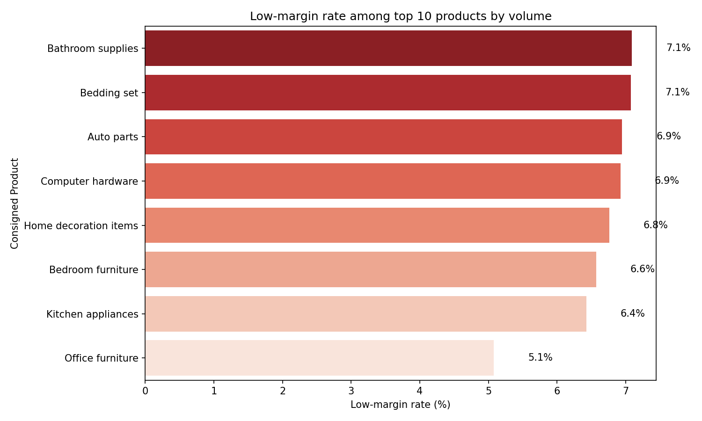
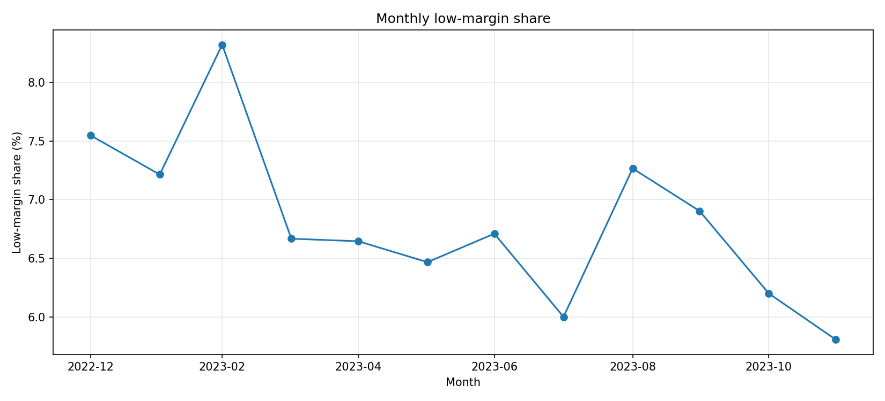
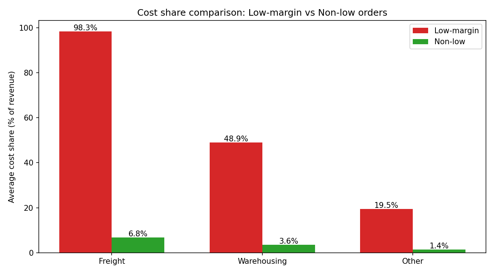

Executive Summary
Low-margin orders are rare but severely unprofitable. The dataset average Profit Margin is 0.795287; low-margin is defined as Profit Margin < 0.397643 (50% of average). Out of 18,250 total orders, 1,243 are low-margin (6.81%). These orders have significantly lower revenue and much higher cost-intensity, often coupled with high discounting and small Sales Quantity. The result is negative average Profit (-5.93) and extreme cost shares relative to Total Logistics Revenue.

Key Visuals
- 
  Key takeaway: Among top-10 products by volume, Bathroom supplies and Bedding set have the highest low-margin rates at 7.09% and 7.07%, respectively. Auto parts and Computer hardware follow at 6.95% and 6.92%. This matters because it pinpoints categories where pricing/discount and cost-to-serve policies should be tightened without sacrificing high-volume demand.

- 
  Key takeaway: The low-margin share peaked at 8.32% in Mar-2023 and fell to 5.81% by Dec-2023, indicating improvement. Sustaining this decline requires codifying discount rules and cost controls that showed up late-year. Specifics: 2023-03 low-rate 8.32%, 2023-12 low-rate 5.81%, with most months in the 6.0–7.5% range.

- 
  Key takeaway: Cost shares are dramatically higher for low-margin orders: Freight Cost is 98.29% of Total Logistics Revenue vs 6.82% in non-low; Warehousing Cost 48.94% vs 3.55%; Other Operating Costs 19.51% vs 1.44%. Total Logistics Cost reaches 166.74% of revenue vs 11.82% for non-low, which explains negative Profit. This matters because revenue in these orders does not cover cost-to-serve.

Data and Method Notes
- Source: sheet1 (SQLite). Key columns used: Profit Margin, Sales Quantity, Total Logistics Revenue, Discount Amount, Freight Cost, Warehousing Cost, Other Operating Costs, Total Logistics Cost, Profit, Logistics Unit Price, List Price Revenue, Logistics Value-Added Service Revenue, Destination, Date, Customer Gender, Customer Age, Age Range, Consigned Product.
- Definition: Low-margin orders have Profit Margin < 0.397643 (50% of dataset average 0.795287).
- Python steps executed (sqlite3 + pandas + seaborn/matplotlib) to compute comparative means, rates, and generate plots. Script: analysis_low_margin.py.

Overall Characteristics of Low-Margin Orders (vs Non-Low
