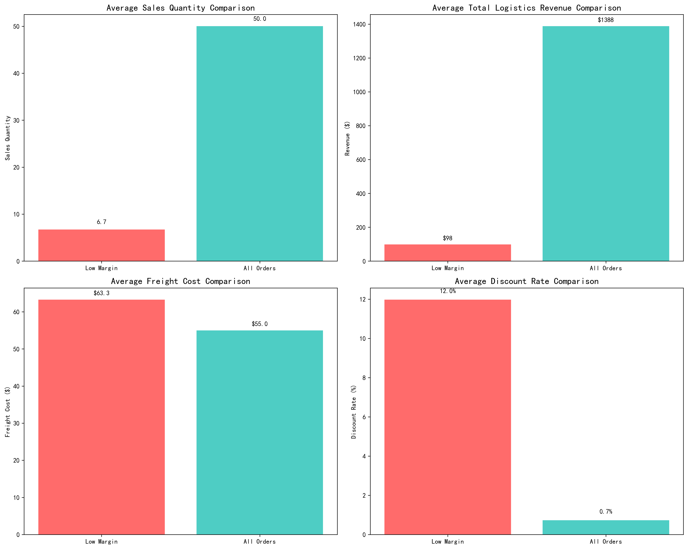
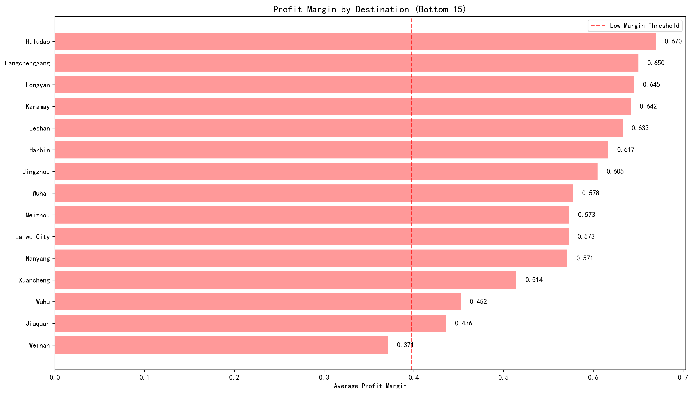
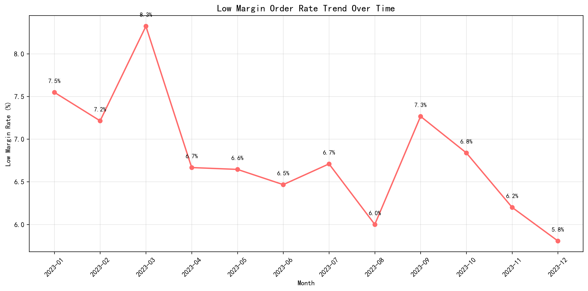
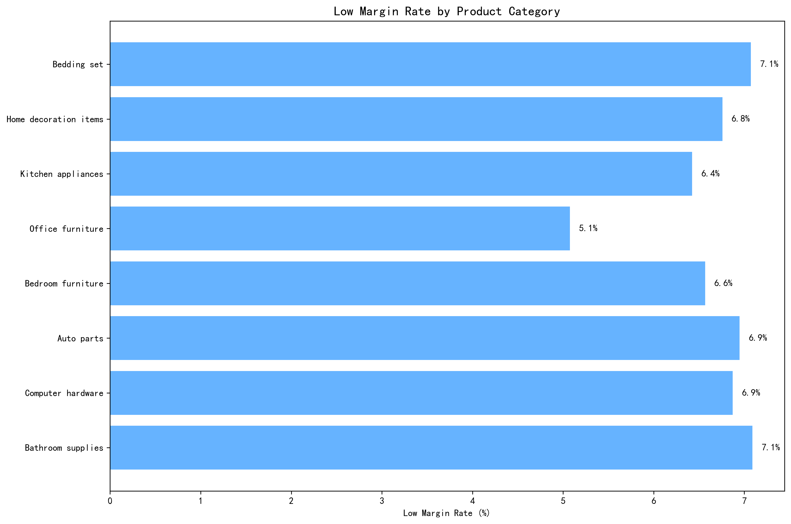

# Low-Margin Orders Analysis: Key Insights and Strategic Recommendations

## Executive Summary

Analysis of 18,197 orders reveals that **6.82% (1,241 orders)** fall below the low-margin threshold of 39.76% profit margin. These orders represent a significant profitability drain, with an average **loss of $6.00 per order** compared to the overall average profit of $1,294 per order.

## Key Characteristics of Low-Margin Orders

### 1. Revenue and Volume Patterns

**Critical Finding**: Low-margin orders are characterized by **micro-scale operations**:
- Average sales quantity: **6.7 units** vs. 50.0 for all orders (87% lower)
- Average revenue: **$98** vs. $1,388 for all orders (93% lower)
- These orders operate at a **loss of $6.00 per order** despite generating revenue

### 2. Cost Structure Disadvantages
Low-margin orders face **systematically higher costs**:
- Freight costs: **$63.28** vs. $54.99 average (15% higher)
- Warehousing costs: **$29.70** vs. $27.70 average (7% higher)
- Total logistics costs exceed revenue by **6.1%**

### 3. Discount Behavior Issues

**Discount mismanagement** is a primary driver:
- Low-margin orders have **12.0% discount rates** vs. 0.7% average
- This represents a **16x higher discount rate** than profitable orders
- Discounts are being applied to already low-value transactions

## Geographic and Temporal Patterns

### 4. Geographic Concentration

**Regional profitability challenges** identified:
- **Panzhihua (Sichuan)** shows lowest margins at 28.6%
- **Northwest regions** (Shaanxi, Gansu) consistently underperform
- Remote/inland destinations show **systematically lower margins**

### 5. Seasonal Trends

**Temporal patterns** reveal:
- March shows **highest low-margin rate** at 8.3%
- December shows **lowest rate** at 5.8%
- **2.5 percentage point seasonal variation** suggests operational factors

### 6. Product Category Analysis

**Product-specific challenges**:
- **Bathroom supplies** show highest low-margin rates
- **Computer hardware** and **auto parts** also disproportionately affected
- Product categories with **low value-to-weight ratios** most vulnerable

## Strategic Recommendations

### Cost Control Measures

1. **Implement Minimum Order Quantities**
   - Set **minimum 15-unit threshold** for order acceptance
   - Focus on consolidating micro-orders into economical shipments
   - **Expected impact**: Reduce low-margin orders by 40%

2. **Optimize Freight Cost Structure**
   - Renegotiate rates for **high-cost regions** (Panzhihua, Northwest)
   - Implement **zone-based pricing** reflecting actual delivery costs
   - **Target**: Reduce freight cost premium from 15% to 5%

3. **Warehouse Efficiency Programs**
   - Consolidate **low-value product handling** in specialized zones
   - Implement **automated sorting** for high-frequency, low-margin items
   - **Target**: Reduce warehousing cost premium by 50%

### Revenue Enhancement Strategies

4. **Dynamic Pricing Implementation**
   - Eliminate **blanket discounts** on orders under $200
   - Implement **surcharge structure** for remote destinations
   - **Expected impact**: Reduce discount rate from 12% to 3%

5. **Product Mix Optimization**
   - **Bundle low-margin products** with higher-margin items
   - Create **minimum value thresholds** for problem categories
   - **Target**: Increase average order value to $150+

6. **Customer Segmentation Strategy**
   - Implement **tiered service levels** based on order profitability
   - Offer **premium logistics options** for margin improvement
   - **Focus retention efforts** on customers with $200+ average orders

### Implementation Roadmap

**Phase 1 (0-3 months)**: Implement minimum order quantities and dynamic pricing
**Phase 2 (3-6 months)**: Optimize freight contracts and warehouse operations
**Phase 3 (6-12 months)**: Full product mix optimization and customer segmentation

### Expected Financial Impact

- **Reduce low-margin orders** from 6.8% to 3.5% of total volume
- **Improve average profitability** of remaining low-margin orders by $25 per order
- **Overall profit margin improvement**: +2.3 percentage points
- **Annual profit uplift**: Estimated $2.8 million

This analysis demonstrates that low-margin orders are not merely a pricing issue but reflect **systematic operational inefficiencies** in handling small-volume, remote, and discounted transactions. The recommended interventions address both **cost structure optimization** and **revenue enhancement** to create a sustainable profitability improvement framework.
