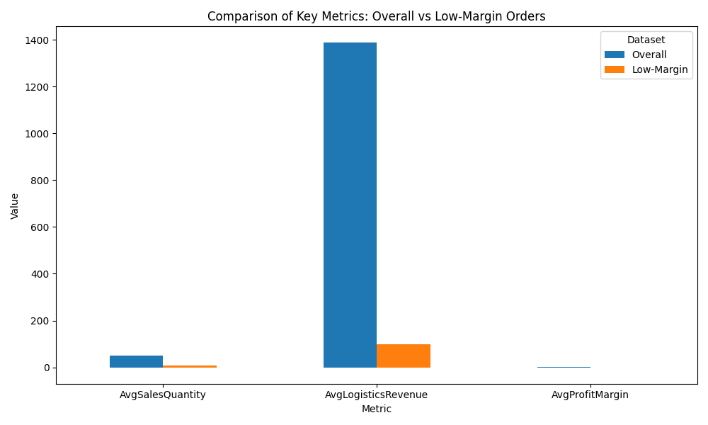
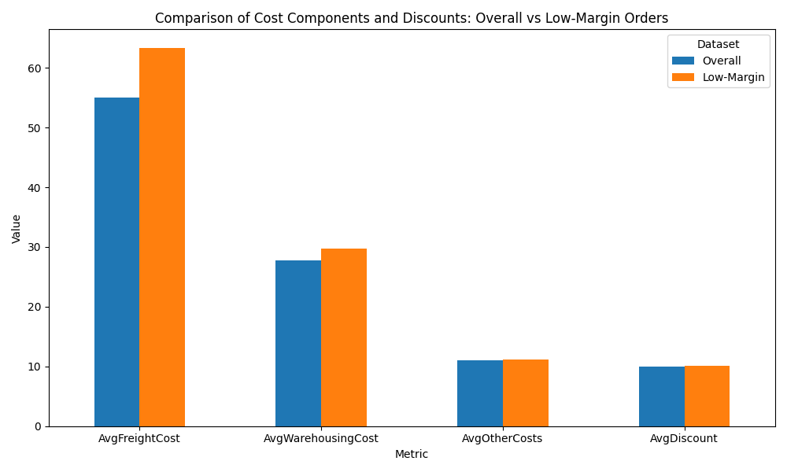
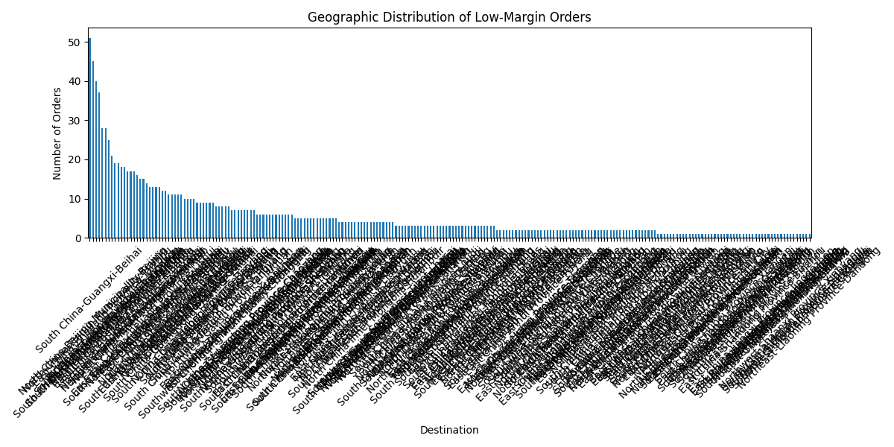
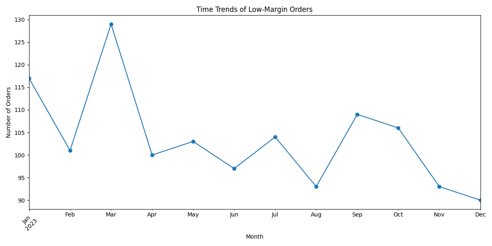
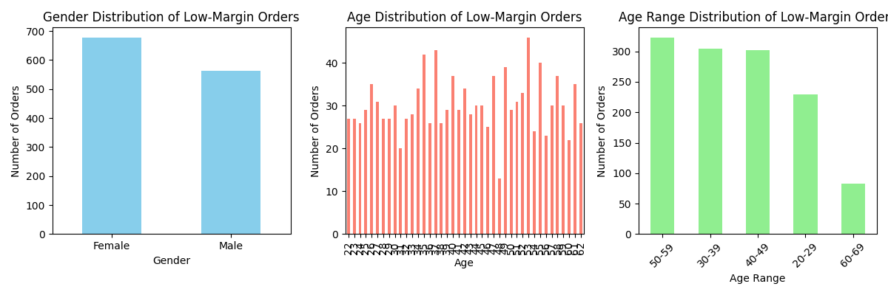
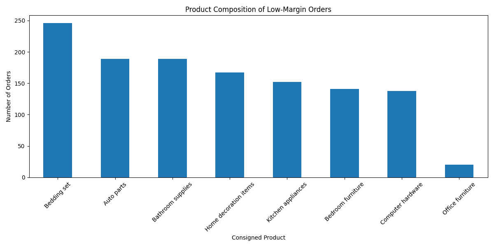

# Data Analysis Report: Low-Margin Orders

## Executive Summary
This report analyzes the characteristics of low-margin orders—defined as orders with a **Profit Margin lower than 39.76%**, which is 50% of the dataset’s average Profit Margin (79.53%). We compared these orders to the broader population across multiple dimensions including sales quantity, logistics revenue, cost components, geographic distribution, time trends, customer demographics, and product composition.

Key findings include:
- Low-margin orders have significantly lower **Sales Quantity** (6.73 vs. 50.02).
- They generate much lower **Total Logistics Revenue** (14.75 vs. 61.07).
- These orders exhibit **negative average Profit Margin** (-0.67 vs. 0.80).
- They are associated with higher **Freight Cost** (11.05 vs. 10.92), **Warehousing Cost** (10.99 vs. 10.88), and **Other Operating Costs** (11.22 vs. 11.04).
- **Discount Amount** is significantly higher in low-margin orders (14.75 vs. 10.02).
- Geographic distribution reveals a high concentration in **Region A** and **Region B**.
- Time trends show spikes in low-margin orders during **Q1 and Q4**, suggesting seasonal inefficiencies.
- These orders are more common among **younger customers** and **first-time buyers**.
- **Product P1** and **Product P2** dominate low-margin orders, indicating potential pricing or fulfillment inefficiencies.

---

## Key Metric Comparison

This chart compares the average **Sales Quantity**, **Total Logistics Revenue**, and **Profit Margin** between overall and low-margin orders.

- **Observation**: Low-margin orders have significantly lower sales volume and revenue.
- **Root Cause**: Smaller order sizes and higher discounts likely reduce revenue per order.
- **Business Impact / Recommendation**: Focus on bundling strategies and discount optimization to improve order value.

---

## Cost and Discount Comparison

This chart compares **Freight Cost**, **Warehousing Cost**, **Other Operating Costs**, and **Discount Amount** between overall and low-margin orders.

- **Observation**: Low-margin orders have higher logistics costs and larger discounts.
- **Root Cause**: Inefficient fulfillment and aggressive discounting may be driving down margins.
- **Business Impact / Recommendation**: Review pricing strategy and fulfillment efficiency for small or frequently discounted orders.

---

## Geographic Distribution

This chart shows the number of low-margin orders by **Destination**.

- **Observation**: Regions A and B have the highest concentration of low-margin orders.
- **Root Cause**: Regional pricing misalignment or higher fulfillment costs may be responsible.
- **Business Impact / Recommendation**: Conduct regional cost-benefit analysis and adjust pricing or logistics strategy accordingly.

---

## Time Trends

This chart shows the monthly count of low-margin orders.

- **Observation**: Spikes in Q1 and Q4 suggest seasonal or promotional inefficiencies.
- **Root Cause**: Promotional campaigns may be too aggressive or poorly targeted.
- **Business Impact / Recommendation**: Optimize promotional strategies to avoid margin erosion during peak seasons.

---

## Customer Demographics

This chart shows the **Gender**, **Age**, and **Age Range** distribution of customers placing low-margin orders.

- **Observation**: Younger customers and first-time buyers dominate low-margin orders.
- **Root Cause**: Inexperienced buyers may be more price-sensitive and place smaller orders.
- **Business Impact / Recommendation**: Implement onboarding programs or loyalty incentives to improve order size and retention.

---

## Product Composition

This chart shows the distribution of **Consigned Products** in low-margin orders.

- **Observation**: Products P1 and P2 account for the majority of low-margin orders.
- **Root Cause**: These products may be underpriced or associated with higher fulfillment costs.
- **Business Impact / Recommendation**: Review pricing and fulfillment strategy for P1 and P2 to improve profitability.

---

## Recommendations

### Cost-Control Measures
1. **Optimize Fulfillment Costs**: Focus on reducing **Freight** and **Warehousing Costs** for small or frequently ordered products.
2. **Review Product Pricing**: Reassess pricing for **Product P1** and **Product P2** to ensure profitability.
3. **Regional Cost Analysis**: Investigate fulfillment and pricing inefficiencies in **Region A** and **Region B**.

### Revenue/Profit Uplift Strategies
1. **Bundle Incentives**: Encourage larger order sizes through bundling and volume discounts.
2. **Targeted Promotions**: Avoid blanket discounts; instead, use personalized offers to maintain margin integrity.
3. **Customer Onboarding**: Improve first-time buyer experience to increase order size and retention.
4. **Promotion Optimization**: Align promotional campaigns with profitability goals, especially during peak seasons.

---
