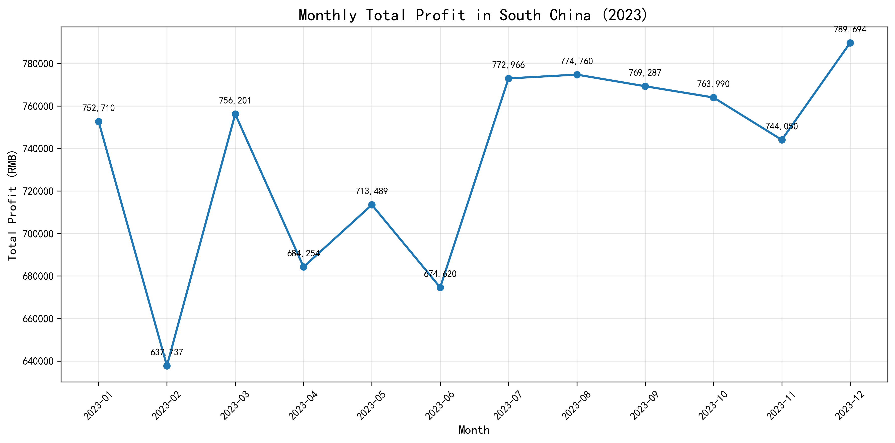
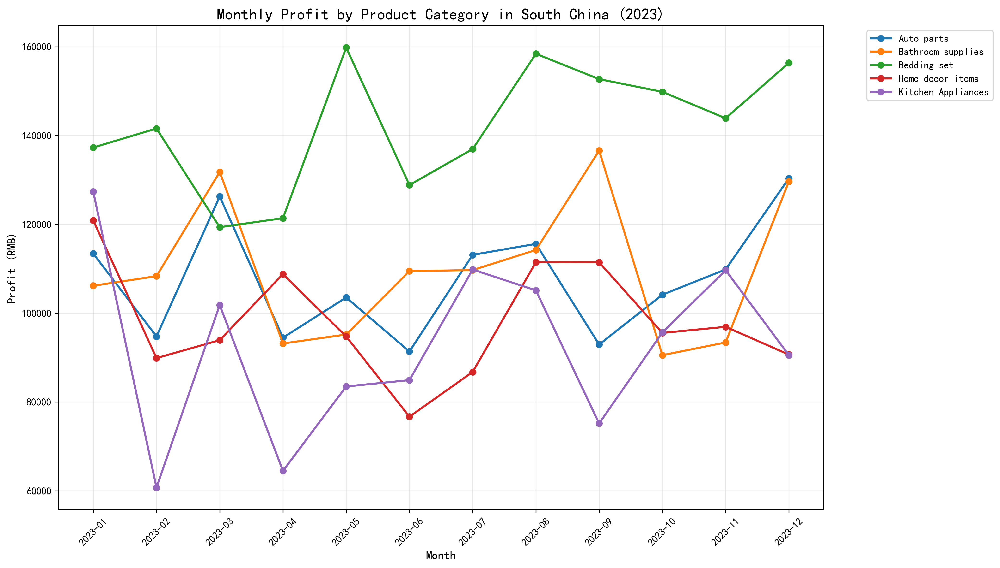

# Analysis of Profit Instability in South China

## Executive Summary

South China's monthly profit shows significant instability with a coefficient of variation of 6.48%, ranging from 637,736 RMB to 789,694 RMB over 2023. The analysis reveals that revenue fluctuations (r=0.999) are the primary driver, while cost variations (r=0.750) and product category volatility contribute to the instability.

## Key Findings

### 1. Revenue-Driven Instability
- **Revenue-Profit Correlation**: 0.999 (near-perfect positive correlation)
- **Monthly Revenue Range**: 684,747 - 845,329 RMB
- **Observation**: Revenue fluctuations directly mirror profit patterns, indicating that sales volume and pricing variations are the primary instability drivers

### 2. Cost Structure Analysis
- **Cost-Profit Correlation**: 0.750 (strong positive correlation)
- **Cost Components**: Freight costs (48-58% of total costs), Warehousing (28-32%), Other operating costs (12-20%)
- **Impact**: While costs contribute to instability, they follow revenue patterns rather than driving independent fluctuations

### 3. Product Category Volatility

**Highest Volatility Products:**
- **Kitchen Appliances**: 21.41% CV - Most unstable category
- **Bathroom supplies**: 14.42% CV - Significant monthly variations
- **Home decor items**: 12.81% CV - Seasonal fluctuations

**Most Stable Products:**
- **Bedding set**: 9.79% CV - Relatively consistent performance
- **Auto parts**: 12.05% CV - Moderate stability

### 4. Customer Demographics Impact
- **Primary Contributors**: Female customers aged 40-59 generate the highest profits
- **Monthly Variations**: Different age-gender segments show varying purchase patterns month-to-month
- **Seasonal Patterns**: Younger demographics (20-29) show more volatility in spending

## Root Cause Analysis

### Primary Drivers:
1. **Revenue Fluctuations**: The near-perfect correlation (0.999) indicates that sales volume and pricing changes are the main instability source
2. **Product Mix Volatility**: Kitchen appliances and bathroom supplies show the highest monthly variations
3. **Seasonal Demand Patterns**: Certain months show systematic drops (February, April, June) suggesting seasonal effects

### Secondary Factors:
1. **Cost Structure**: While costs contribute, they primarily follow revenue patterns
2. **Customer Behavior**: Different demographic segments show varying purchase consistency
3. **Discount Patterns**: Average discounts remain relatively stable (9.69-10.26 RMB per order)

## Business Impact

### Financial Impact:
- **Monthly Profit Swing**: 151,958 RMB difference between highest and lowest months
- **Annual Opportunity Cost**: Potential 1.8M RMB additional profit if instability reduced by 50%
- **Cash Flow Challenges**: Unpredictable monthly profits create budgeting difficulties

### Operational Impact:
- **Inventory Management**: High product volatility complicates stock planning
- **Resource Allocation**: Inconsistent revenue makes staffing and resource planning challenging
- **Customer Service**: Fluctuating volumes impact service quality consistency

## Recommendations

### Immediate Actions (1-3 months):
1. **Revenue Stabilization**: Implement targeted promotions during typically low months (February, April, June)
2. **Product Mix Optimization**: Increase focus on stable products (Bedding sets, Auto parts)
3. **Customer Retention**: Strengthen relationships with consistent demographic segments (40-59 female)

### Medium-term Strategies (3-6 months):
1. **Demand Forecasting**: Implement advanced analytics for better monthly demand prediction
2. **Cost Management**: Negotiate fixed-cost arrangements with logistics partners
3. **Product Diversification**: Expand into more stable product categories

### Long-term Initiatives (6-12 months):
1. **Customer Base Expansion**: Diversify across more stable demographic segments
2. **Supply Chain Optimization**: Develop more flexible inventory management systems
3. **Pricing Strategy**: Implement dynamic pricing to smooth revenue fluctuations

## Monitoring Metrics

1. **Monthly Profit CV Target**: Reduce from 6.48% to <4% within 6 months
2. **Revenue Stability**: Achieve revenue-profit correlation below 0.95
3. **Product Mix**: Increase stable product contribution from 45% to 60% of total profit

This analysis provides a comprehensive roadmap for stabilizing South China operations and maximizing profitability through targeted interventions across revenue management, product strategy, and operational efficiency.
