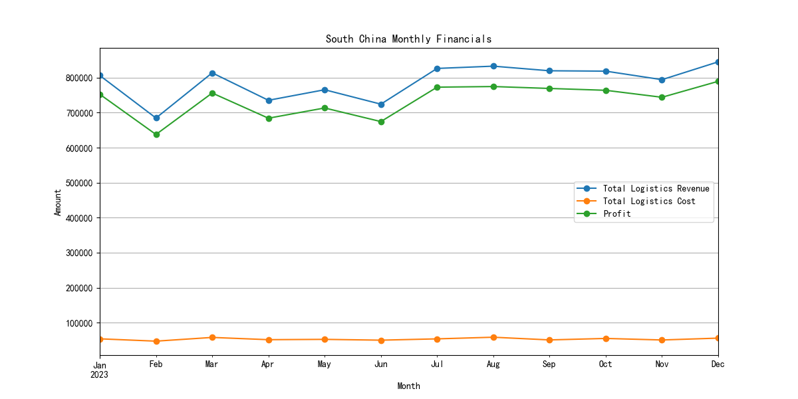
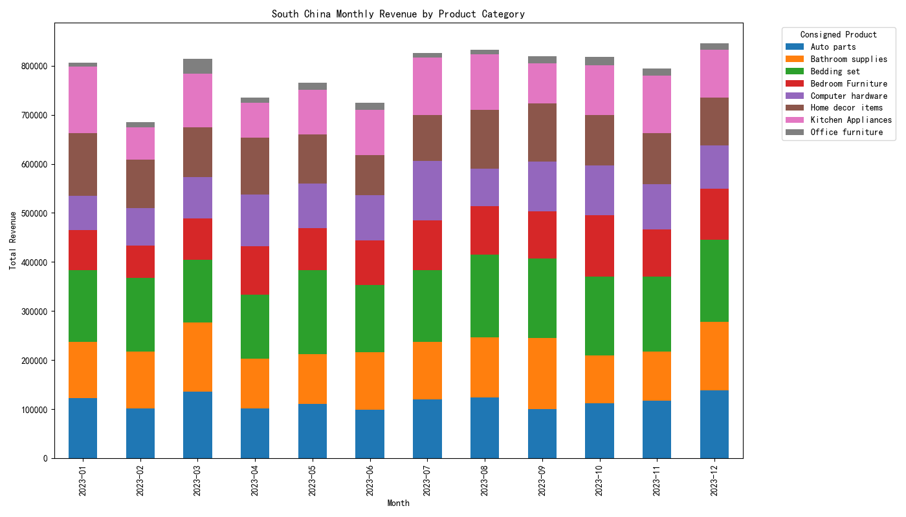

# **Analysis of Profit Instability in South China**

## **Executive Summary**

This report analyzes the causes of the significant monthly profit instability in the South China region. Our findings indicate that the fluctuations in total profit are primarily driven by volatile monthly revenues, rather than costs, which remain relatively stable. The revenue instability is largely attributable to inconsistent sales in specific product categories, most notably **Kitchen Appliances**, **Bedroom Furniture**, and **Home Decor Items**.

We recommend a targeted marketing strategy and a review of the supply chain for these product categories to stabilize revenue and, consequently, profit.

## **Profit Instability Driven by Revenue Fluctuations**

An initial analysis of the monthly financials for South China reveals that the `Total Logistics Cost` has remained relatively constant throughout the year. However, the `Total Logistics Revenue` and `Profit` have shown significant volatility.

As shown in the chart above, the trend line for profit closely mirrors the trend line for revenue, with noticeable dips in **February, April, and June**. This strong correlation suggests that revenue is the primary driver of profit instability. For instance, in February, a 15% drop in revenue from January (from 806k to 685k) resulted in a 15% drop in profit (from 753k to 638k).

## **Product-Specific Revenue Instability**

To understand the root cause of the revenue fluctuations, we analyzed the monthly revenue for each product category. The analysis revealed that the instability is not uniform across all products.

The stacked bar chart above illustrates the monthly revenue contribution of each product category. A detailed breakdown of the data reveals that **Kitchen Appliances** experienced the most dramatic revenue drop, falling by over 50% from 135k in January to 66k in February. While other categories also showed some level of fluctuation, "Kitchen Appliances", along with "Bedroom Furniture" and "Home Decor Items", are the primary contributors to the overall revenue instability.

## **Key Findings and Root Causes**

1.  **Profit instability is a revenue problem, not a cost problem.** Our analysis shows that `Total Logistics Cost` is stable, while `Total Logistics Revenue` fluctuates significantly, directly impacting profit.
2.  **The instability is concentrated in specific product categories.** The most volatile categories are "Kitchen Appliances," "Bedroom Furniture," and "Home Decor Items."
3.  **Seasonal factors or specific events may be at play.** The sharp drop in revenue in February across multiple categories suggests a potential impact from events like the Chinese New Year, which typically sees a slowdown in business activity.

## **Recommendations**

Based on our findings, we recommend the following actions:

1.  **Conduct a targeted market analysis for key product categories.** Investigate the reasons for the sharp revenue drops in "Kitchen Appliances," "Bedroom Furniture," and "Home Decor Items." This could involve customer surveys, competitor analysis, and a review of marketing campaigns.
2.  **Develop a more robust, year-round marketing strategy.** Create marketing campaigns for the identified product categories that are not reliant on seasonal peaks and can sustain demand during traditionally slower months.
3.  **Optimize the supply chain for volatile products.** Review inventory management and logistics for the identified product categories to ensure that supply can be adjusted to meet fluctuating demand without incurring excessive costs.

By addressing the root causes of revenue instability in these key product categories, we can work towards achieving more stable and predictable profits in the South China region.
