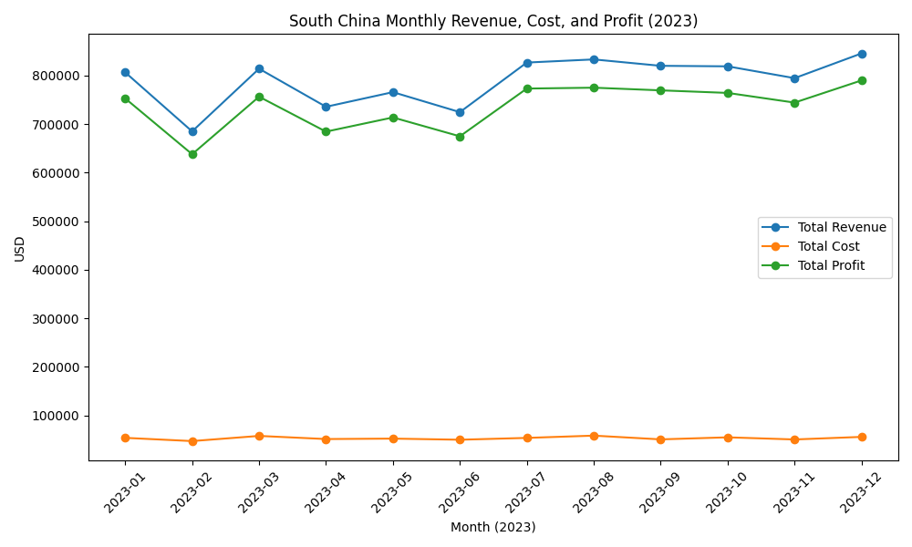

South China monthly profit instability: what’s driving it and how to stabilize it

Executive summary
- Monthly profit in South China ranges from 637,736 USD (Feb-2023) to 789,694 USD (Dec-2023), with a mean of 736,146 USD and CV of 6.5%. Variability is mainly driven by sales quantity swings, discount rate fluctuations, and mix effects (products and provinces). Costs per unit are relatively stable and play a secondary role.

What the data shows (evidence)
- Data source and fields: SQLite table sheet1; key fields include Date, Destination, Sales Quantity, Total Logistics Revenue, Total Logistics Cost, Profit, Discount Amount, Logistics Value-Added Service Revenue, Freight/Warehousing/Other Operating Costs, Consigned Product.
- Monthly totals for South China (SQL): SELECT strftime('%Y-%m', Date) AS month, SUM(Profit) AS total_profit FROM sheet1 WHERE Destination LIKE 'South China-%' GROUP BY month;
- Monthly components (SQL/Python): Aggregated quantity, revenue, costs, discounts, VAS revenue; computed unit economics and correlations.

Visual: South China monthly revenue, cost, and profit

- Key takeaway: Profit tracks revenue closely; the trough in Feb (revenue 684,747 USD, cost 47,011 USD, profit 637,737 USD) and the peak in Dec (revenue 845,329 USD, cost 55,635 USD, profit 789,694 USD) show a 151,958 USD swing. This matters because ~95% of the profit change comes from revenue growth, indicating demand/price levers dominate stability.
- Python plotting code was executed to generate this figure (see analysis_sc.py in the transcript).

Drivers of instability (observation → root cause → business impact / recommendation)
1) Volume swings (Sales Quantity)
- Observation: Quantity correlates strongly with profit (corr = +0.875). Quantity ranges from 25,432 units (Feb) to 30,983 units (Aug), a +21.8% swing.
- Root cause: Demand fluctuations across months; profit is essentially revenue minus cost, and revenue is volume-driven with nearly flat unit costs.
- Business impact: The Dec vs Feb profit difference (+151,958 USD) is mostly a revenue effect. Revenue increased by +160,582 USD, while costs rose only +8,624 USD. A simple decomposition shows ~70% of the revenue increase comes from higher quantity (+4,154 units), ~25% from higher revenue per unit (+1.65 USD), with a small cross-term.
- Recommendation: Smooth demand and lock volume: launch volume-commitment contracts with key accounts, pre-Feb promotions, and enterprise capacity guarantees to reduce troughs.

2) Discount intensity (Discount Amount / Total Revenue)
- Observation: Discount rate correlates negatively with profit (corr = -0.698). Monthly discount rate ranges from 0.0067 to 0.0075.
- Root cause: Higher discount intensity directly suppresses revenue per unit and total revenue in already low-volume months.
- Business impact: Even small absolute changes in discount rate on a large revenue base produce meaningful profit swings.
- Recommendation: Tighten discount ladders in weak months (e.g., Feb), apply guardrails (minimum floor prices), and tie discounts to margin thresholds rather than blanket campaigns.

3) Value-added services mix (VAS revenue share)
- Observation: VAS share of revenue correlates negatively with profit (corr = -0.497); VAS share ranges from 1.64% to 1.98% of total revenue.
- Root cause: VAS appears lower-margin relative to core logistics revenue; months with higher VAS share dilute overall margin.
- Business impact: Mix shifts toward VAS reduce total profit at the margin.
- Recommendation: Revisit VAS pricing and bundling; upsell premium logistics bundles to raise revenue per unit without margin dilution, or de-emphasize low-margin VAS in downturn months.

4) Product portfolio mix
- Observation: High-share products with higher volatility drive instability: Kitchen Appliances (12.6% profit share, CV = 0.214), Bathroom supplies (14.9% share, CV = 0.144), Bedroom Furniture (11.9% share, CV = 0.161), Computer hardware (11.6% share, CV = 0.156). Office furniture has high CV (0.427) but low share (1.76%).
- Root cause: Demand variability in these categories changes monthly volume and revenue per unit.
- Business impact: Mix shifts toward more volatile categories amplify profit fluctuations.
- Recommendation: Stabilize supply and demand in volatile, material categories (e.g., Kitchen Appliances): forward inventory positioning, category-specific promotions, and large-account contracts to flatten month-to-month swings.

5) Province mix effects
- Observation: Guangdong (42.7% profit share, CV = 0.089) and Guangxi (25.8%, CV = 0.098) are relatively stable; smaller provinces show higher volatility: Hubei (CV = 0.239), Hainan (0.209), Hunan (0.201), Henan (0.174).
- Root cause: Geographic demand variability and account concentration in smaller provinces lead to uneven monthly volumes.
- Business impact: Shifts toward more orders from high-CV provinces amplify monthly profit variability.
- Recommendation: Targeted account management and guaranteed volume agreements in Hubei, Hainan, Hunan, Henan; smooth capacity planning across cities to reduce spikes/dips.

6) Cost structure stability
- Observation: Cost per unit has weak correlation with profit (corr = -0.149); freight share modestly positive (0.268). Unit costs are relatively steady across months.
- Root cause: Operational costs are not the primary driver of monthly swings.
- Business impact: Cost-focused actions will yield limited stability vs. demand/price/mix levers.
- Recommendation: Maintain operational efficiency; prioritize demand smoothing and pricing policy, then optimize freight routing as a secondary lever.

Why it matters
- The bulk of profit instability is demand-led with pricing/mix overlay—controllable via commercial levers rather than operational cost cuts. Addressing volume, discount policy, and mix will deliver more predictable monthly profit.

Action plan (prioritized)
- Lock volume: Q1 capacity commitments with top South China accounts; Feb-focused campaigns; SLAs to reduce cancellations.
- Discount governance: Introduce margin floors and approval workflows for discounts; tailor campaigns to low-CV provinces and stable categories.
- Portfolio/mix steering: Kitchen Appliances and Bathroom supplies smoothing via inventory and promotions; bundle VAS for margin accretion.
- Geographic stabilization: Structured pipelines in Hubei/Hainan/Hunan/Henan; quarterly targets for volume consistency.
- Monitoring: Monthly dashboards of quantity, discount rate, VAS share, product/province CV; trigger playbooks when metrics breach thresholds.

Appendix: key numbers
- Profit: min 637,736 USD (Feb), max 789,694 USD (Dec), mean 736,146 USD, std 47,676 USD, CV 6.5%.
- Quantity: 25,432 (Feb) to 30,983 (Aug); key correlation with profit +0.875.
- Discount rate: 0.0067–0.0075; correlation with profit -0.698.
- VAS share: 1.64%–1.98%; correlation with profit -0.497.
- Revenue per unit: 26.92 USD (Feb) to 28.57 USD (Dec).

Conclusion
- South China’s monthly profit instability is primarily due to sales quantity variability, compounded by discount intensity and revenue mix (VAS, products, provinces). Stabilize demand, govern discounts, and steer mix for predictable monthly profit.
