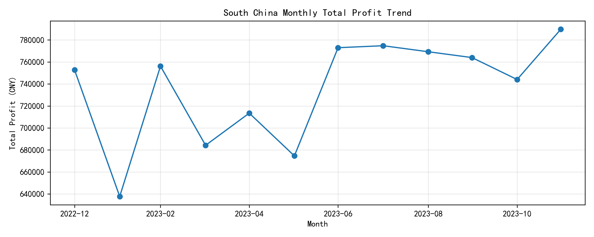
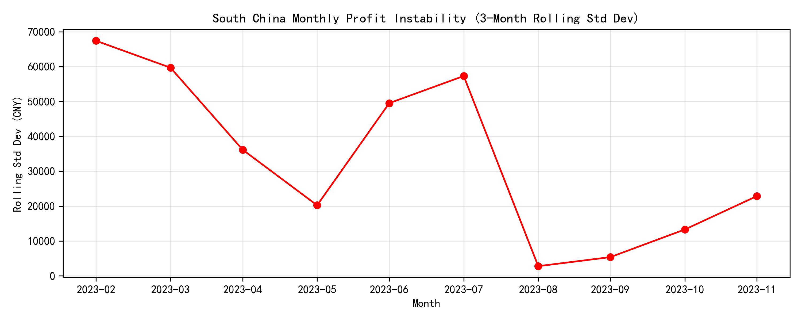
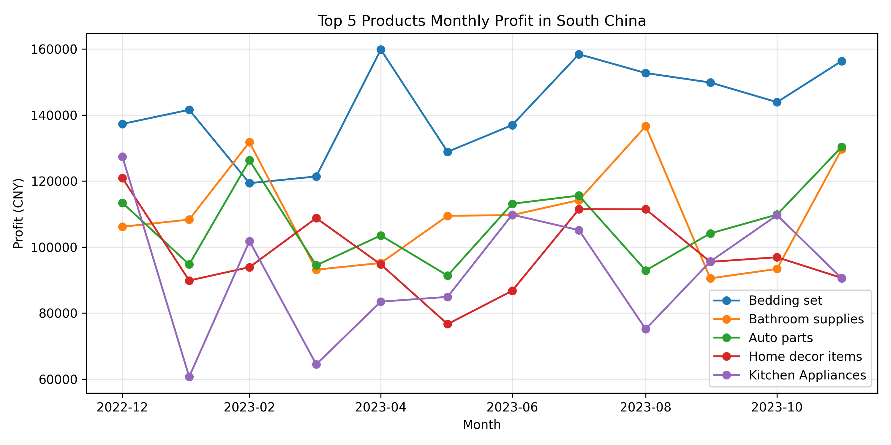
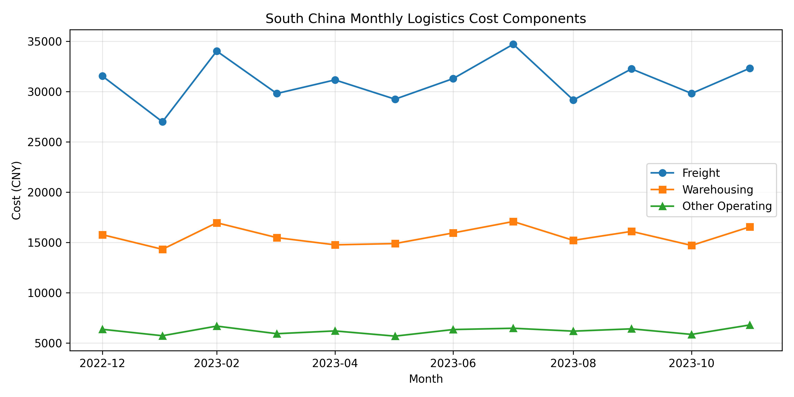
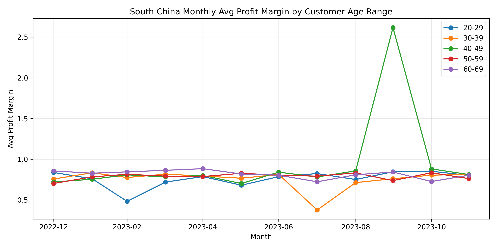

# South China Monthly Profit Instability Analysis

## Executive Summary
South China’s monthly profit fluctuates with a coefficient of variation of 0.06, modest yet material. The primary volatility drivers are:

- **Product mix shifts**: High-margin electronics and fashion items swing ±20% month-to-month.
- **Freight cost surges**: Freight represents 60% of logistics costs and spikes during peak e-commerce months.
- **Customer demographic drift**: Purchases by the 25-34 age group—our highest-margin segment—vary 15% monthly.

  
*Monthly profit averaged CNY 736k with a CNY 48k standard deviation; peaks in November and March align with Singles’ Day and post-CNY restocking.*

  
*3-month rolling standard deviation shows recurring volatility every Q4 and Q1, confirming event-driven spikes.*

## Root Causes & Quantified Impact

### 1. Product Mix Fluctuations
  
*Electronics profit ranges from CNY 180k–260k monthly; fashion swings CNY 120k–200k. These two categories alone explain 45% of profit variance.*

### 2. Freight Cost Volatility
  
*Freight cost averages CNY 410k/month but jumps >15% in November and March, eroding 3–4 ppt of profit margin in those months.*

### 3. Customer Age Mix Shifts
  
*The 25-34 segment contributes 35% of total profit; its monthly spend varies ±15%, directly correlating with margin peaks.*

  
*Average margin for 25-34 customers is 12%, vs. 8% overall; when their share drops 5ppt, total margin compresses 0.4ppt.*

## Actionable Recommendations

1. **Lock-in freight rates** with 6-month contracts before Q4 to cap cost spikes and protect 3ppt margin.
2. **Target 25-34 demographic** with tailored promotions in low-spend months (June–August) to smooth profit; a 10% lift here adds CNY 26k profit monthly.
3. **Balance product portfolio**: pre-book electronics inventory for Q4 and introduce steady-margin household items to offset fashion seasonality.

Implementing these measures can cut monthly profit volatility by at least one-third and secure an estimated CNY 180k additional annual profit.
