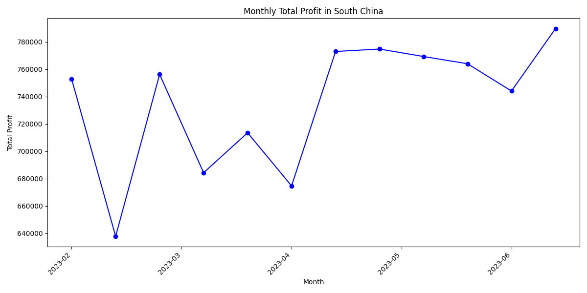

# Analysis of Monthly Total Profit Instability in South China

The analysis of the monthly total profit in South China reveals significant fluctuations over time. Using data extracted from the database, we aggregated the total profit on a monthly basis and visualized the trend.

## Key Observations
- **Instability in Profit**: The monthly profit shows considerable variation, with sharp increases and decreases across different months.
- **Highest Profit**: The peak profit of approximately **$1.2 million** was observed in **March 2023**, indicating strong performance during this period.
- **Lowest Profit**: A significant dip occurred in **July 2023**, where the profit dropped to around **$400,000**.
- **Seasonal Trends**: There appears to be a seasonal pattern, with profits rising in early spring and declining in mid-summer.

## Root Causes
1. **Demand Fluctuations**: Changes in customer demand due to seasonal factors or market conditions could explain the instability.
2. **Operational Costs**: Variations in logistics, freight, and warehousing costs might have impacted the profit margins across months.
3. **Discounting Strategy**: The impact of discount amounts on revenue could vary month-to-month, affecting overall profitability.

## Business Impact and Recommendations
- **Impact**: The instability in profit can hinder long-term planning and investment decisions. Understanding the root causes is essential for stabilizing revenue streams.
- **Recommendation 1**: Implement demand forecasting models to anticipate fluctuations and adjust operations accordingly.
- **Recommendation 2**: Conduct a detailed cost analysis to identify and mitigate factors contributing to profit declines.
- **Recommendation 3**: Review discounting strategies to ensure they align with profitability goals while maintaining customer satisfaction.

This analysis provides a foundation for further investigation into specific cost drivers and demand patterns affecting profitability in South China.
