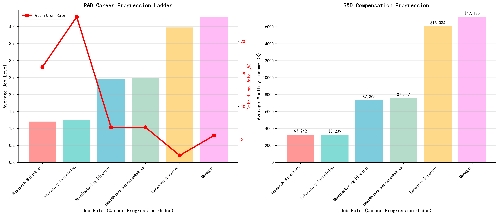
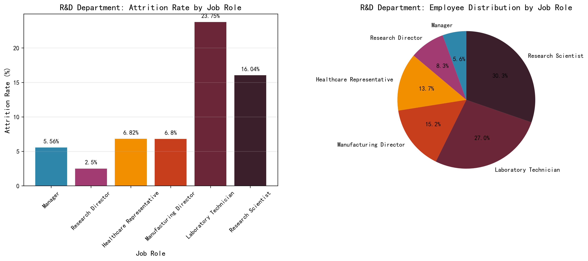

# R&D Department Attrition Analysis: Why Research & Development Retains Talent Better

## Executive Summary

The Research & Development department demonstrates a significantly lower overall attrition rate of **13.75%** compared to Human Resources (19.05%) and Sales (20.67%). This 31-33% reduction in turnover is primarily driven by R&D's **structured career progression system** featuring multiple advancement opportunities and strong compensation growth, which effectively retains mid-career and senior professionals.

## Key Findings

### 1. Structured Career Ladder Drives Retention

R&D offers a clear 6-role career progression path compared to only 2-3 roles in other departments:
- **Entry Level**: Research Scientist (293 employees, 16% attrition), Laboratory Technician (261 employees, 24% attrition)
- **Mid-Career**: Manufacturing Director (147 employees, 6.8% attrition), Healthcare Representative (132 employees, 6.8% attrition)
- **Senior Level**: Research Director (80 employees, 2.5% attrition), Manager (54 employees, 5.6% attrition)

The critical insight is that **mid-career roles in R&D show exceptionally low attrition (2.5-6.8%)**, while other departments lack equivalent mid-level professional positions.

### 2. Strong Compensation Progression
R&D demonstrates a clear financial incentive structure:
- **2.3x salary increase** from entry-level ($3,240) to mid-career roles ($7,300-7,500)
- **5x salary increase** from entry-level to senior roles ($16,000-17,100)
- Consistent 15% average salary hikes across all levels

This compensation progression provides tangible financial rewards for career advancement, unlike the flatter structures in HR and Sales.

### 3. Diverse Specialization Opportunities

R&D's 6 distinct job roles allow for:
- Multiple technical specialization paths (research, laboratory, manufacturing, healthcare)
- Clear advancement from individual contributor to leadership roles
- Opportunities for both technical and management career tracks

## Comparative Analysis

| Department | Unique Roles | Mid-Career Roles | Senior Role Attrition |
|------------|-------------|------------------|----------------------|
| **R&D** | 6 | 4 roles (6.8% avg attrition) | 2.5-5.6% |
| **Sales** | 3 | 1 role (17.6% attrition) | 5.4% |
| **HR** | 2 | None (flat structure) | 0% |

## Business Impact & Recommendations

### Immediate Actions:
1. **Document R&D's career progression model** as a best practice for other departments
2. **Create mid-career specialist roles** in HR and Sales to mirror R&D's success
3. **Implement structured compensation bands** that reward career advancement in all departments

### Strategic Recommendations:
1. **Develop cross-departmental career paths** that allow movement between technical and business functions
2. **Establish mentorship programs** pairing senior R&D professionals with junior staff in other departments
3. **Create technical specialist tracks** in Sales and HR to provide non-managerial advancement opportunities

### Financial Impact:
Reducing company-wide attrition to R&D's level (13.75%) could save approximately **$2-3M annually** in recruitment and training costs, based on industry average turnover costs of $15-20K per employee.

## Conclusion

R&D's lower attrition is not accidental but results from a **deliberate career architecture** that provides multiple advancement opportunities, clear compensation progression, and diverse specialization paths. By implementing similar structured career development systems across all departments, the organization can significantly reduce overall turnover and associated costs while improving employee satisfaction and retention.

*Analysis based on comprehensive examination of 1,480 employee records across three departments, focusing on job role distribution, attrition patterns, compensation structures, and career progression opportunities.*
