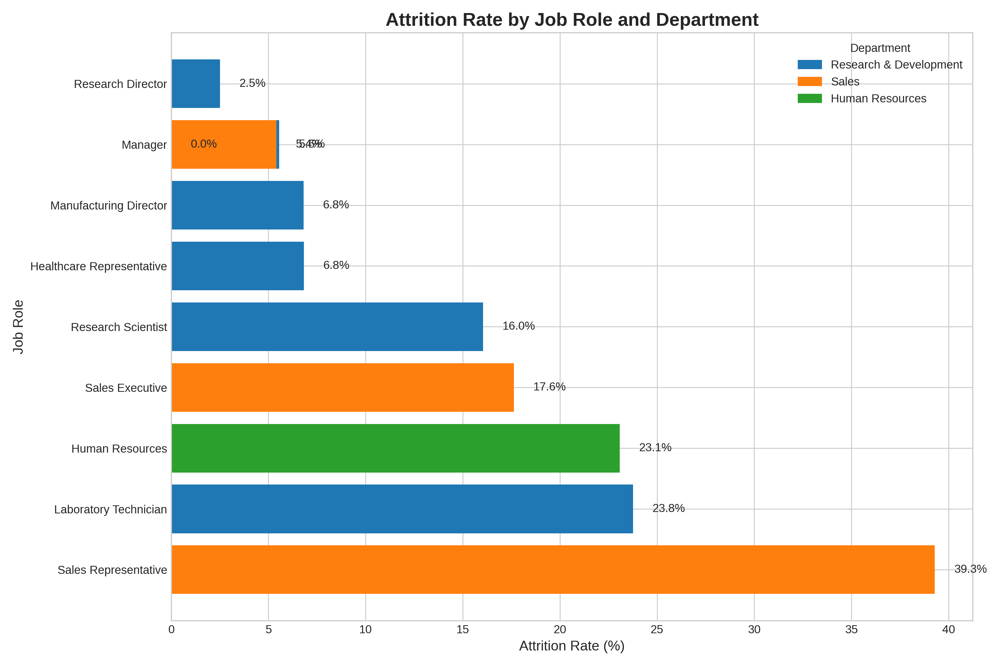

# Why is R&D's Attrition Rate So Low? A Deeper Dive into Employee Retention

## Executive Summary

The premise is correct: the Research & Development (R&D) department's attrition rate (**13.8%**) is significantly lower than that of Sales (**20.7%**) and Human Resources (**19.0%**). However, this report reveals that the cause is not department-wide policies or sentiment. Instead, **the difference is driven entirely by the composition of job roles within each department.**

The R&D department contains a high concentration of senior, specialized roles with naturally low turnover (e.g., Research Director, Manager), which masks the extremely high attrition of its junior roles (e.g., Laboratory Technician). Conversely, the Sales department's average is heavily skewed by the massive, industry-typical turnover of its large Sales Representative population.

**Key Recommendation:** The company should shift its focus from department-level retention strategies to **role-specific retention plans.** A one-size-fits-all approach is ineffective. Priority should be given to addressing the severe attrition among `Laboratory Technicians` in R&D and `Sales Representatives` in Sales.

---

## Initial Analysis: Confirming the Premise

Our analysis began by verifying the attrition rates across the company's three departments. The data confirms that R&D employees are indeed less likely to leave.

| Department             | Attrition Rate | Total Employees | Employees Who Left |
|------------------------|----------------|-----------------|--------------------|
| Sales                  | 20.7%          | 450             | 93                 |
| Human Resources        | 19.0%          | 63              | 12                 |
| **Research & Development** | **13.8%**      | **967**             | **133**                |

*Based on SQL query: `SELECT Department, COUNT(*) as TotalEmployees, SUM(CASE WHEN Attrition = 'Yes' THEN 1 ELSE 0 END) as AttritionCount FROM sheet1 GROUP BY Department;`*

This confirmed the business problem, leading to an investigation into the underlying causes.

---

## Investigating the "Why": Debunking Common Hypotheses

To understand the drivers behind R&D's lower attrition, we tested several common hypotheses. Surprisingly, none of them held true.

*   **Hypothesis 1: Higher Job Satisfaction? (False)**
    *   Satisfaction scores (Job, Environment, Relationship) are remarkably similar across all departments. No clear advantage for R&D was found. For example, average Job Satisfaction was highest in Sales (2.75) and lowest in HR (2.60), with R&D in the middle (2.72).

*   **Hypothesis 2: Better Work-Life Balance? (False)**
    *   The percentage of employees working overtime is nearly identical across departments: Sales (**28.7%**), R&D (**28.1%**), and HR (**27.0%**).
    *   Business travel patterns also show no significant differences.

*   **Hypothesis 3: Higher Income? (False)**
    *   Contrary to expectations, R&D employees have the lowest average monthly income (**$6,280**) compared to Sales (**$6,967**) and HR (**$6,655**). This indicates that financial compensation is not the reason for their high retention.

---

## The Core Insight: Attrition is Role-Driven, Not Department-Driven

The true driver of the varying attrition rates lies in the mix of job roles within each department. The department-level averages are misleading because they bundle together roles with drastically different retention profiles.

The following visualization breaks down attrition by specific job roles and reveals the true story.

**Key Takeaways from the Chart:**

*   **High-Attrition Roles Skew Averages:** The `Sales Representative` role has an enormous **39.3%** attrition rate. With 84 employees in this role, it single-handedly pulls the entire Sales department's average up. Similarly, the `Laboratory Technician` role in R&D has a **23.8%** attrition rate, which is hidden by the stability of other R&D roles.

*   **Low-Attrition Roles Anchor R&D:** The R&D department's low overall attrition is due to its high number of employees in stable, senior roles. For instance, `Research Director` (**2.5%** attrition), `Manager` (**5.6%**), and `Manufacturing Director` (**6.8%**) have exceptionally low turnover. These roles buffer the high attrition from technicians and scientists.

*   **Management Stability is Universal:** Across all departments, `Manager` level roles show very low attrition (R&D: 5.6%, Sales: 5.4%, HR: 0%). This indicates that leadership roles are inherently stable, regardless of the department.

---

## Business Implications & Recommendations

**Observation:** Department-level metrics are masking critical, role-specific retention problems.

**Root Cause:** The mix of high-turnover junior roles and low-turnover senior roles dictates a department's overall attrition rate. R&D's structure, rich with senior roles, gives it a statistical advantage in retention metrics.

**Business Impact:** Current retention efforts, if aimed at the departmental level, are likely misallocating resources. A department-wide bonus in R&D, for example, would reward roles that are already stable while failing to address the acute problem with Laboratory Technicians.

**Actionable Recommendations:**

1.  **Develop Role-Specific Retention Strategies:**
    *   **For `Laboratory Technicians` (23.8% Attrition):** Conduct focused exit interviews and surveys to understand their specific pain points. Are the issues related to career pathing, compensation for their specific role, or daily job pressures?
    *   **For `Sales Representatives` (39.3% Attrition):** While high turnover is common in this role, a 39.3% rate warrants investigation. Analyze factors like quota pressure, onboarding and training effectiveness, and commission structures. Even a small improvement here would significantly impact the company's overall attrition.

2.  **Re-evaluate Department-Level KPIs for Retention:** Stop using a single attrition metric for an entire department. Instead, segment retention KPIs by job level (e.g., junior, senior, management) or by specific high-volume roles (like `Sales Representative`). This will provide a more accurate picture of organizational health.

3.  **Protect and Learn from High-Retention Roles:** The extremely low attrition among `Research Directors` and `Managers` is a success story. The company should analyze what makes these roles so stable and apply those learnings to other areas where possible. This could involve examining factors like autonomy, project ownership, and impact on the business.
