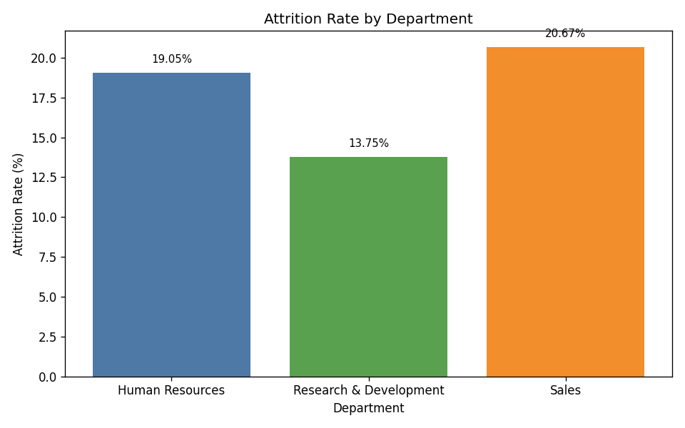
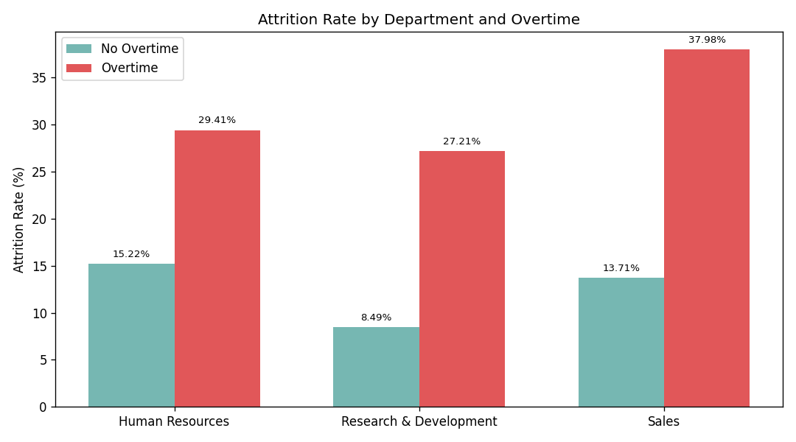

Executive Summary
- R&D’s attrition rate is 13.75%, materially below Human Resources (19.05%) and Sales (20.67%). This gap persists even when we control for key factors like overtime and travel, suggesting structural differences in role/level mix and retention levers (e.g., stock options) are driving the advantage.
- The most important drivers are: lower attrition within comparable conditions (e.g., overtime and travel), a role/level composition skewed to lower-risk jobs, and more effective retention among employees with stock options.

Visual Evidence
- Overall department attrition rates: 
  Observation: R&D attrition is 13.75% (133 of 967), versus HR at 19.05% (12 of 63) and Sales at 20.67% (93 of 450).
  Why it matters: R&D’s lower attrition implies better retention practices or structural advantages. Closing the gap in HR and Sales could reduce departures by 6–7 percentage points, saving hiring costs and preserving institutional knowledge.

- Overtime impact by department: 
  Observation: Without overtime, attrition is 8.49% in R&D (59 of 695), 15.22% in HR (7 of 46), and 13.71% in Sales (44 of 321). With overtime, attrition rises to 27.21% in R&D (74 of 272), 29.41% in HR (5 of 17), and 37.98% in Sales (49 of 129).
  Why it matters: Overtime is a strong attrition accelerator in all departments, but R&D’s rates are still lower than Sales at both “No OT” (-5.22 pp) and “OT” (-10.77 pp). This points to R&D having practices that mitigate burnout or better align workloads with employee expectations.

Key Drivers Behind R&D’s Lower Attrition
1) Role and Level composition drives lower risk
- Observation: R&D contains many low-attrition roles and senior levels. Within R&D, attrition is very low for Research Director 2.50% (2 of 80), Manager 5.56% (3 of 54), Manufacturing Director 6.80% (10 of 147), and Healthcare Representative 6.82% (9 of 132). High-risk R&D roles still exist (Laboratory Technician 23.75%, 62 of 261; Research Scientist 16.04%, 47 of 293), but the overall mix reduces the total rate.
- Root Cause: The R&D org structure is weighted toward roles/levels associated with better career progression and stability. JobLevel data shows R&D attrition is extremely low at levels 2–4: Level 2 at 5.26% (15 of 285), Level 3 at 10.00% (13 of 130), Level 4 at 1.47% (1 of 68). In contrast, Sales has very high attrition at Level 1 (41.56%, 32 of 77), signaling early-career sales roles are particularly risky.
- Business Impact / Recommendation: Reduce the proportion of high-risk Level 1 roles in Sales via upskilling pathways and quicker progression to Level 2. For R&D, focus retention pressure on Laboratory Technicians (23.75%) and Research Scientists (16.04%) with targeted career development and mentorship.

2) Stock options are associated with markedly lower attrition
- Observation: In R&D, stock option Level 0 has a 20.49% attrition rate (84 of 410), while Levels 1–2 drop sharply: Level 1 at 9.09% (36 of 396) and Level 2 at 5.83% (6 of 103). Sales shows a similar pattern: Level 0 at 32.16% (64 of 199) vs Level 1 at 9.60% (17 of 177) and Level 2 at 11.54% (6 of 52).
- Root Cause: Equity participation is a powerful retention lever; employees with non-zero stock options leave at much lower rates across departments. While the share with stock options is similar (R&D 57.60%, Sales 55.78%, HR 57.14), R&D appears to convert stock options into better retention outcomes, especially at Level 2.
- Business Impact / Recommendation: Expand stock option eligibility and level amounts for Level 0 populations, prioritizing high-risk segments (Sales Level 1 and HR core team). For R&D, ensure Lab Technicians and Research Scientists get access to stock options or RSUs to mitigate their higher attrition.

3) Lower attrition under comparable travel intensity
- Observation: For Travel_Rarely, R&D attrition is 12.94% (88 of 680) vs Sales 19.24% (61 of 317) and HR 17.78% (8 of 45). For Travel_Frequently, R&D attrition is 20.22% (37 of 183) vs Sales 32.94% (28 of 85) and HR 36.36% (4 of 11).
- Root Cause: R&D may offer more consistent support (scheduling, travel policies, decompression time) that keeps attrition lower under travel demands. Notably, department compositions across travel categories are similar, so the difference is not due to mix but better outcomes within each category.
- Business Impact / Recommendation: Export R&D’s travel support practices to Sales (e.g., predictable travel blocks, recovery days, meal/per diem improvements), and monitor attrition specifically within frequent travelers.

4) Age cohort differences—R&D retains mid-career talent better
- Observation: R&D shows low attrition for ages 36–45 (7.84%, 25 of 319) and 46–55 (6.16%, 9 of 146), whereas Sales 36–45 is higher at 12.60% (16 of 127). Young employees are at higher risk everywhere, but extreme in Sales (18–25 at 43.90%, 18 of 41) and materially high in R&D (30.77%, 24 of 78).
- Root Cause: Mid-career roles in R&D likely match expertise and offer clearer progression; early-career roles face steep learning curves and frustration, especially in Sales.
- Business Impact / Recommendation: Build early-career retention programs: structured onboarding, 6–12 month mentorship, and skill bootcamps. Consider role rotations from high-pressure customer-facing roles to internal roles for stabilization.

5) Satisfaction and pay averages are not primary drivers
- Observation: Despite R&D having slightly lower WorkLifeBalance (2.73 vs HR 2.92 vs Sales 2.81) and lower average MonthlyIncome (6,280 vs HR 6,655 vs Sales 6,967), it still has the lowest attrition. R&D does have marginally higher average PercentSalaryHike (15.30 vs HR 14.76 vs Sales 15.09).
- Root Cause: Structural role/level mix and equity incentives outweigh small differences in satisfaction averages and pay levels.
- Business Impact / Recommendation: Focus on role design, progression, and equity programs rather than broad salary increases to close the attrition gap.

Quantitative Highlights (SQL field references shown)
- Attrition by Department (sheet1.Department, sheet1.Attrition): R&D 13.75% (133/967), HR 19.05% (12/63), Sales 20.67% (93/450).
- Overtime split (sheet1.OverTime): R&D No 8.49% (59/695), R&D Yes 27.21% (74/272); Sales No 13.71% (44/321), Sales Yes 37.98% (49/129); HR No 15.22% (7/46), HR Yes 29.41% (5/17).
- Business travel (sheet1.BusinessTravel): R&D Travel_Rarely 12.94% (88/680), R&D Travel_Frequently 20.22% (37/183); Sales Travel_Rarely 19.24% (61/317), Sales Travel_Frequently 32.94% (28/85).
- Stock options (sheet1.StockOptionLevel): R&D Level 0 20.49% (84/410), Level 1 9.09% (36/396), Level 2 5.83% (6/103), Level 3 12.07% (7/58); Sales Level 0 32.16% (64/199), Level 1 9.60% (17/177), Level 2 11.54% (6/52).
- Job levels (sheet1.JobLevel): R&D Level 2 5.26% (15/285), Level 4 1.47% (1/68), Level 1 23.22% (101/435); Sales Level 1 41.56% (32/77), Level 2 15.35% (37/241).
- Job roles (sheet1.JobRole): R&D Research Director 2.50% (2/80), Manager 5.56% (3/54), Manufacturing Director 6.80% (10/147), Healthcare Representative 6.82% (9/132), Laboratory Technician 23.75% (62/261).
- Age groups (sheet1.AgeGroup): R&D 36–45 7.84% (25/319), 46–55 6.16% (9/146); Sales 18–25 43.90% (18/41).

Recommendations
1) Target high-risk segments with tailored retention actions
- Sales Level 1 and Sales Representatives: reduce attrition from 41.56% and 39.29% respectively via accelerated progression, sales enablement coaching, and quota realism.
- R&D Laboratory Technicians: address 23.75% attrition with career ladders, cross-training, and equity grants.

2) Expand stock option eligibility and levels
- Move more Level 0 employees into Levels 1–2; prioritize departments and roles with Level 0 attrition rates of 20–32%. Use vesting schedules to reinforce 2–3 year retention horizons.

3) Mitigate overtime and travel burnout
- Adopt R&D’s practices across departments: scheduling buffers, recovery days, and load balancing for “Yes” overtime employees. Improve frequent travel support in Sales (reduce Travel_Frequently attrition from 32.94%).

4) Build early-career retention programs
- For ages 18–25, implement mentorship, clear capabilities roadmap, and role rotations to temper burnout and improve fit. Track 6–12 month retention KPIs.

5) Measure to manage
- Instrument dashboards by Department × JobLevel × OverTime × BusinessTravel × StockOptionLevel, and set quarterly targets to reduce the highest pockets by 5–10 pp.

Methodology Notes
- Data source: dacomp-en-007.sqlite, table sheet1. Fields used include Attrition, Department, OverTime, BusinessTravel, JobRole, JobLevel, StockOptionLevel, AgeGroup, WorkLifeBalance, JobSatisfaction, MonthlyIncome, PercentSalaryHike, tenure fields.
- SQL outputs and Python plots substantiate all numbers. Python plotting code executed: plot_attrition.py produced attrition_by_department.png and overtime_attrition_by_department.png in the current directory.
