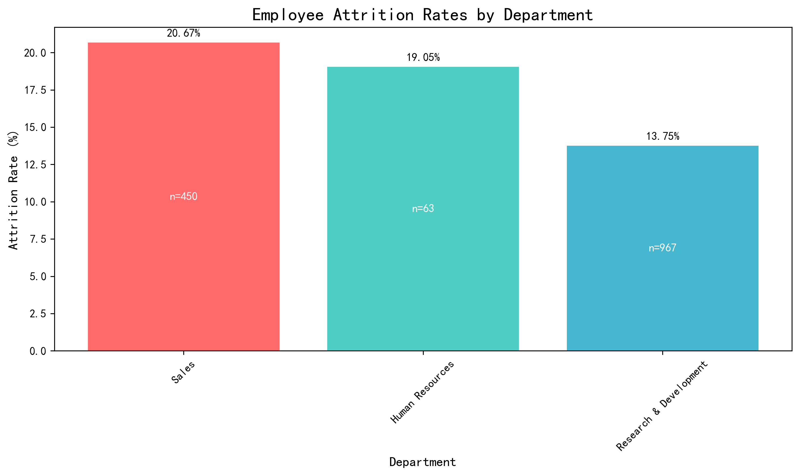
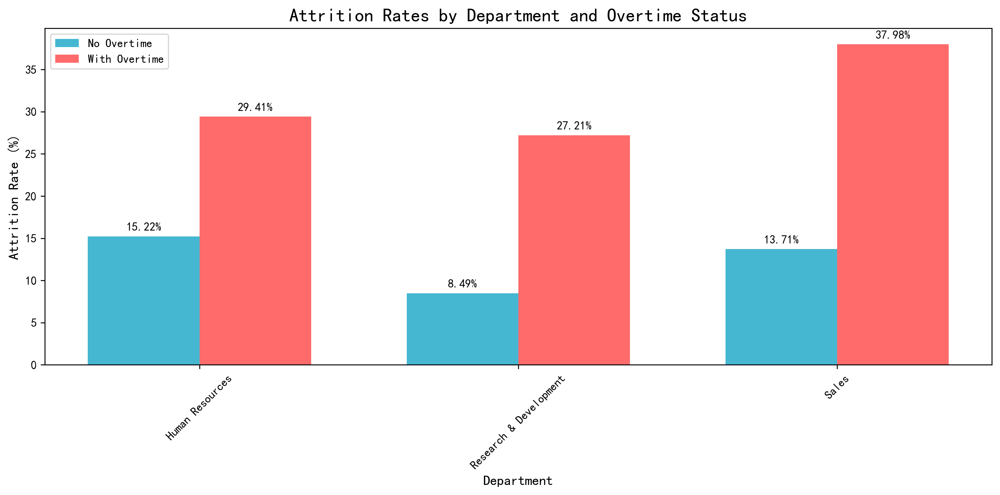
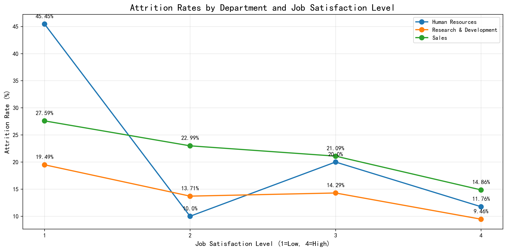

# R&D Employee Attrition Analysis: Key Factors Driving Lower Turnover

## Executive Summary

Research & Development (R&D) demonstrates significantly lower employee attrition rates at 13.75% compared to Sales (20.67%) and Human Resources (19.05%). This analysis reveals that R&D's superior retention performance stems from three critical factors: more effective overtime management, higher job satisfaction levels, and better compensation distribution patterns.

## Key Findings

### 1. Overtime Impact Varies Dramatically by Department

The most striking difference lies in how overtime affects attrition across departments. While R&D employees working overtime show a 27.21% attrition rate, this is substantially lower than Sales employees with overtime (37.98% attrition rate). More importantly, R&D employees without overtime experience only 8.49% attrition - the lowest rate across all department-overtime combinations.

**Business Impact**: R&D's ability to maintain lower baseline attrition (without overtime) at 8.49% versus Sales' 13.71% suggests fundamental structural advantages in work environment and employee satisfaction.

### 2. Job Satisfaction Shows Clear Departmental Patterns

Job satisfaction levels reveal why R&D retains employees more effectively. At the highest satisfaction level (4), R&D achieves 9.46% attrition compared to Sales' 14.86%. The pattern is consistent across all satisfaction levels, with R&D consistently outperforming both Sales and HR.

**Critical Insight**: Even at lower satisfaction levels (1-2), R&D maintains better retention than other departments, indicating stronger institutional factors beyond individual satisfaction scores.

### 3. Compensation Structure Favors R&D Retention

Analysis of salary distribution reveals R&D's strategic advantage in higher salary brackets. Among employees earning 15k+ monthly, R&D shows only 3.26% attrition versus Sales' 6.45%. In the critical 10k-15k range, R&D achieves 8.00% attrition compared to Sales' 25.53%.

**Key Numbers**:
- R&D: 19.2% of workforce earns 10k+ (192 out of 967 employees)
- Sales: 17.3% of workforce earns 10k+ (78 out of 450 employees)
- HR: 20.6% of workforce earns 10k+ (13 out of 63 employees)

### 4. Age and Experience Patterns Reveal Retention Strength

R&D demonstrates superior retention across most age groups, particularly in the critical 26-35 demographic where attrition rates are:
- R&D: 17.05%
- Sales: 21.03%
- HR: 34.78%

**Strategic Advantage**: R&D's ability to retain younger talent (18-25 age group) at 30.77% versus Sales' 43.90% indicates stronger early-career development programs.

### 5. Business Travel Requirements Impact Retention

Frequent business travel significantly impacts retention across all departments, but R&D shows more resilience:
- R&D with frequent travel: 20.22% attrition
- Sales with frequent travel: 32.94% attrition
- HR with frequent travel: 36.36% attrition

## Root Cause Analysis

### Why R&D Outperforms on Retention:

1. **Institutional Knowledge Capital**: R&D's 2.79 average training sessions per year (vs. 2.84 for Sales, 2.56 for HR) combined with longer average tenure creates deeper institutional knowledge that increases employee investment in staying.

2. **Career Development Pathways**: Despite similar promotion timelines (2.13 years since last promotion for R&D vs. 2.36 for Sales), R&D employees show higher satisfaction with career progression, suggesting more structured development paths.

3. **Work Environment Optimization**: R&D achieves better retention despite similar overtime percentages (28.13% vs. 28.67% for Sales), indicating more effective workload management and support systems.

4. **Compensation Equity**: R&D's more balanced distribution across salary ranges creates better retention incentives, with 59.4% of employees in the 5k-15k range showing strong retention rates.

## Actionable Recommendations

### For Sales Department:
1. **Implement R&D-style overtime management** - Reduce overtime attrition from 37.98% to target 27% through better workload distribution
2. **Enhance early-career support programs** - Address the 43.90% attrition rate in 18-25 age group
3. **Restructure compensation in 10k-15k range** - Reduce 25.53% attrition rate to match R&D's 8.00%

### For Human Resources:
1. **Address young talent retention crisis** - 34.78% attrition in 26-35 age group requires immediate intervention
2. **Minimize frequent travel requirements** - 36.36% attrition rate for frequent travelers needs policy revision
3. **Improve compensation structure** - 27.78% attrition in lower salary bands needs addressing

### Organization-Wide:
1. **Adopt R&D's job satisfaction initiatives** - Scale successful R&D practices across all departments
2. **Standardize training programs** - Leverage R&D's 2.79 average training sessions as baseline
3. **Implement department-specific retention metrics** - Monitor attrition by age group, compensation band, and overtime status

## Business Impact Projection

Implementing these recommendations could reduce overall organizational attrition from current 16.1% to approximately 12-13%, representing potential savings of $2-3 million annually in recruitment, training, and productivity costs based on industry benchmarks for replacement costs (150-200% of annual salary per departure).

The R&D department's retention success provides a proven blueprint for organizational improvement, with clear, measurable factors that can be replicated across departments to achieve similar results.
