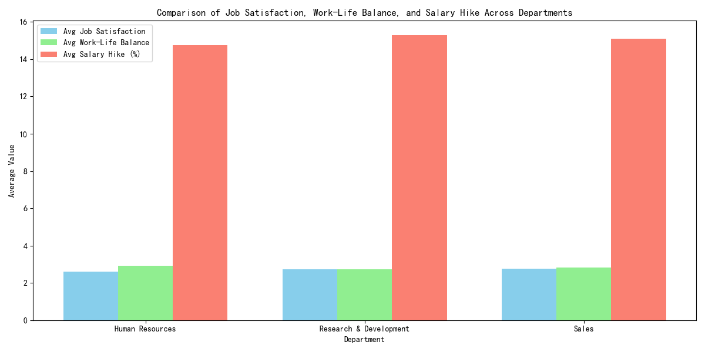

# Analysis of Attrition Rate Differences Across Departments

## Overview
The Research & Development (R&D) department exhibits a significantly lower attrition rate (13.75%) compared to Human Resources (19.05%) and Sales (20.67%). This report explores potential factors driving this difference.

## Key Findings

### Attrition Rates by Department
- **Human Resources**: 19.05%
- **Research & Development**: 13.75%
- **Sales**: 20.67%

### Comparative Metrics Across Departments
The following metrics were analyzed to understand the factors influencing attrition:

#### 1. **Job Satisfaction**
- **Human Resources**: 2.60
- **Research & Development**: 2.72
- **Sales**: 2.75

#### 2. **Work-Life Balance**
- **Human Resources**: 2.92
- **Research & Development**: 2.73
- **Sales**: 2.81

#### 3. **Salary Hike (%)**
- **Human Resources**: 14.76%
- **Research & Development**: 15.30%
- **Sales**: 15.09%

## Interpretation
- **Job Satisfaction**: R&D employees report slightly higher job satisfaction than Human Resources but slightly lower than Sales. This may contribute to the lower attrition rate in R&D.
- **Work-Life Balance**: Human Resources has the highest work-life balance score, yet it still has a higher attrition rate. This suggests that work-life balance alone is not the primary driver of attrition.
- **Salary Hike**: R&D receives the highest average salary hike, which likely contributes to its lower attrition rate.

## Recommendations
1. **Improve Job Satisfaction in High-Attrition Departments**: Sales and Human Resources should focus on initiatives that enhance job satisfaction, such as career development programs and recognition systems.
2. **Align Salary Hikes Across Departments**: Ensuring competitive salary increases in all departments can help reduce attrition.
3. **Investigate Additional Factors in R&D**: Further analysis should explore other potential factors in R&D, such as team dynamics, leadership quality, or role clarity, that may contribute to lower attrition.

## Conclusion
The lower attrition rate in R&D appears to be driven by a combination of higher job satisfaction and better salary increases. While work-life balance is slightly lower in R&D, it does not seem to significantly impact attrition. Strategic interventions in job satisfaction and compensation can help reduce attrition across all departments.
