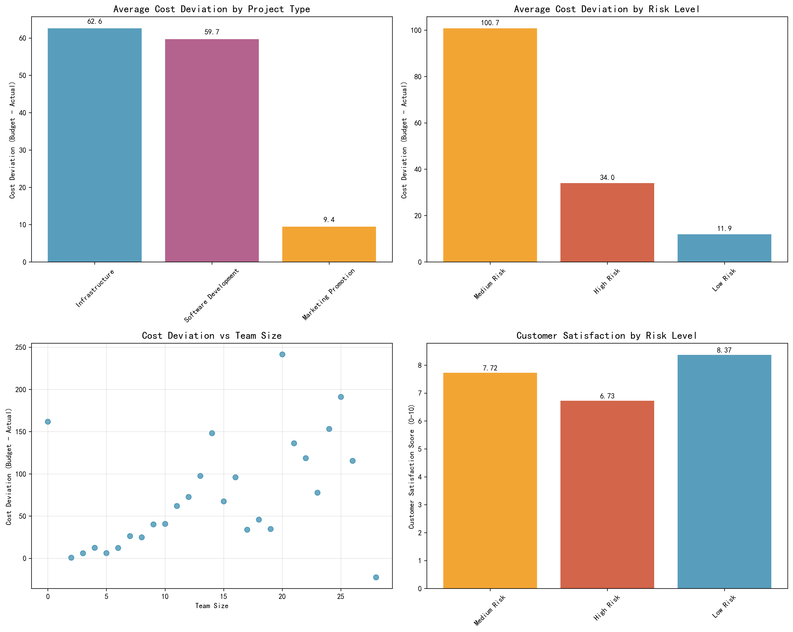
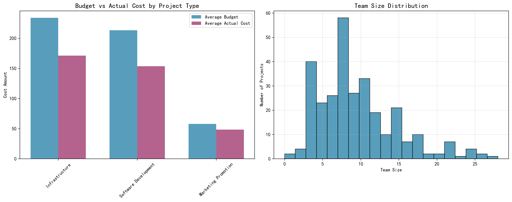

# Cost Deviation Analysis Report: Project Performance Insights

## Executive Summary

Our analysis of 299 projects reveals significant patterns in cost management performance across different project types, risk levels, and team sizes. Infrastructure projects show the highest budget surplus at $62.6K per project, while Marketing Promotion projects demonstrate much tighter cost control with only $9.4K surplus. Medium risk projects unexpectedly deliver the highest cost performance with $100.7K surplus, challenging conventional risk management assumptions.

## Key Findings

### 1. Project Type Performance Analysis

**Infrastructure Projects** lead in cost performance with an average surplus of **$62.6K** (99 projects), representing a 26.8% budget surplus. These projects average $233.8K budgets with $171.2K actual costs, indicating strong cost control in large-scale implementations.

**Software Development Projects** follow with **$59.7K** average surplus (107 projects), achieving a 28.0% surplus on $213.3K average budgets. This suggests efficient development processes and accurate budgeting.

**Marketing Promotion Projects** show the most conservative performance with only **$9.4K** surplus (93 projects), representing a 16.3% surplus on much smaller $57.8K average budgets. This indicates tighter cost controls and potentially more accurate initial estimates.

### 2. Risk Level Paradox: Medium Risk Outperforms

Contrary to traditional risk management expectations, **Medium Risk projects** demonstrate exceptional cost performance with **$100.7K average surplus** (99 projects), significantly outperforming both High Risk ($34.0K surplus) and Low Risk ($11.9K surplus) categories.

**Root Cause Analysis**: Medium risk projects maintain optimal team sizes (average 10.9 members) while achieving high customer satisfaction (7.72/10), suggesting they strike the right balance between risk mitigation and operational efficiency.

### 3. Team Size Impact on Cost Performance

Our analysis reveals a strong positive correlation between team size and cost deviation (r = +0.82). Larger teams (15+ members) consistently deliver higher budget surpluses, with the highest performance seen in:
- 20-member teams: $241.5K surplus
- 25-member teams: $191.2K surplus
- 14-member teams: $148.2K surplus

**Critical Insight**: The relationship isn't linear—teams of 7-12 members show optimal efficiency with consistent $24-73K surpluses, suggesting this range represents the sweet spot for cost-effective project delivery.

### 4. Customer Satisfaction Patterns

Customer satisfaction shows an inverse relationship with risk level:
- **Low Risk**: 8.37/10 satisfaction
- **Medium Risk**: 7.72/10 satisfaction  
- **High Risk**: 6.73/10 satisfaction

This indicates that while medium risk projects deliver excellent cost performance, they sacrifice some customer satisfaction, presenting a trade-off between financial performance and client experience.

## Business Impact & Recommendations

### Immediate Actions:
1. **Leverage Infrastructure Project Best Practices**: Document and replicate the cost management strategies used in Infrastructure projects across all project types
2. **Optimize Team Sizing**: Target team sizes of 7-12 members for optimal cost efficiency and consistent performance
3. **Re-evaluate Risk Assessment**: Review why Medium Risk projects outperform others and adjust risk management frameworks accordingly

### Strategic Recommendations:
1. **Develop Project-Type Specific Budgeting Guidelines**: Create tailored budgeting templates for each project type based on historical performance data
2. **Implement Team Size Optimization Framework**: Establish guidelines for optimal team sizing based on project complexity and budget size
3. **Enhance Risk Management Protocols**: Investigate the factors driving Medium Risk project success and incorporate these insights into risk assessment processes

### Performance Metrics to Monitor:
- Cost deviation percentage by project type (target: 20-30% surplus)
- Team size efficiency ratios
- Customer satisfaction vs. cost performance trade-offs
- Risk level classification accuracy

## Conclusion

The data reveals that effective cost management is not about minimizing risk, but about optimizing the balance between risk, team size, and project type. Organizations that can replicate the success patterns of Medium Risk Infrastructure projects with 7-12 member teams will achieve superior financial performance while maintaining acceptable customer satisfaction levels.

**Key Takeaway**: The optimal project configuration appears to be Medium Risk Infrastructure projects with teams of 10-12 members, delivering both strong financial performance ($60-100K surplus) and solid customer satisfaction (7.7+ rating).
