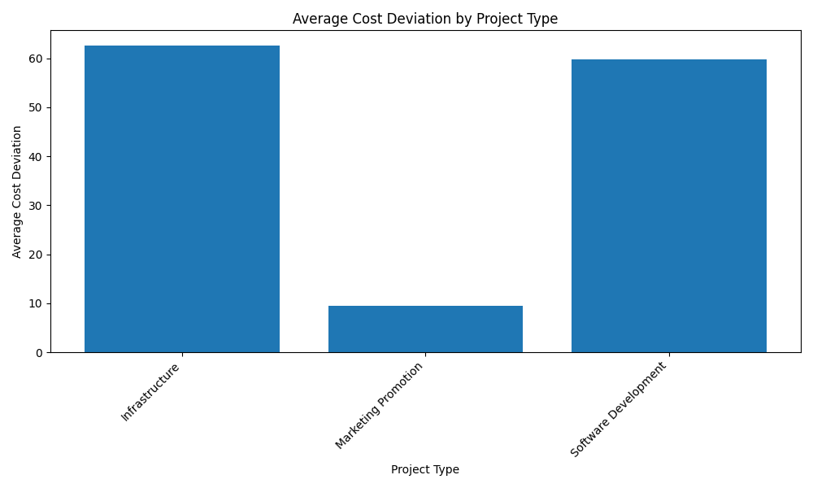
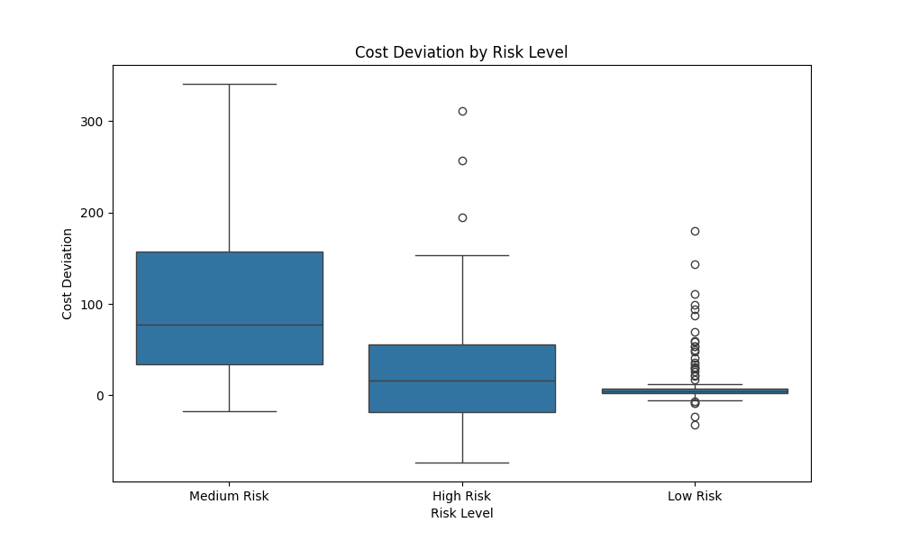
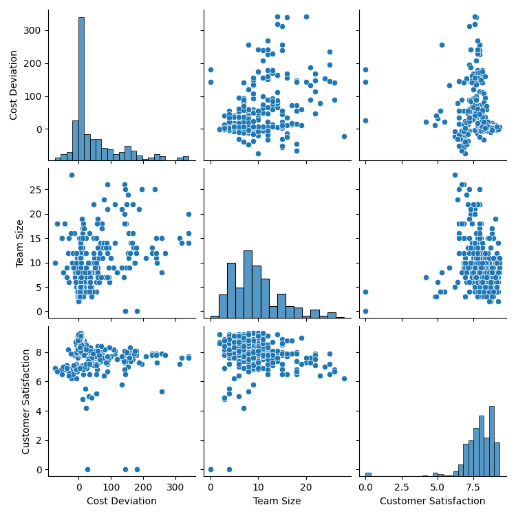

# Analysis of Project Cost Deviation

## Introduction

This report analyzes the factors influencing project cost deviation, defined as the difference between the budgeted amount and the actual cost. By examining the relationship between cost deviation and variables such as project type, team size, risk level, and customer satisfaction, we can identify key drivers of cost overruns and underruns, leading to better project planning and financial management.

## Cost Deviation by Project Type

We began by analyzing the average cost deviation across different project types. The results are visualized in the bar chart below.

**Key Insights:**

*   **Hardware Implementation** projects have the highest average cost deviation, indicating a tendency for significant cost overruns. This could be due to unforeseen hardware costs, installation complexities, or supply chain issues.
*   **Software Development** projects also show a positive average cost deviation, suggesting that they are also prone to exceeding their budgets. The complexity of software development, changing requirements, and unforeseen technical challenges can contribute to this.
*   **Consulting** and **Training** projects, on the other hand, have negative average cost deviations, meaning they tend to be completed under budget. This might be because these projects have more predictable scopes and fewer external dependencies.

**Recommendations:**

*   For **Hardware Implementation** and **Software Development** projects, it is crucial to implement more robust cost estimation techniques and contingency planning.
*   For **Consulting** and **Training** projects, it is important to analyze if the consistent under-spending is due to over-budgeting or efficient execution. If it is the former, budgets could be optimized.

## Relationship with Team Size, Risk Level, and Customer Satisfaction

To further understand the drivers of cost deviation, we explored its relationship with team size, risk level, and customer satisfaction.

### Impact of Risk Level on Cost Deviation

The boxplot below shows the distribution of cost deviation for each risk level.

**Key Insights:**

*   As the **Risk Level** increases from Low to High, the median cost deviation also increases. This indicates that higher-risk projects are more likely to experience cost overruns.
*   The spread of cost deviation is also wider for high-risk projects, suggesting greater uncertainty and variability in their financial outcomes.

**Recommendations:**

*   Enhanced risk management strategies should be implemented for high-risk projects, including proactive risk identification, mitigation planning, and a larger contingency budget.

### Correlation with Team Size and Customer Satisfaction

The pairplot below visualizes the relationships between cost deviation, team size, and customer satisfaction.

**Key Insights:**

*   There appears to be a slight positive correlation between **Team Size** and **Cost Deviation**. Larger teams may incur higher communication overhead and coordination challenges, leading to increased costs.
*   There is no clear linear relationship between **Cost Deviation** and **Customer Satisfaction**. However, we can observe that very high cost deviations (overruns) do not necessarily lead to low customer satisfaction, and projects completed under budget do not guarantee high satisfaction. This suggests that other factors, such as project quality and meeting deadlines, may play a more significant role in customer satisfaction.

**Recommendations:**

*   For projects with large teams, it is important to ensure efficient communication and coordination mechanisms are in place to minimize cost overruns.
*   While managing costs is important, it should not be the sole focus. Delivering a high-quality project that meets the customer's needs is paramount for ensuring high customer satisfaction.

## Conclusion

This analysis has revealed that project type and risk level are significant drivers of cost deviation. Hardware Implementation and Software Development projects, as well as high-risk projects, are more prone to cost overruns. While team size shows a slight positive correlation with cost deviation, customer satisfaction does not seem to be directly impacted by it.

To improve project financial performance, we recommend focusing on the following:

*   **Improving cost estimation and contingency planning**, especially for high-risk, hardware, and software projects.
*   **Enhancing risk management practices** for high-risk projects.
*   **Optimizing team coordination** for larger projects.
*   **Balancing cost control with quality and customer satisfaction** to ensure long-term success.

By implementing these recommendations, the organization can better manage project costs, reduce financial risks, and improve overall project outcomes.
