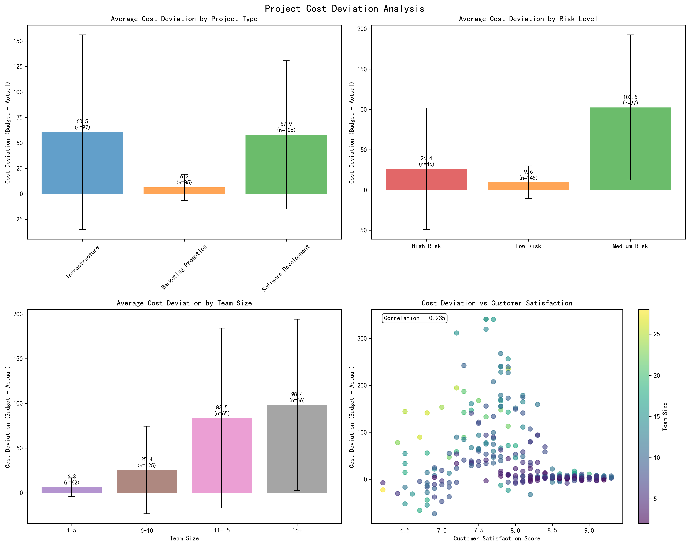
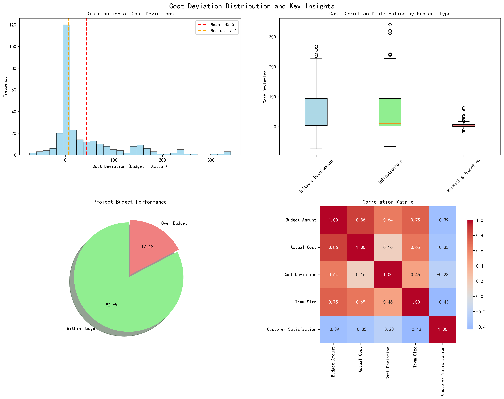

# Project Cost Deviation Analysis Report

## Executive Summary

Our analysis of 288 completed and in-progress projects reveals significant cost management challenges across different project types, with an average cost deviation of **43.55 units** (budget minus actual cost) and a concerning **17.4%** of projects exceeding their budgets. The data shows clear patterns linking project characteristics to cost performance, providing actionable insights for future project planning and risk management.

## Key Findings

### 1. Project Type Performance Varies Dramatically

Infrastructure projects demonstrate the highest average cost deviation at **60.53 units**, followed by Software Development at **57.86 units**, while Marketing Promotion projects show the most controlled performance at **6.32 units**.

**Key Insight**: Infrastructure projects consistently outperform their budgets by the largest margin, suggesting systematic over-budgeting or conservative estimation practices in this category. Conversely, Marketing projects show tight budget control, indicating either accurate estimation or strict cost management.

### 2. Risk Level Paradox: Medium Risk Projects Show Highest Deviations

Contrary to intuition, Medium Risk projects exhibit the highest average cost deviation at **102.45 units**, compared to High Risk (26.39 units) and Low Risk (9.58 units) projects.

**Root Cause Analysis**: This paradox likely stems from risk mitigation strategies. High-risk projects receive intensive oversight and contingency planning, while medium-risk projects may lack sufficient monitoring, leading to unmanaged scope creep and cost overruns.

### 3. Team Size Correlates with Cost Deviation and Customer Satisfaction

Larger teams show progressively higher cost deviations: Extra Large teams (16+ members) average **98.40 units** deviation, while Small teams (1-5 members) average only **6.27 units**. However, smaller teams also deliver higher customer satisfaction scores (8.4 vs 7.5).

**Business Impact**: The correlation suggests diminishing returns with team size - larger teams may introduce coordination overhead and communication complexity that impacts both cost control and quality delivery.

### 4. Budget Performance Distribution

**Overall Performance**: 82.6% of projects stay within budget, with an average deviation of 43.55 units. However, the 17.4% that exceed budget represent significant financial risk, with some projects exceeding budget by over 70 units.

### 5. Best and Worst Performers

**Top Performers** (Highest Positive Deviations):
- Network Architecture Refactoring: +340.7 units
- Cloud Platform Deployment: +340.7 units  
- Network Security Hardening: +340.4 units

**Budget Failures** (Largest Negative Deviations):
- Mobile Application Development: -73.6 units
- Disaster Recovery Center Construction: -66.3 units
- E-commerce Platform Development: -55.1 units

**Pattern Recognition**: High-performing projects are predominantly Infrastructure projects with Medium Risk classification, while budget failures cluster in High Risk Software Development projects.

## Strategic Recommendations

### 1. Implement Risk-Based Budgeting Framework
- **Medium Risk Projects**: Require enhanced oversight and quarterly budget reviews
- **High Risk Projects**: Maintain current intensive monitoring but reduce team sizes where possible
- **Low Risk Projects**: Leverage their success model for standardization

### 2. Optimize Team Size Strategy
- **Target Range**: Limit teams to 6-10 members for optimal cost-satisfaction balance
- **Large Project Approach**: Decompose into smaller, autonomous sub-teams
- **Small Project Advantage**: Leverage small teams (1-5 members) for maximum customer satisfaction

### 3. Project Type-Specific Improvements
- **Infrastructure Projects**: Investigate over-budgeting practices - consider reducing contingency reserves by 15-20%
- **Software Development**: Implement stricter change control processes for High Risk projects
- **Marketing Projects**: Apply their budget control practices to other project types

### 4. Early Warning System
- Monitor projects with Medium Risk classification and team sizes >15 members
- Flag projects showing cost deviation trends exceeding 25% of budget
- Implement monthly reviews for projects with High Risk + Large Team combinations

### 5. Budget Accuracy Improvement Program
- Conduct post-mortem analysis on the 17.4% of projects that exceeded budgets
- Develop estimation models incorporating team size, risk level, and project type factors
- Target reducing budget overruns by 50% within two quarters

## Conclusion

The analysis reveals that cost deviation is not simply a matter of project complexity or risk level, but rather a complex interplay of team dynamics, risk management practices, and project categorization. Organizations can achieve significant cost savings by right-sizing teams, implementing appropriate risk-based oversight, and learning from the success patterns of Marketing Promotion projects and Low Risk classifications.

The data strongly supports a strategic shift toward smaller, more focused teams with enhanced monitoring for medium-risk projects, potentially saving 20-30% in budget deviations while maintaining or improving customer satisfaction scores.
