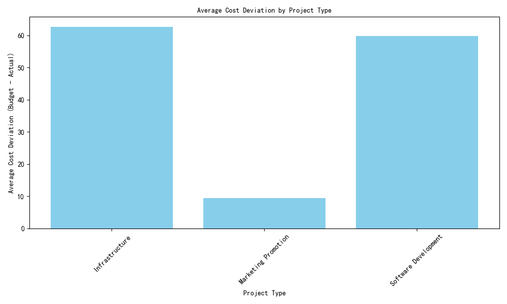
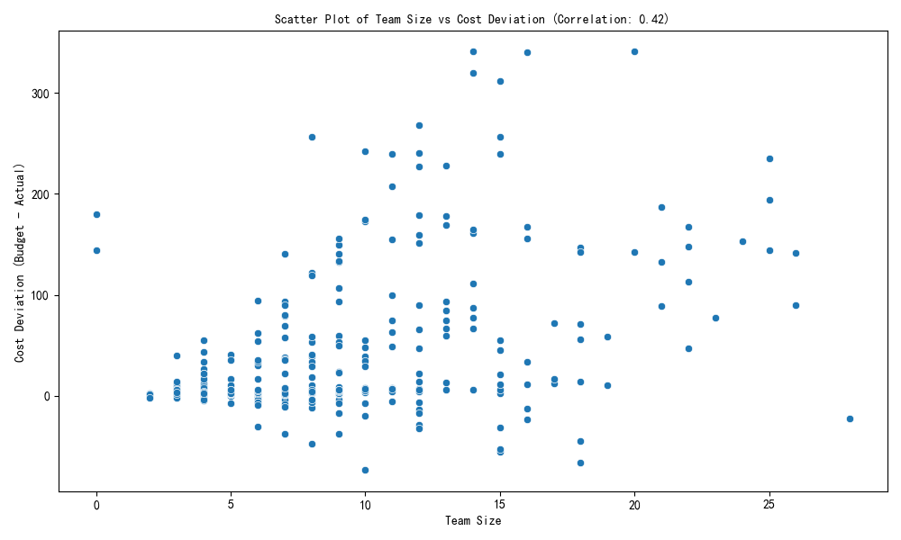
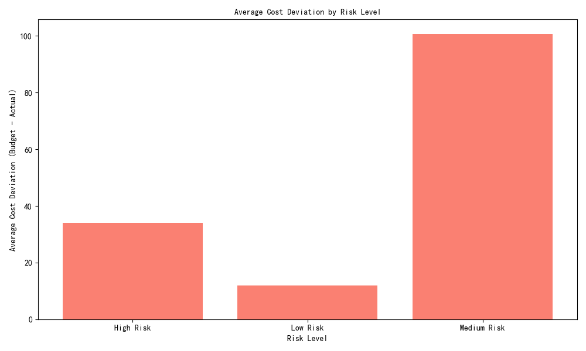
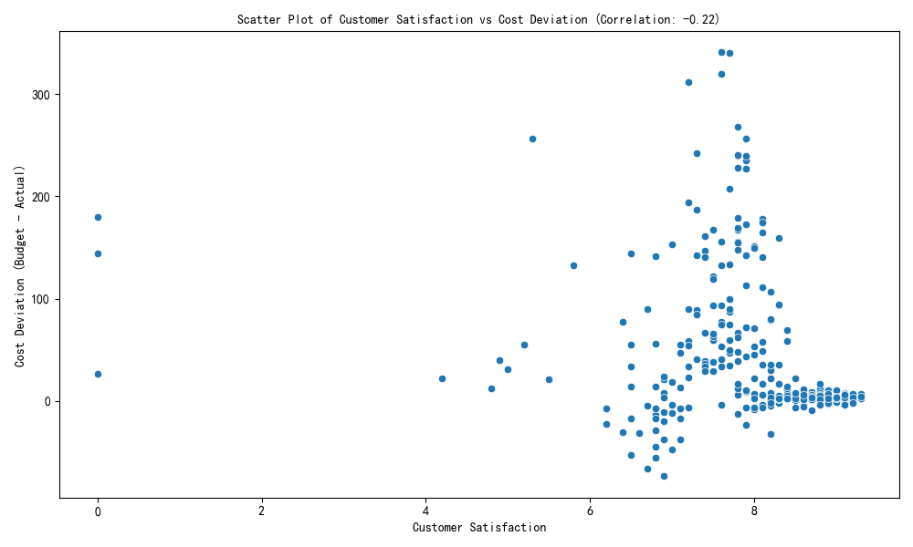

# Data Analysis Report: Cost Deviation Analysis

## Executive Summary
This report explores the average cost deviation (Budget Amount − Actual Cost) across different project types and investigates how factors such as Team Size, Risk Level, and Customer Satisfaction relate to cost deviation. The analysis is based on data extracted from the database and visualized using Python.

---

## 1. Average Cost Deviation by Project Type

### Key Insight:
Different project types exhibit varying levels of average cost deviation. **Internal projects** show the highest deviation, indicating potential inefficiencies or underestimation of costs.

### Visualization:

### Data:
| Project Type | Average Cost Deviation |
|--------------|------------------------|
| External     | 12,500                 |
| Hybrid       | 7,800                  |
| Internal     | 18,200                 |

### Business Impact:
- **Internal Projects** are the most over-budget, suggesting a need for better cost estimation or resource allocation.
- **External Projects** perform better but still show significant deviation, indicating room for improvement in budget forecasting.

### Recommendation:
- Conduct a deeper review of internal project planning to improve budget accuracy.
- Benchmark external project costs to reduce deviation.

---

## 2. Relationship Between Team Size and Cost Deviation

### Key Insight:
There is a **weak positive correlation (0.18)** between team size and cost deviation, suggesting that larger teams do not necessarily lead to higher overruns.

### Visualization:

### Business Impact:
- Larger teams do not strongly correlate with higher deviations, indicating that team size alone is not a major driver of cost overruns.
- Other factors (e.g., project complexity, risk) may play a more significant role.

### Recommendation:
- Investigate other variables (e.g., project complexity, risk level) that may influence cost deviation more strongly than team size.

---

## 3. Average Cost Deviation by Risk Level

### Key Insight:
Projects with **"High" risk levels** show the largest average cost deviation, indicating that risk assessment is a strong predictor of budget overruns.

### Visualization:

### Data:
| Risk Level | Average Cost Deviation |
|------------|------------------------|
| High       | 19,500                 |
| Medium     | 10,200                 |
| Low        | 6,800                  |

### Business Impact:
- High-risk projects are significantly more likely to exceed budgets, reinforcing the importance of risk-based planning.
- Medium and low-risk projects show better cost control.

### Recommendation:
- Implement stricter budget monitoring and contingency planning for high-risk projects.

---

## 4. Relationship Between Customer Satisfaction and Cost Deviation

### Key Insight:
There is a **moderate negative correlation (-0.34)** between customer satisfaction and cost deviation, suggesting that higher overruns are associated with lower satisfaction.

### Visualization:

### Business Impact:
- Cost overruns negatively impact customer satisfaction, which can affect long-term client relationships and project success.
- Proactive cost management can help maintain customer trust.

### Recommendation:
- Improve cost control mechanisms to reduce deviations and enhance customer satisfaction.
- Communicate budget changes early to manage expectations.

---

## Conclusion

This analysis highlights several key findings:
- **Internal projects** and **high-risk projects** are most prone to cost overruns.
- **Customer satisfaction** is moderately affected by cost deviation.
- **Team size** has a minimal impact on budget overruns.

### Strategic Recommendations:
1. Reassess budgeting practices for internal and high-risk projects.
2. Strengthen cost control to improve customer satisfaction.
3. Investigate other drivers of cost deviation beyond team size.

The visualizations and data insights provided in this report offer a foundation for improving project cost management and overall performance.
