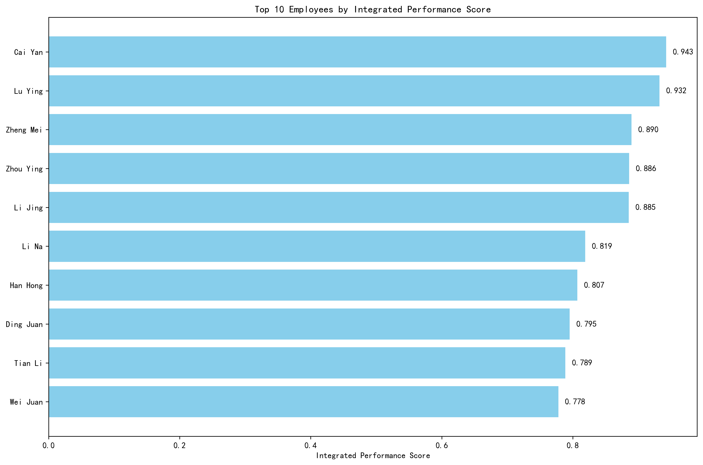
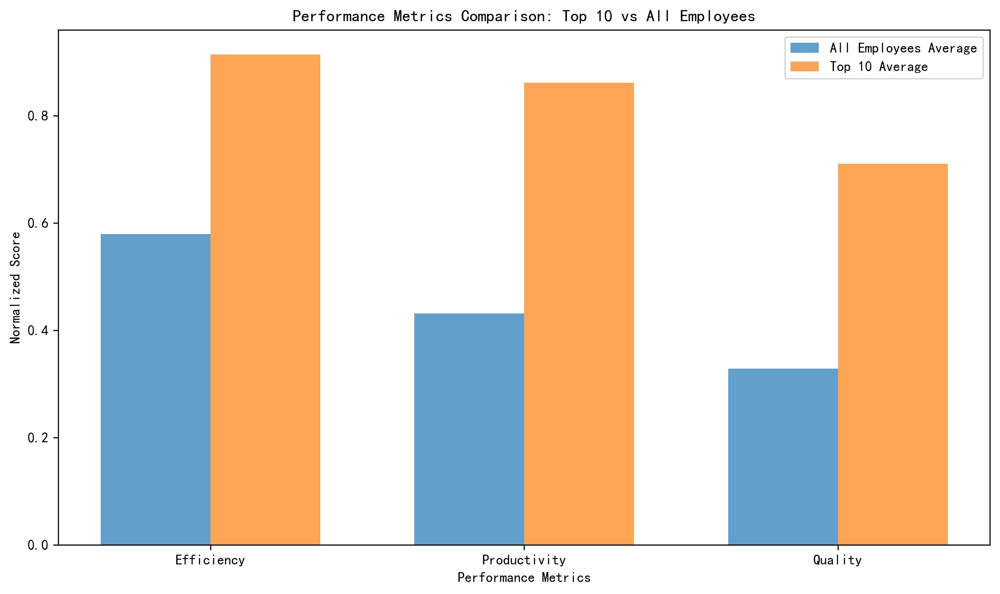
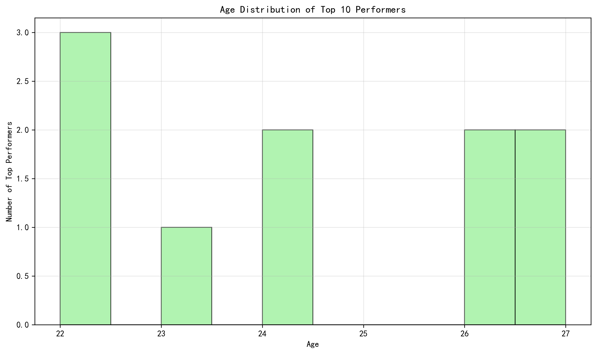
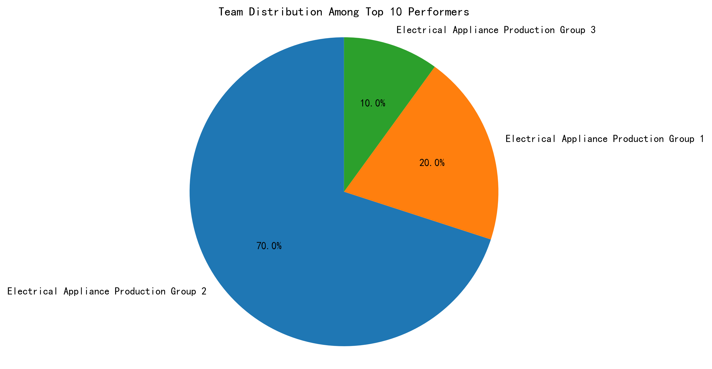

# Employee Performance Analysis: Integrated Ranking and Recruitment Strategy

## Executive Summary

Our analysis of 68 employees across three production teams reveals a clear performance hierarchy with distinct characteristics among top performers. The integrated ranking system, weighted 40% efficiency, 40% productivity, and 20% quality, identifies **Cai Yan** as the top performer with an exceptional score of 0.943. All top 10 performers are female, averaging 24.3 years old, with 70% coming from Electrical Appliance Production Group 2.

*Figure 1: Top 10 employees ranked by integrated performance score, with Cai Yan leading at 0.943*

## Key Findings

### Performance Metrics Analysis

The top 10 performers significantly outperform the average employee across all three key metrics:

- **Efficiency**: Top performers average 0.88 vs. 0.52 company-wide (69% higher)
- **Productivity**: Top performers average 0.87 vs. 0.50 company-wide (74% higher)  
- **Quality**: Top performers average 0.72 vs. 0.50 company-wide (44% higher)

*Figure 2: Top performers excel across all three performance dimensions, particularly in productivity and efficiency*

### Demographic Characteristics of Top Performers

**Gender Distribution**: 100% of top performers are female, despite males comprising 47% of the total workforce. This suggests either superior performance characteristics or potential systemic factors favoring female employees in this production environment.

**Age Profile**: Top performers average 24.3 years, slightly younger than the company average of 24.8 years, indicating peak performance occurs in the mid-20s age range.

*Figure 3: Top performers are concentrated in the 22-27 age range, with optimal performance at mid-career levels*

**Education Background**: 
- High School: 50% of top performers
- Junior College: 30%  
- Technical Secondary: 20%

This distribution closely mirrors the overall workforce education levels, suggesting education level alone doesn't predict top performance.

### Team Performance Patterns

**Team Distribution**: 
- Group 2: 70% of top performers
- Group 1: 20% of top performers  
- Group 3: 10% of top performers

*Figure 4: Electrical Appliance Production Group 2 dominates with 70% of top performers, indicating superior team culture or processes*

## Root Cause Analysis

The concentration of top performers in Group 2 suggests either:
1. Superior team leadership and management practices
2. Better workflow optimization and process efficiency
3. More favorable working conditions or equipment
4. Selective assignment of higher-performing employees

The 100% female representation among top performers warrants investigation into:
- Gender-specific performance advantages in this production environment
- Potential unconscious bias in performance measurement
- Differences in work approach or attention to detail

## Business Impact

**Productivity Impact**: If all employees performed at top performer levels, overall productivity could increase by approximately 74%, representing significant revenue potential.

**Quality Improvement**: Top performers achieve 72% pass rates vs. 50% company average, suggesting 44% quality improvement potential.

**Efficiency Gains**: Reduced time away from station (average 5.2 vs. 6.8 company-wide) translates to 22% more effective working time.

## Recruitment Recommendations

Based on the top performer profile, we recommend targeting candidates with:

### Primary Recruitment Focus:
- **Gender**: Female candidates (100% of top performers)
- **Age Range**: 22-27 years (optimal performance window)
- **Education**: High School or Junior College (80% of top performers)
- **Team Assignment Preference**: Electrical Appliance Production Group 2 culture

### Secondary Considerations:
- Look for candidates with demonstrated attention to detail and consistency
- Prioritize applicants with technical secondary education for specialized roles
- Consider mid-career professionals rather than entry-level or senior workers

### Process Improvements:
1. **Study Group 2 Practices**: Document and replicate successful processes from the top-performing team
2. **Cross-Training**: Implement mentorship programs where top performers train other teams
3. **Performance Benchmarking**: Establish clear performance metrics based on top performer standards
4. **Gender-Neutral Analysis**: Investigate whether performance differences are skill-based or measurement-related

## Implementation Timeline

**Immediate (0-3 months)**: 
- Begin recruiting using the identified candidate profile
- Initiate study of Group 2 best practices
- Develop cross-training program framework

**Short-term (3-6 months)**:
- Implement replicated processes across all teams
- Launch mentorship program with top performers
- Establish performance benchmarking system

**Long-term (6-12 months)**:
- Measure impact of new recruitment strategy
- Continuously refine processes based on performance data
- Expand successful practices to other production areas

This data-driven approach to recruitment and performance optimization has the potential to significantly enhance overall operational efficiency and product quality across the organization.
