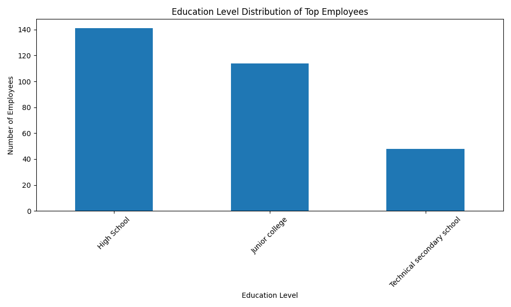

# Integrated Employee Performance Analysis and Recruitment Recommendations

## Introduction

To identify the characteristics of top-performing employees and inform future recruitment strategies, we conducted an integrated performance analysis. We developed a composite score that ranks employees based on three key metrics: **Effective Working Hours**, **Overall Units Produced**, and **Production Quality (Pass Rate)**. This report details our findings and provides data-driven recommendations for the ideal candidate profile.

## Methodology

We began by combining daily production data from six separate sheets into a unified dataset. From this, we engineered a new metric, "Effective Working Hours," by subtracting "Total Time Away" from the "Standard Working Hours."

To create a holistic performance measure, we normalized each of the three key metrics (Effective Working Hours, Units Produced, and Pass Rate) and then calculated an "Integrated Score" as a simple average of these normalized values. Employees were then ranked based on this score, and we focused our analysis on the top 10% of performers.

## Key Findings: Characteristics of Top Employees

Our analysis of the top-performing employees revealed a distinct profile:

*   **Education Level:** The most common educational background among top performers is **High School**. This group represents the largest portion of our high-achievers, suggesting that a formal higher education degree is not a prerequisite for success in this role.

*   **Age:** The average age of our top performers is approximately **24.2 years**. This indicates that younger employees, who may be in the early stages of their careers, are particularly effective and adaptable in our production environment.

The following visualization illustrates the educational background of our top-performing employees:

As the chart "Education Level Distribution of Top Employees" clearly shows, individuals with a 'High School' education make up the largest segment of top performers, followed by 'Technical secondary school' and 'Junior college'. This reinforces the conclusion that practical skills and on-the-job performance are more critical than advanced academic credentials for this role.

## Recommendations for Future Recruitment

Based on this analysis, we recommend that the HR department refines its recruitment strategy to target candidates with the following profile:

1.  **Prioritize Candidates with a High School Education:** Our data shows a strong correlation between a high school education and top-tier performance. Recruitment efforts and job postings should be tailored to attract these candidates.

2.  **Focus on Younger Applicants:** With an average age of 24.2 years, our top performers are relatively young. Targeting this demographic in recruitment campaigns could lead to a more productive workforce.

3.  **Screen for Work Ethic and Adaptability:** While not directly measured, the high "Effective Working Hours" and "Pass Rate" of top performers point to the importance of qualities like dedication, focus, and a willingness to learn. Interview processes should include behavioral questions to assess these traits.

By aligning our recruitment efforts with these data-driven insights, we can increase the likelihood of hiring candidates who will excel in our production environment, ultimately boosting overall productivity and quality.
