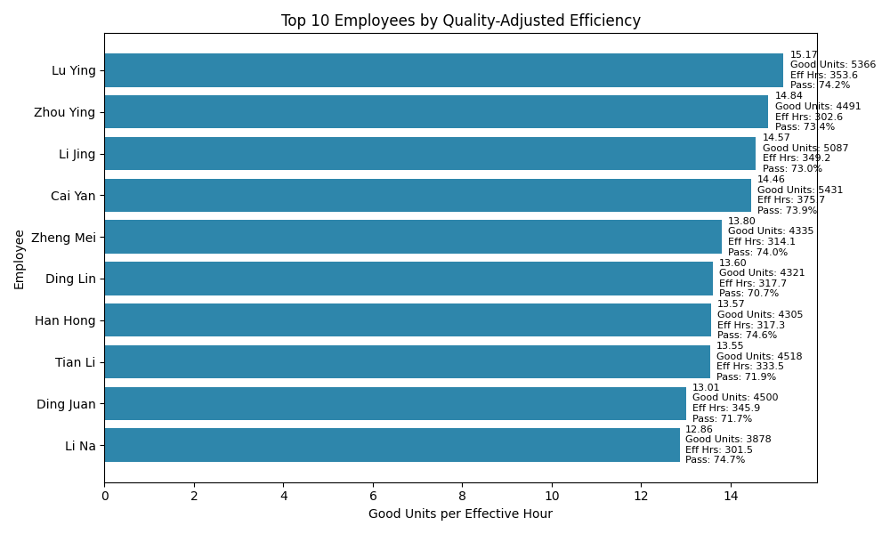

Integrated ranking of production efficiency and quality: Top employee characteristics and the next hire profile

Executive summary
- Conclusion: The highest performers deliver more quality-adjusted output per effective hour (average 13.32 vs 10.05 for others), driven by higher pass rates, more on-station time, and team process effects.
- Business impact: Replicating the behaviors and environment of the top cohort can increase quality-adjusted throughput by ~32% (13.3161 vs 10.0527 good units per effective hour), translating directly into more saleable units per paid hour.
- Recommendation: Recruit operators with proven ability to maintain high pass rates (≥72%), minimize time away from station (<40 hours over the period), and prior exposure to Group 2-style workflows; reinforce with process replication and targeted screening.

Methodology: The integrated ranking metric
- Data sources: sheet1–sheet6; fields referenced: Units Produced (REAL), Pass Rate (TEXT percent), Standard Working Hours (TEXT, e.g., “8 hours”), Total Time Away (TEXT, e.g., “47min4s”), Employee, Employee ID, Age, Gender, Education Level, Team.
- SQL steps: 
  - Unioned all six sheets, parsed Pass Rate to numeric (CAST(REPLACE('Pass Rate','%','') AS REAL)/100), parsed Total Time Away into minutes/seconds and converted to away_hours, computed Effective Working Hours as Standard Working Hours - away_hours.
  - Computed quality-adjusted output as Good Units = Units Produced × Pass Rate and aggregated per employee.
  - Integrated ranking: Good Units per Effective Hour = total_good_units / total_effective_hours.
- Python analysis: Ranked employees by good_units_per_eff_hour; computed top quartile threshold (12.1117), cohort summaries, and categorical distributions.

Visualization and key takeaway

- Key takeaway: The top 10 operators achieve between 12.86 and 15.17 good units per effective hour. The leader, Lu Ying, delivers 15.17 good units/hour (total good units 5,365.93 over 353.62 effective hours, pass rate 74.18%), followed by Zhou Ying at 14.84 (total good units 4,490.81; effective hours 302.56; pass rate 73.44%).
- Why it matters: Quality-adjusted efficiency directly drives saleable output per paid hour; focusing on the traits that enable 13–15 good units/hour can materially lift factory throughput.

What defines our top performers (top quartile vs. rest
