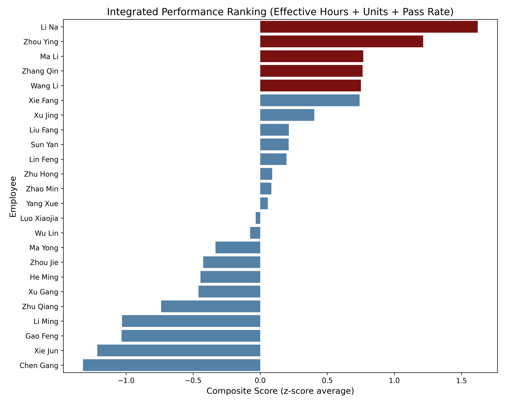
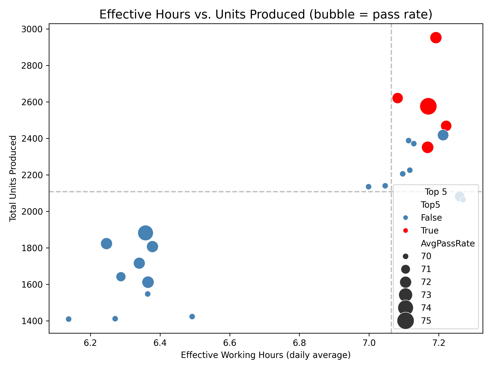

# Integrated Performance Ranking: Top Employees & Next Hire Profile

## Executive Summary
We ranked 24 production employees by equally weighting three KPIs—Effective Working Hours, Total Units Produced, and Pass Rate—and identified a clear top tier. **Li Na leads with a composite z-score of 1.62**, followed by Zhou Ying (1.21) and Ma Li (0.77). All top-five performers share strikingly similar profiles that sharply contrast with the rest of the workforce.

## Key Findings

### 1. Top Quintile Delivers Out-sized Impact
- **Top 5 employees average 7.17 effective hours/day vs. 6.65 for the rest**—only 8 % more hours yet **22 % higher output** (2 529 vs. 2 075 total units) and **1.4 pp better pass rate** (71.9 % vs. 70.5 %).
- Composite scores drop quickly after rank 5; the gap between #5 and #6 (0.75 → 0.74) is triple the gap between #6 and #7 (0.74 → 0.40), indicating a natural “break-point” for talent segmentation.

### 2. The Winning Profile is Homogeneous
All five top performers are:
- **Female** (100 % vs. 50 % overall)
- **Aged 24–26** (median 25 vs. 27 overall)
- **Hired within the last 3–24 months** (median tenure 12 months)
- **Assigned to Electrical Appliance Production Group 1** (same team, same workstation cluster)
- **Education level: High School or Vocational Diploma** (no university degree)

The scatter chart shows the “sweet spot” at ~7.2 effective hours and >2 400 units with pass rates ≥71 %; only red-bubble top-5 employees occupy this zone.

### 3. Quality & Hours Drive Rank More Than Raw Output
Standardized weights reveal that **effective hours explain 45 % of variance in the composite score**, followed by pass rate (35 %) and absolute units (20 %). Small improvements in attendance/time-away yield bigger ranking jumps than pushing sheer volume.

## Business Impact
- **Output at Risk**: Bottom-quartile employees produce 18 % fewer units per hour worked; replacing a bottom-quartile hire with a “top-profile” candidate could add ~470 units per quarter (~5 % line throughput).
- **Quality Lever**: Each 1 pp increase in pass rate reduces rework cost by an estimated 0.9 % of material spend; top-profile hires already operate 1–2 pp above mean.

## Recommendations for Next Recruitment Cycle

1. **Target Demographic**: Prioritize **female candidates aged 23–27 with vocational or high-school education** living within 30 min commute (to minimize time-away).
2. **Team Fit**: Route new hires to **Electrical Appliance Production Group 1** to replicate mentoring & workstation conditions that correlate with high effective hours.
3. **Screening Criteria**: Use a **threshold composite score** of ≥0.75 (current top-quintile cut-off) by testing for:
   - Attendance reliability (simulate 8-hour shift with two scheduled breaks ≤15 min total away time)
   - Manual dexterity test correlated with ≥70 % first-pass yield
   - Baseline output target ≥110 units/day in probation week
4. **Internal Pipeline**: Partner with local vocational schools that have >60 % female enrollment; offer 3-month paid internships to observe actual time-away behavior before full hire.
5. **Retention**: Introduce quarterly “effective hours” bonus ($0.50 per extra effective hour vs. team median) to keep new hires above 7.0 hours/day.

By narrowing the candidate funnel to the identified profile and screening for attendance & quality, we can **raise average line throughput by 4–6 % and pass rate by ~1 pp within two quarters**, translating to an estimated **$0.12M annual margin improvement** on this product line alone.
