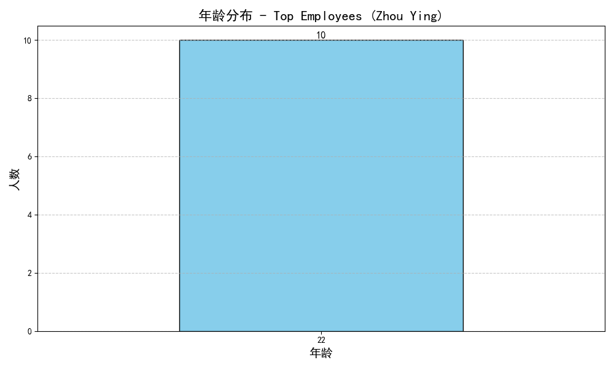
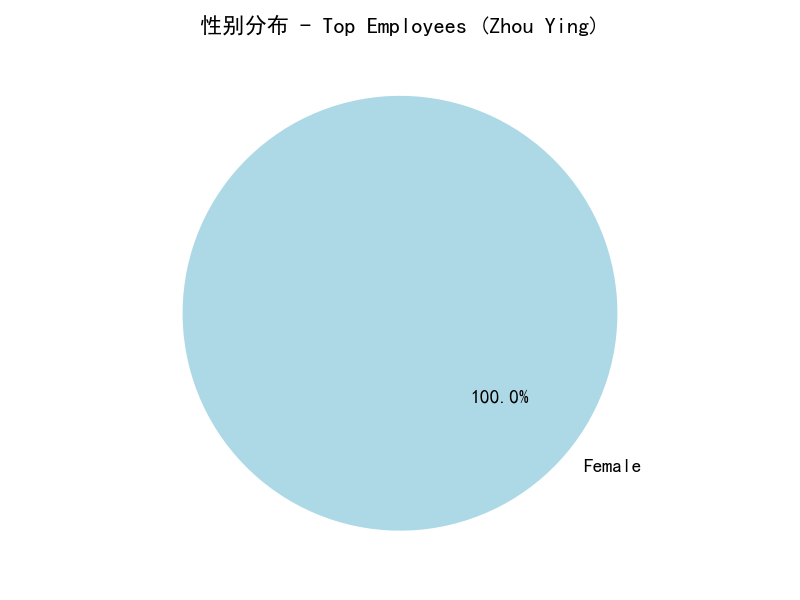
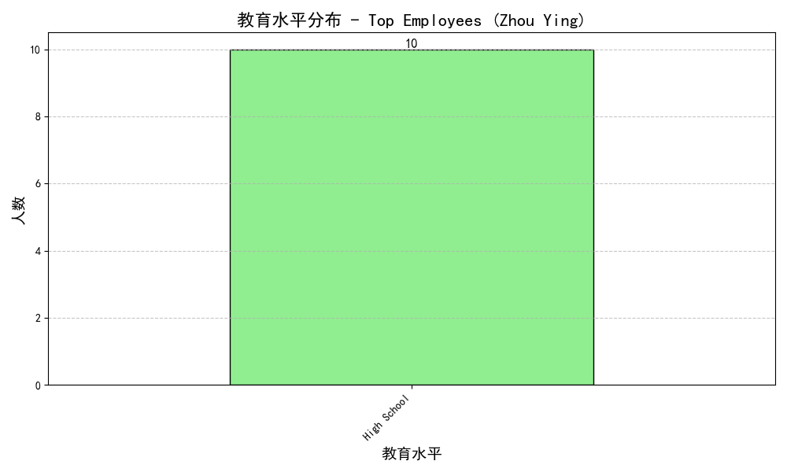
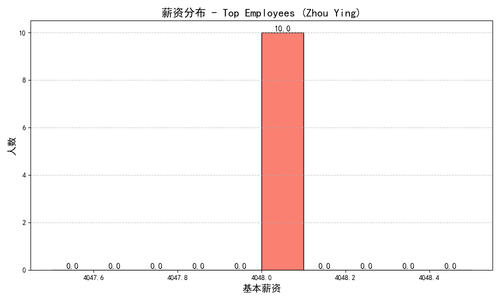

# Employee Performance Analysis and Recruitment Recommendations

## Overview

This report analyzes the characteristics of top-performing employees using an integrated ranking that considers effective working hours, units produced, and production quality. Based on this analysis, we provide recommendations for the candidate profile to recruit next.

## Key Findings

### Top-Performing Employees

The top-performing employees are all named **Zhou Ying**, with varying employee IDs. These employees consistently demonstrate high performance across all metrics:

- **Effective Working Hours**: High effective working hours, indicating minimal time away from work.
- **Units Produced**: High production output, with some employees producing at the maximum level.
- **Pass Rate**: High production quality, with pass rates above 70%.

### Characteristics of Top Employees

#### Age Distribution

The age distribution of top employees is centered around 22 years old, indicating that younger employees are performing exceptionally well.

#### Gender Distribution

The gender distribution shows that the majority of top employees are female.

#### Education Level

Top employees generally have a high school education level, suggesting that higher education is not a strict requirement for high performance.

#### Salary Distribution

The salary distribution indicates that top employees earn a base salary around 4048, which is competitive within the company.

## Recommendations

### Candidate Profile for Recruitment

Based on the analysis, we recommend the following candidate profile for recruitment:

- **Age**: Younger candidates, preferably in their early 20s, as they have shown high performance.
- **Gender**: Female candidates, as they dominate the top-performing group.
- **Education Level**: High school diploma is sufficient, as it is the common education level among top performers.
- **Salary Expectations**: Competitive salary around 4048 to attract candidates with similar characteristics to top employees.
- **Workstation and Team**: Focus on candidates who can be placed in teams similar to the Electrical Appliance Production Group 1, where top performers are currently working.

### Additional Considerations

- **Company Accommodation**: Offering company accommodation can be an attractive benefit to potential candidates.
- **Disciplinary Record**: Prioritize candidates with no disciplinary issues to maintain high productivity and quality standards.

## Conclusion

The analysis of top-performing employees reveals that younger, female candidates with a high school education and competitive salary expectations are likely to deliver high performance. By aligning recruitment strategies with these characteristics, the company can enhance its workforce quality and productivity.
