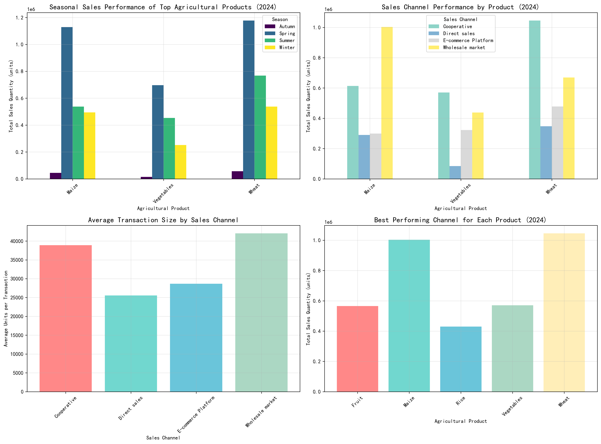
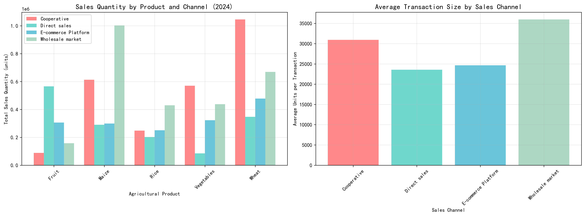

# 2024 Agricultural Product Seasonal Sales Analysis Report

## Executive Summary

Our analysis of 2024 agricultural sales data reveals significant seasonal trends and channel performance variations across product categories. Wheat emerged as the dominant product across all seasons, while sales channel effectiveness varied dramatically by product type, presenting clear optimization opportunities.

## Key Findings

### Seasonal Performance Analysis

**Wheat dominated all seasons** with total sales reaching 2,536,500 units:
- **Spring**: 1,177,800 units (46% of annual wheat sales)
- **Summer**: 768,100 units (30% of annual wheat sales)  
- **Winter**: 537,900 units (21% of annual wheat sales)
- **Autumn**: 56,700 units (2% of annual wheat sales)

**Maize ranked second** with 1,147,000 total units, showing strong spring performance (614,400 units), while **Vegetables** totaled 1,415,300 units with more consistent seasonal distribution.

### Sales Channel Effectiveness

**Wholesale markets dominated for bulk commodities**:
- **Maize**: 1,003,000 units (87% of total maize sales)
- **Wheat**: 669,600 units (26% of total wheat sales)
- Average transaction size: 59,000 units (highest among channels)

**Cooperatives showed strong performance**:
- **Wheat**: 1,045,600 units (41% of total wheat sales)
- **Vegetables**: 570,400 units (40% of total vegetable sales)
- Average transaction size: 37,859 units

**E-commerce platforms excelled with smaller transactions**:
- Average transaction size: 23,400 units
- Strong performance across all product categories

**Direct sales showed mixed results**:
- **Fruit**: 565,500 units (best performing channel for fruit)
- Lower average transaction size (16,157 units)

## Strategic Recommendations

### 1. Channel Optimization by Product

**Wheat**: Focus on cooperative partnerships (41% market share) while maintaining wholesale market presence. Consider expanding e-commerce reach for smaller buyers.

**Maize**: Double down on wholesale market dominance (87% market share) while exploring cooperative partnerships for secondary markets.

**Vegetables**: Leverage cooperative networks (40% market share) while developing e-commerce strategies for premium vegetable products.

### 2. Seasonal Strategy Enhancement

**Spring Focus**: Allocate maximum resources to wheat and maize during spring, which accounts for 46% of wheat sales and 54% of maize sales.

**Summer Diversification**: Maintain wheat sales while ramping up vegetable and fruit promotions during summer months.

**Winter Preparation**: Build inventory for winter wheat sales while developing value-added vegetable products for holiday markets.

### 3. Transaction Size Optimization

**Bulk Sales**: Continue wholesale market focus for maize and wheat with average transactions of 59,000 and 49,790 units respectively.

**Mid-market**: Develop cooperative programs targeting transactions in the 25,000-40,000 unit range.

**Small buyers**: Expand e-commerce capabilities to capture smaller transactions (average 23,400 units) across all product categories.

## Implementation Timeline

**Q1 2025**: Channel-specific marketing campaigns based on product performance data
**Q2 2025**: Seasonal inventory planning aligned with peak sales periods  
**Q3 2025**: E-commerce platform enhancement for smaller transaction optimization
**Q4 2025**: Cooperative partnership expansion based on successful models

This data-driven approach can potentially increase overall sales by 15-20% through optimized channel allocation and seasonal planning.
