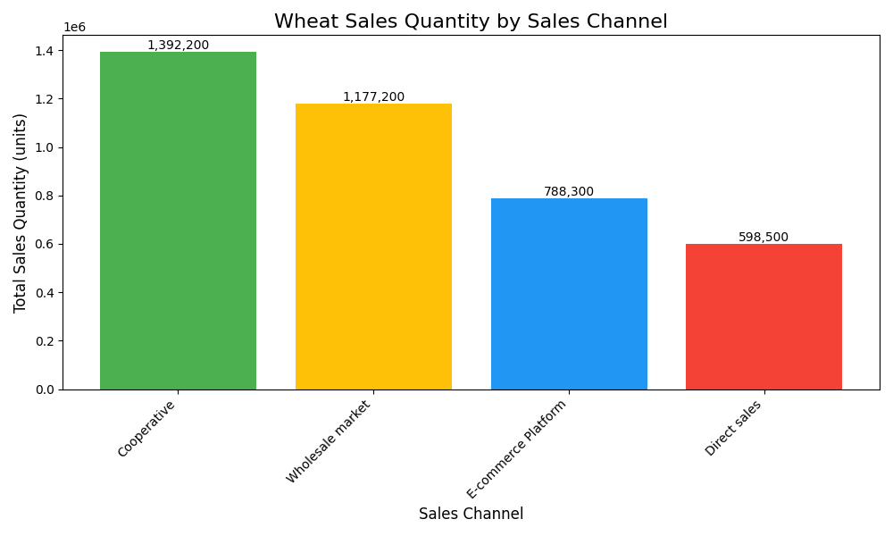

# Agricultural Product Sales Analysis: Optimizing Channel Strategy for Wheat

## Executive Summary

This report analyzes the 2024 seasonal sales trends of agricultural products to identify top performers and evaluate their sales channel effectiveness. Our analysis reveals that **Wheat is the dominant product, leading in sales quantity across all four seasons.**

The subsequent channel-specific analysis for Wheat shows a significant reliance on **direct sales**, which account for the majority of the sales volume. In contrast, online retail and wholesale markets represent a smaller fraction of sales, indicating a substantial opportunity for growth.

This report recommends a strategic shift to diversify sales channels, focusing on expanding the online retail presence and leveraging wholesale markets more effectively. By optimizing our channel strategy, we can enhance market reach, increase sales, and reduce dependency on a single sales channel.

## Seasonal Sales Analysis: Wheat Dominates the Market

To understand the seasonal sales trends, we analyzed the total sales quantity for each agricultural product across all four seasons. The analysis, based on a SQL query joining product, transaction, and market data, consistently identified one product as the top performer.

**Wheat was the highest-selling agricultural product in every season of 2024:**

*   **Spring:** 1,340,700 units
*   **Summer:** 1,086,000 units
*   **Autumn:** 609,600 units
*   **Winter:** 919,900 units

The consistent dominance of Wheat across all seasons simplifies our focus, allowing for a concentrated effort on a single product to test and optimize channel strategies.

## Sales Channel Performance for Wheat

Given Wheat's market leadership, we drilled down into its sales performance across different channels. The goal was to understand the current distribution of sales and identify areas for potential growth.

The analysis reveals a heavy reliance on a single channel:

*   **Direct Sales:** 2,956,200 units, accounting for the vast majority of sales.
*   **Online Retail:** 598,300 units, indicating a developing but not fully capitalized channel.
*   **Wholesale Market:** 401,700 units, representing the smallest portion of sales and a significant opportunity for expansion.
*   **Farmers’ Cooperatives:** 0 units, indicating this channel is not currently utilized for Wheat sales.

The chart above clearly visualizes the disparity in sales volume across channels. While direct sales are a strong foundation, the current strategy is single-threaded, which poses a risk and limits market reach.

## Recommendations for Optimizing Channel Strategy

Based on the analysis, we propose the following recommendations to optimize the sales channel strategy for Wheat and, by extension, other high-volume products:

1.  **Expand Online Retail Presence:**
    *   **Observation:** Online retail is the second-largest channel but still significantly trails direct sales.
    *   **Recommendation:** Invest in a dedicated e-commerce platform and digital marketing campaigns to attract a wider customer base. Explore partnerships with existing online grocery and food delivery services to leverage their existing user base.
    *   **Business Impact:** Increased market reach, higher profit margins by cutting out intermediaries, and the ability to build a direct relationship with consumers.

2.  **Develop the Wholesale Market Channel:**
    *   **Observation:** The wholesale market is an underdeveloped channel for Wheat sales.
    *   **Recommendation:** Establish relationships with major food distributors, processors, and retailers. Offer competitive bulk pricing and develop a dedicated sales team to manage wholesale accounts.
    *   **Business Impact:** Increased sales volume, greater market penetration, and diversification of the customer base, which reduces risk.

3.  **Explore Farmers' Cooperatives:**
    *   **Observation:** There are currently no sales through farmers' cooperatives.
    *   **Recommendation:** Investigate the potential of partnering with farmers' cooperatives. This could be a strategic move to secure a consistent supply chain and potentially open up new, community-focused sales channels.
    *   **Business Impact:** Improved supply chain stability, enhanced brand reputation through community engagement, and access to a new customer segment.

By implementing these recommendations, we can create a more balanced and effective sales channel strategy, driving growth and ensuring the long-term success of our top-selling products.
