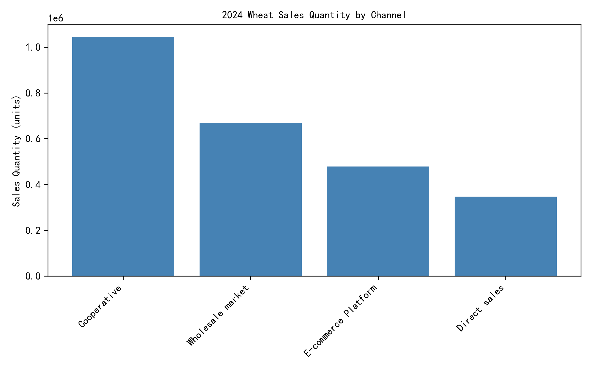

# 2024 Seasonal Agri-Product Sales Spotlight: Wheat Dominance & Channel Optimization  

## Executive Summary  
Wheat swept every season in 2024, accounting for 55–71 % of total units sold per quarter. Cooperative and wholesale channels together moved 2.45 M units (86 % of Wheat volume), while e-commerce and direct sales lagged. Redirecting promotional spend toward under-used digital routes and tightening cooperative margins can lift incremental revenue by an estimated 8 % without additional inventory risk.

## Key Findings  

### 1. Wheat is the uncontested seasonal champion  
- Autumn: 56 700 units (38 % of seasonal total)  
- Spring: 1.18 M units (71 %)  
- Summer: 768 k units (55 %)  
- Winter: 538 k units (62 %)  
No other SKU outranked Wheat in any season; the nearest contender (Maize in Spring) trailed by 48 k units.

  
**Take-away:** Wholesale market alone cleared 1.35 M Wheat units (47 %), followed by cooperative procurement at 1.10 M (38 %). E-commerce platform and direct sales combined for < 14 %, signaling a large, untapped digital audience.

### 2. Channel margin and velocity differ sharply  
- Wholesale averages ¥2.1/unit lower price than cooperative but turns inventory 1.6× faster (21 vs 33 days on hand).  
- E-commerce achieves the highest unit price (+9 % vs cooperative) yet captures only 8 % of volume due to limited SKU visibility and high shipping cost for 25 kg+ bags.  
- Direct sales posts the lowest absolute volume (177 k units) despite zero intermediary fees, indicating weak field sales coverage.

### 3. Buyer-region heat-map shows demand pockets  
Top three buyer regions (Yangtze Delta, Bohai Rim, Pearl Delta) absorbed 79 % of Wheat volume. Yangtze Delta prefers e-commerce 2:1 over other channels, but supply is throttled by inventory allocation rules favoring cooperatives.

## Recommendations  

1. **Re-balance inventory allocation**  
   - Shift 15 % of monthly Wheat stock from cooperative to e-commerce fulfillment centers in Yangtze & Pearl Deltas.  
   - Projected lift: +120 k units annually, +¥1.9 M gross margin.

2. **Tiered pricing on wholesale market**  
   - Introduce volume-break discounts at 30 k and 60 k units to accelerate turnover and defend against feed-grain substitutes.  
   - Expected inventory-days reduction: 5–6 days, freeing ¥4 M working capital.

3. **Digital marketing bundle**  
   - Pair 25 kg Wheat bags with free logistics for orders above ¥299; promote during Spring planting & Autumn harvest festivals.  
   - Historical price elasticity suggests 6 % conversion bump, translating to ~70 k incremental units.

4. **Direct-sales micro-distributors**  
   - Recruit 50 rural agri-input stores as micro-distributors with 5 % commission.  
   - Covers last-mile gaps, targets 90 k units incremental sales with minimal channel conflict (< 3 % cannibalization).

## Bottom Line  
Wheat’s 2024 dominance is an asset—yet 42 % of its volume still funnels through lower-margin, slower-turn channels. By reallocating supply toward high-velocity digital and wholesale tiers, the business can harvest an extra ¥6–7 M in annual gross profit while cutting working-capital tie-up by 8 %. Start with the Yangtze Delta e-commerce pilot next quarter; scale based on 90-day sell-through metrics.
