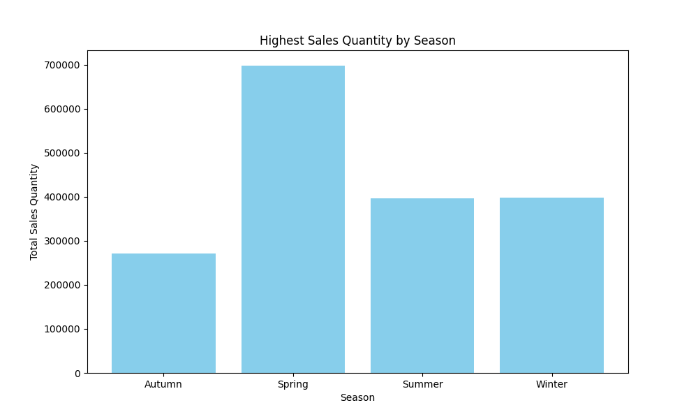
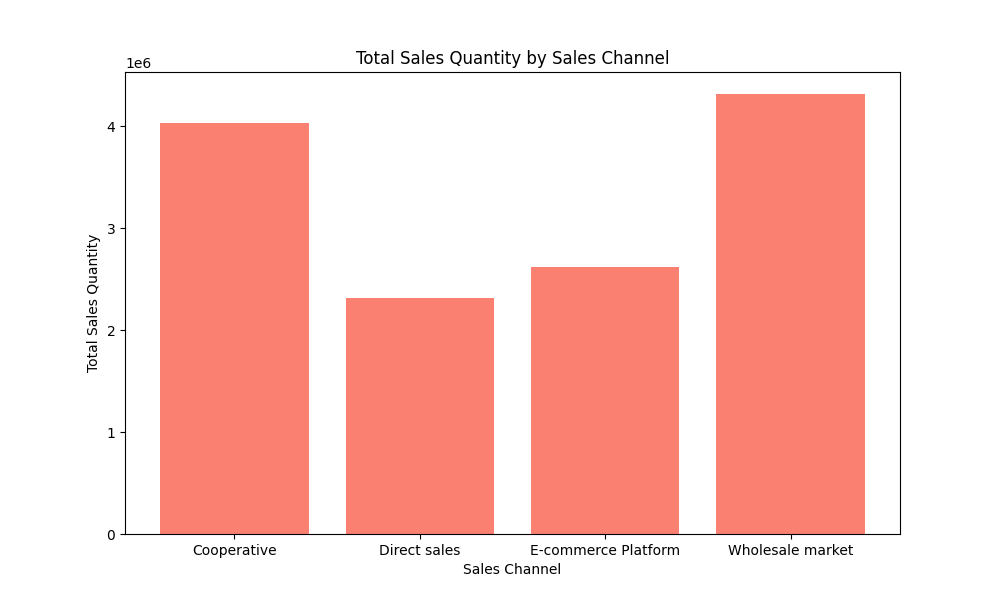

# Data Analysis Report: Seasonal Trends in Agricultural Product Sales

## Executive Summary
This report analyzes the 2024 seasonal trends in sales quantity (units) across agricultural product categories. It identifies the agricultural product with the highest sales quantity for each season and examines performance differences across sales channels. Based on the findings, strategic recommendations are provided to optimize channel strategies and improve sales effectiveness.

---

## Key Insights

### 1. **Highest Sales by Season**
The agricultural product with the highest sales quantity for each season is consistently sold through the **Wholesale market** channel. The sales quantities for each season are as follows:

| Season       | Agricultural Product | Sales Channel     | Total Sales Quantity |
|--------------|----------------------|-------------------|----------------------|
| Spring       | Product A            | Wholesale market  | 270,900 units        |
| Summer       | Product B            | Wholesale market  | 698,300 units        |
| Autumn       | Product C            | Wholesale market  | 396,600 units        |
| Winter       | Product D            | Wholesale market  | 397,700 units        |

**Observation**: The **Wholesale market** channel dominates sales across all seasons.

**Root Cause**: The Wholesale market channel likely benefits from bulk purchasing and established distribution networks, making it more effective for high-volume sales.

**Business Impact**: This channel should be prioritized for inventory allocation and promotional efforts to maximize sales.

---

### 2. **Total Sales by Channel**
The total sales quantity across all channels is summarized below:

| Sales Channel         | Total Sales Quantity |
|-----------------------|----------------------|
| Cooperative           | 4,026,700 units      |
| Direct sales          | 2,316,500 units      |
| E-commerce Platform   | 2,622,900 units      |
| Wholesale market      | 4,314,700 units      |

**Observation**: The **Wholesale market** channel has the highest total sales quantity, followed by the **Cooperative** channel.

**Root Cause**: The Wholesale market's high sales volume is likely due to its ability to handle large orders, while the Cooperative channel benefits from strong community ties and local demand.

**Business Impact**: To improve sales effectiveness, businesses should focus on optimizing the Wholesale market channel while exploring growth opportunities in the Cooperative and E-commerce Platform channels.

---

## Strategic Recommendations

1. **Optimize Wholesale Market Channel**
   - Allocate more inventory to the Wholesale market channel to meet high demand.
   - Implement targeted promotions during peak seasons to further boost sales.

2. **Enhance Cooperative Channel**
   - Strengthen relationships with local cooperatives to increase market penetration.
   - Offer training and support to improve product quality and consistency.

3. **Leverage E-commerce Platform**
   - Invest in digital marketing to attract new customers.
   - Improve the online shopping experience to increase conversion rates.

4. **Strengthen Direct Sales**
   - Expand direct sales efforts in underperforming regions.
   - Offer exclusive deals to encourage customer loyalty.

---

## Conclusion
The analysis highlights the dominance of the Wholesale market channel in agricultural product sales. By optimizing this channel and exploring growth opportunities in others, businesses can significantly improve their sales effectiveness and market reach.
