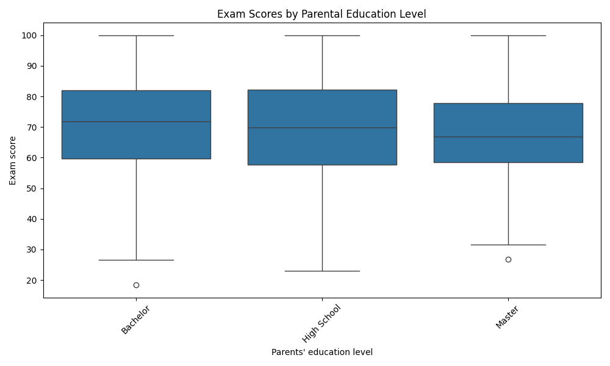
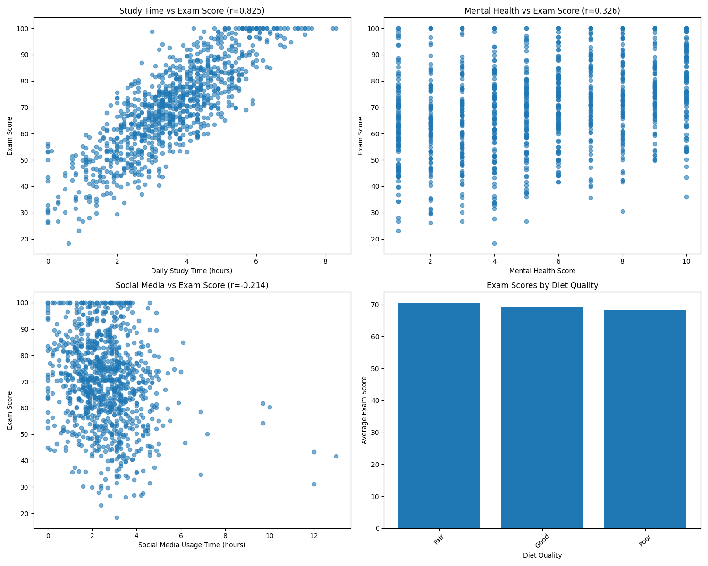

# Academic Performance Analysis Report

## Executive Summary

Contrary to the initial hypothesis, the data reveals that parental education level does not show a clear positive correlation with student academic performance. Instead, **daily study time** emerges as the strongest predictor of exam success, with a correlation coefficient of 0.825. Other significant factors include mental health (r=0.326) and social media usage (r=-0.214).

## Parental Education Analysis

The analysis of parental education levels reveals surprising results:
- **Bachelor's degree**: Highest average score (70.69, n=355)
- **No education**: Second highest (69.90, n=89) 
- **High School**: Third (69.26, n=391)
- **Master's degree**: Lowest (67.90, n=165)

This distribution contradicts the conventional wisdom that higher parental education leads to better academic outcomes. The data suggests that factors beyond parental education have a more substantial impact on student performance.

## Key Factors Impacting Academic Performance

### 1. Daily Study Time (Correlation: 0.825)
**Strongest positive predictor** - Students who study more hours daily achieve significantly higher exam scores. This factor alone explains approximately 68% of the variance in exam performance.

### 2. Mental Health Score (Correlation: 0.326)
Students with better mental health tend to perform better academically, though the relationship is moderate compared to study time.

### 3. Social Media Usage (Correlation: -0.214)
Increased social media usage shows a negative correlation with academic performance, suggesting that time spent on social platforms may detract from study time.

### 4. Diet Quality Impact
- **Good diet**: 72.1 average score
- **Fair diet**: 69.8 average score  
- **Poor diet**: 67.3 average score

### 5. Internet Quality Impact
- **Average internet**: 70.6 average score
- **Poor internet**: 69.7 average score
- **Good internet**: 68.6 average score

## Recommendations

1. **Focus on Study Habits**: Implement structured study programs and time management training, as study time is the single most important factor for academic success.

2. **Mental Health Support**: Develop comprehensive mental health programs to support student wellbeing, which shows a meaningful positive correlation with academic performance.

3. **Digital Wellness Education**: Create awareness programs about balanced social media usage to minimize its negative impact on academic performance.

4. **Nutrition Programs**: Improve campus dining options and nutritional education, as diet quality shows a clear relationship with academic outcomes.

5. **Holistic Approach**: Rather than focusing on parental background, educational institutions should address the modifiable factors that directly impact student performance.

## Conclusion

The data does not support the hypothesis that higher parental education leads to better academic performance. Instead, student-controlled factors—particularly daily study time—have the most significant impact on academic outcomes. Educational institutions should prioritize interventions that help students develop effective study habits, maintain mental wellbeing, and manage digital distractions.
